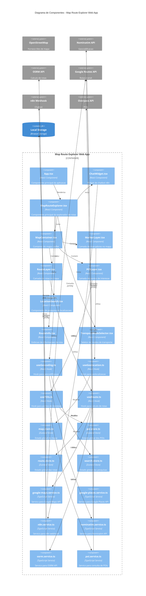

```mermaid
C4Component
    title Diagrama de Componentes - Map Route Explorer Web App

    Container_Boundary(web_app, "Map Route Explorer Web App") {
        Component(app, "App.tsx", "React Component", "Componente principal da aplicacao")
        Component(chat_widget, "ChatWidget.tsx", "React Component", "Widget de chatbot n8n")
        Component(map_route_explorer, "MapRouteExplorer.tsx", "React Component", "Componente principal do explorador de rotas")

        Component(map_container, "MapContainer.tsx", "React Component", "Container do mapa Leaflet")
        Component(marker_layer, "MarkerLayer.tsx", "React Component", "Camada de marcadores no mapa")
        Component(route_layer, "RouteLayer.tsx", "React Component", "Camada de rotas no mapa")
        Component(poi_layer, "POILayer.tsx", "React Component", "Camada de pontos de interesse")

        Component(location_search, "LocationSearch.tsx", "React Component", "Componente de pesquisa de localizacoes")
        Component(route_info, "RouteInfo.tsx", "React Component", "Exibicao de informacoes da rota")
        Component(transport_mode_selector, "TransportModeSelector.tsx", "React Component", "Seletor de modos de transporte")

        Component(use_geocoding, "useGeocoding.ts", "React Hook", "Hook para geocodificacao")
        Component(use_geolocation, "useGeolocation.ts", "React Hook", "Hook para geolocalizacao")
        Component(use_pois, "usePOIs.ts", "React Hook", "Hook para pontos de interesse")
        Component(use_route, "useRoute.ts", "React Hook", "Hook para calculo de rotas")

        Component(map_store, "map.store.ts", "Zustand Store", "Estado global do mapa")
        Component(poi_store, "poi.store.ts", "Zustand Store", "Estado global dos POIs")
        Component(route_store, "route.store.ts", "Zustand Store", "Estado global das rotas")
        Component(search_store, "search.store.ts", "Zustand Store", "Estado global das pesquisas")

        Component(google_maps_service, "google-maps.service.ts", "TypeScript Service", "Servico para Google Maps API")
        Component(google_places_service, "google-places.service.ts", "TypeScript Service", "Servico para Google Places API")
        Component(n8n_service, "n8n.service.ts", "TypeScript Service", "Servico para n8n webhook")
        Component(nominatim_service, "nominatim.service.ts", "TypeScript Service", "Servico para Nominatim API")
        Component(osrm_service, "osrm.service.ts", "TypeScript Service", "Servico para OSRM API")
        Component(poi_service, "poi.service.ts", "TypeScript Service", "Servico para consulta de POIs")
    }

    System_Ext(osm, "OpenStreetMap", "Fornece tiles de mapa")
    System_Ext(nominatim, "Nominatim API", "Geocodificacao")
    System_Ext(osrm, "OSRM API", "Calculo de rotas")
    System_Ext(google_routes, "Google Routes API", "Rotas transit")
    System_Ext(n8n, "n8n Webhook", "Chatbot")
    System_Ext(overpass, "Overpass API", "POIs")

    ContainerDb(local_storage, "Local Storage", "Browser Storage")

    Rel(app, map_route_explorer, "Renderiza")
    Rel(map_route_explorer, chat_widget, "Inclui")
    Rel(map_route_explorer, map_container, "Inclui")
    Rel(map_container, marker_layer, "Contem")
    Rel(map_container, route_layer, "Contem")
    Rel(map_container, poi_layer, "Contem")

    Rel(map_route_explorer, location_search, "Inclui")
    Rel(map_route_explorer, route_info, "Inclui")
    Rel(map_route_explorer, transport_mode_selector, "Inclui")

    Rel(location_search, use_geocoding, "Utiliza")
    Rel(marker_layer, use_geolocation, "Utiliza")
    Rel(route_layer, use_route, "Utiliza")
    Rel(poi_layer, use_pois, "Utiliza")

    Rel(use_geocoding, search_store, "Atualiza")
    Rel(use_geolocation, map_store, "Atualiza")
    Rel(use_route, route_store, "Atualiza")
    Rel(use_pois, poi_store, "Atualiza")

    Rel(google_maps_service, google_routes, "Consulta", "HTTPS")
    Rel(google_places_service, google_routes, "Consulta", "HTTPS")
    Rel(n8n_service, n8n, "Envia", "HTTPS")
    Rel(nominatim_service, nominatim, "Consulta", "HTTPS")
    Rel(osrm_service, osrm, "Consulta", "HTTPS")
    Rel(poi_service, overpass, "Consulta", "HTTPS")

    Rel(use_geocoding, nominatim_service, "Utiliza")
    Rel(use_route, osrm_service, "Utiliza")
    Rel(use_route, google_maps_service, "Utiliza")
    Rel(use_pois, poi_service, "Utiliza")
    Rel(chat_widget, n8n_service, "Utiliza")

    Rel(route_store, local_storage, "Persiste", "Web Storage API")

    UpdateLayoutConfig($c4ShapeInRow="4", $c4BoundaryInRow="1")
```