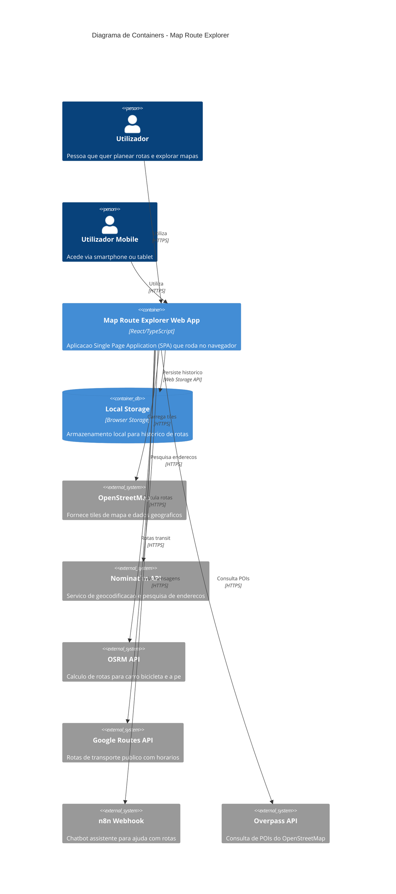

```mermaid
C4Container
    title Diagrama de Containers - Map Route Explorer

    Person(user, "Utilizador", "Pessoa que quer planear rotas e explorar mapas")
    Person(mobile_user, "Utilizador Mobile", "Acede via smartphone ou tablet")

    Container(web_app, "Map Route Explorer Web App", "React/TypeScript", "Aplicacao Single Page Application (SPA) que roda no navegador")
    ContainerDb(local_storage, "Local Storage", "Browser Storage", "Armazenamento local para historico de rotas")

    System_Ext(osm, "OpenStreetMap", "Fornece tiles de mapa e dados geograficos")
    System_Ext(nominatim, "Nominatim API", "Servico de geocodificacao e pesquisa de enderecos")
    System_Ext(osrm, "OSRM API", "Calculo de rotas para carro bicicleta e a pe")
    System_Ext(google_routes, "Google Routes API", "Rotas de transporte publico com horarios")
    System_Ext(n8n, "n8n Webhook", "Chatbot assistente para ajuda com rotas")
    System_Ext(overpass, "Overpass API", "Consulta de POIs do OpenStreetMap")

    Rel(user, web_app, "Utiliza", "HTTPS")
    Rel(mobile_user, web_app, "Utiliza", "HTTPS")

    Rel(web_app, osm, "Carrega tiles", "HTTPS")
    Rel(web_app, nominatim, "Pesquisa enderecos", "HTTPS")
    Rel(web_app, osrm, "Calcula rotas", "HTTPS")
    Rel(web_app, google_routes, "Rotas transit", "HTTPS")
    Rel(web_app, n8n, "Envia mensagens", "HTTPS")
    Rel(web_app, overpass, "Consulta POIs", "HTTPS")
    Rel(web_app, local_storage, "Persiste historico", "Web Storage API")

    UpdateLayoutConfig($c4ShapeInRow="3", $c4BoundaryInRow="1")
```