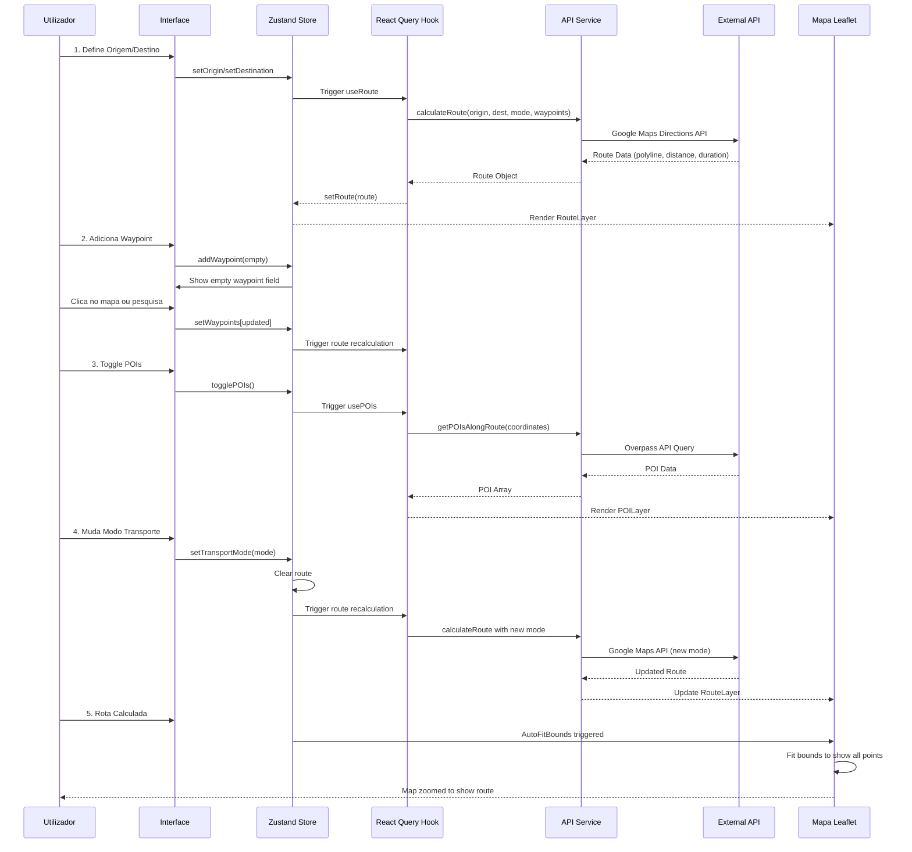

# 🗺️ Map Route Explorer - React + Vite

> **Sistema Interativo de Rotas e Exploração de Locais com OpenStreetMap**


Uma aplicação web moderna desenvolvida em React + Vite que permite aos utilizadores explorar mapas baseados em dados do OpenStreetMap, traçar rotas entre pontos de interesse e obter informações relevantes sobre o trajeto.

Documentação detalhada foi movida para `docs/`:

- `docs/DEPLOY.md`, `docs/DEPLOY_PORTAINER.md`
- `docs/DEPLOYMENT_CHECKLIST.md`, `docs/SPRINT_PLANNING.md`
- `docs/IMPLEMENTATION_SUMMARY.md`, `docs/N8N_WORKFLOW_GUIDE.md`

**Versão**: 3.0.0 | **Status**: Em desenvolvimento

## 🚀 Início Rápido

### Pré-requisitos

- Node.js 18+ e npm
- Git

### Instalação

```bash
# Instalar dependências
npm install

# Iniciar servidor de desenvolvimento
npm run dev

# A aplicação estará disponível em http://localhost:3000
```

### Build para Produção

```bash
# Criar build de produção
npm run build

# Pré-visualizar build
npm run preview
```

## 📋 Funcionalidades

### ✅ Implementadas

- **Visualização de Mapa**: Mapa interativo com Leaflet e tiles do OpenStreetMap
- **Cálculo de Rotas**: Integração com **Google Maps Directions API** para rotas precisas e tempo de viagem real
- **Múltiplos Destinos (Waypoints)**: Suporte para até 5 paragens intermediárias na rota
- **Auto-fit de Mapa**: Zoom automático para mostrar origem, destino e waypoints quando uma rota é calculada
- **Pontos de Interesse (POIs)**: Exibição automática de restaurantes, cafés, postos de combustível, estacionamentos e atrações ao longo da rota
- **Pesquisa de Localização**: API Nominatim para geocodificação e pesquisa com debouncing para evitar rate limiting
- **Geolocalização**: Suporte para obter localização atual do navegador
- **Modos de Transporte**: Carro, Bicicleta e A pé com recálculo automático de rotas
- **Informações de Rota**: Distância total e tempo estimado preciso (com dados de tráfego para carros)
- **Integração Google Maps**: Abrir rota diretamente no Google Maps app
- **Chatbot n8n**: Widget de chat integrado para assistência de roteamento via n8n workflow
- **Interface Moderna**: Design responsivo com Tailwind CSS, otimizado para mobile
- **Deploy Docker**: Configuração completa para deployment com Docker e nginx

### 🔜 Planeadas

- Perfil altimétrico da rota
- Otimização automática de waypoints
- Histórico de rotas salvas

## 🛠️ Tecnologias

- **React 18** - Framework UI
- **Vite 5** - Build tool e dev server
- **TypeScript** - Tipagem estática
- **Leaflet** - Biblioteca de mapas
- **React Leaflet** - Bindings React para Leaflet
- **Zustand** - State management
- **React Query** - Cache e sincronização de dados
- **Axios** - Cliente HTTP
- **Tailwind CSS** - Framework CSS utility-first
- **Lucide React** - Ícones

## 🧹 Qualidade de Código

O projeto utiliza várias ferramentas para garantir qualidade e consistência do código:

### Ferramentas Locais

- **TypeScript Type Checking**: `npm run typecheck` - Verifica erros de tipo sem gerar build
- **ESLint**: `npm run lint` - Analisa código JavaScript/TypeScript para problemas e padrões
- **Prettier**:
  - `npm run format` - Formata automaticamente todos os ficheiros
  - `npm run format:check` - Verifica se os ficheiros estão formatados corretamente
- **Build Check**: `npm run build` - Verifica se o projeto compila sem erros

### CI/CD Pipeline

- **GitHub Actions**: Workflow automático em `.github/workflows/ci.yml` que executa em cada push/PR:
  - Instala dependências (`npm ci`)
  - Executa lint (`npm run lint`)
  - Verifica formatação (`npm run format:check`)
  - Verifica tipos (`npm run typecheck`)
  - Compila projeto (`npm run build`)

  Status do CI: 

### Outras Ferramentas

- **Dependabot**: Configurações em `.github/dependabot.yml` (atualizações automáticas de dependências npm, semanal)

### Status Atual

✅ **Todos os checks de qualidade passam:**

- ✅ ESLint: Sem erros ou avisos
- ✅ Prettier: Todos os ficheiros formatados corretamente
- ✅ TypeScript: Sem erros de tipo
- ✅ Build: Compilação bem-sucedida

## 🏗️ Arquitetura e Integrações

```mermaid
graph TB
    subgraph "Frontend - React Application"
        UI[MapRouteExplorer<br/>Componente Principal]

        subgraph "Componentes UI"
            MapC[MapContainer<br/>Leaflet Map]
            AutoFit[AutoFitBounds<br/>Auto Zoom]
            Search[LocationSearch<br/>Pesquisa & Waypoints]
            RouteInfo[RouteInfo<br/>Info da Rota]
            Transport[TransportModeSelector<br/>Modo Transporte]
            Chat[ChatWidget<br/>Chatbot n8n]
        end

        subgraph "State Management - Zustand"
            MapStore[(MapStore<br/>Center, Zoom, Selected)]
            RouteStore[(RouteStore<br/>Origin, Dest, Waypoints, Route)]
            POIStore[(POIStore<br/>POI Enabled)]
            SearchStore[(SearchStore<br/>Query, Results)]
        end

        subgraph "Data Fetching - React Query"
            useRoute[useRoute Hook<br/>Route Calculation]
            usePOIs[usePOIs Hook<br/>POI Fetching]
            useGeocoding[useGeocoding Hook<br/>Location Search]
            useGeolocation[useGeolocation Hook<br/>Browser Geolocation]
        end

        subgraph "API Services"
            GoogleMaps[Google Maps Service<br/>Directions API]
            POIService[POI Service<br/>Overpass API]
            Nominatim[Nominatim Service<br/>Geocoding]
            N8NService[n8n Service<br/>Chat Workflow]
        end
    end

    subgraph "External APIs"
        GMapsAPI[Google Maps<br/>Directions API<br/>JavaScript SDK]
        OverpassAPI[Overpass API<br/>OpenStreetMap<br/>POI Data]
        NominatimAPI[Nominatim API<br/>OpenStreetMap<br/>Geocoding]
        N8NWebhook[n8n Workflow<br/>Webhook]
        BrowserGeo[Browser<br/>Geolocation API]
    end

    subgraph "Map Rendering"
        Leaflet[Leaflet Map<br/>OpenStreetMap Tiles]
        RouteLayer[RouteLayer<br/>Route Polyline]
        MarkerLayer[MarkerLayer<br/>Origin/Dest/Waypoints]
        POILayer[POILayer<br/>POI Markers]
    end

    UI --> MapC
    UI --> Search
    UI --> RouteInfo
    UI --> Transport
    UI --> Chat

    MapC --> Leaflet
    MapC --> AutoFit
    MapC --> RouteLayer
    MapC --> MarkerLayer
    MapC --> POILayer

    AutoFit --> RouteStore

    Search --> MapStore
    Search --> RouteStore
    Search --> SearchStore
    Search --> useGeocoding
    Search --> useGeolocation

    RouteInfo --> RouteStore
    RouteInfo --> POIStore
    RouteInfo --> useRoute

    Transport --> RouteStore

    Chat --> RouteStore
    Chat --> MapStore
    Chat --> N8NService

    RouteLayer --> RouteStore
    MarkerLayer --> RouteStore
    POILayer --> RouteStore
    POILayer --> POIStore
    POILayer --> usePOIs

    useRoute --> RouteStore
    useRoute --> GoogleMaps
    usePOIs --> RouteStore
    usePOIs --> POIStore
    usePOIs --> POIService
    useGeocoding --> SearchStore
    useGeocoding --> Nominatim
    useGeolocation --> BrowserGeo

    GoogleMaps --> GMapsAPI
    POIService --> OverpassAPI
    Nominatim --> NominatimAPI
    N8NService --> N8NWebhook

    style UI fill:#3b82f6,color:#fff
    style MapStore fill:#10b981,color:#fff
    style RouteStore fill:#10b981,color:#fff
    style POIStore fill:#10b981,color:#fff
    style SearchStore fill:#10b981,color:#fff
    style GMapsAPI fill:#ef4444,color:#fff
    style OverpassAPI fill:#f59e0b,color:#fff
    style NominatimAPI fill:#f59e0b,color:#fff
    style N8NWebhook fill:#8b5cf6,color:#fff
```



## 🔄 Fluxo de Lógica da Aplicação



## 📁 Estrutura do Projeto

```
.
├── src/                    # Código fonte da aplicação
│   ├── components/         # Componentes React
│   │   ├── map/           # Componentes do mapa (MapContainer, RouteLayer, etc.)
│   │   ├── route/         # Componentes de rota (RouteInfo, TransportModeSelector)
│   │   └── search/        # Componentes de pesquisa (LocationSearch)
│   ├── hooks/             # Custom hooks (useRoute, useGeocoding, etc.)
│   ├── services/          # Serviços de API
│   │   └── api/          # Clientes de API (Google Maps, Nominatim, n8n, etc.)
│   ├── store/            # Stores Zustand (map, route, poi, search)
│   ├── types/            # Definições TypeScript
│   └── constants/        # Constantes e configurações
├── deployment/            # Configuração Docker
│   ├── docker-compose.yml # Docker Compose configuration
│   ├── Dockerfile         # Multi-stage Docker build
│   └── README.md         # Documentação de deployment
├── config/               # Ficheiros de configuração
│   └── nginx/           # Configuração nginx (proxy, CORS, etc.)
├── scripts/              # Scripts utilitários
│   └── deploy.sh        # Script de deployment automatizado
├── docs/                 # Documentação do projeto
│   ├── DEPLOY.md        # Guia de deployment
│   ├── DEPLOY_PORTAINER.md
│   ├── N8N_WORKFLOW_GUIDE.md
│   └── ...
└── logs/                 # Logs (gitignored)
    └── nginx/           # Logs do nginx
```

## ⚙️ Configuração

### Google Maps API Key (REQUIRED)

Esta aplicação usa **Google Maps Directions API** para rotas precisas. Você precisa configurar uma chave de API.

1. **Obter API Key**:
   - Acesse https://console.cloud.google.com/
   - Crie um projeto ou selecione um existente
   - Ative "Directions API" e "Maps JavaScript API"
   - Crie uma chave de API em "APIs & Services" > "Credentials"

2. **Configurar**:
   Crie um ficheiro `.env.local` na raiz do projeto:
   ```env
   VITE_GOOGLE_MAPS_API_KEY=sua_chave_api_aqui
   ```

📖 **Guia completo**: Veja [docs/GOOGLE_MAPS_SETUP.md](docs/GOOGLE_MAPS_SETUP.md) para instruções detalhadas.

### Outras Configurações (Opcional)

```env
VITE_NOMINATIM_BASE_URL=https://nominatim.openstreetmap.org
VITE_MAP_DEFAULT_CENTER_LAT=38.7223
VITE_MAP_DEFAULT_CENTER_LNG=-9.1393
VITE_MAP_DEFAULT_ZOOM=13
```

## 📖 Utilização

1. **Pesquisar Localização** (opcional)
   - Digite um endereço no campo de pesquisa (com debouncing automático)
   - Ou clique no botão de geolocalização para usar sua localização atual

2. **Selecionar Pontos**
   - Clique no mapa para marcar origem (marcador verde)
   - Clique novamente para marcar destino (marcador vermelho)
   - Adicione até 5 waypoints usando o botão "+" na secção de paragens

3. **Calcular Rota**
   - Escolha o modo de transporte (Carro, Bicicleta, A pé)
   - A rota será calculada automaticamente
   - O mapa ajusta automaticamente o zoom para mostrar todos os pontos

4. **Visualizar Informações**
   - Distância e tempo estimado aparecem no painel inferior esquerdo
   - Ative POIs para ver pontos de interesse ao longo da rota
   - Use o chatbot (ícone no canto inferior direito) para assistência
   - Clique em "Limpar" para reiniciar

## 🐳 Deployment com Docker

O projeto inclui configuração completa para deployment com Docker:

### Pré-requisitos

- Docker e Docker Compose instalados
- Ficheiro `.env` configurado na raiz do projeto (veja `env.template`)

### Deploy Rápido

```bash
# Usar o script de deployment
./scripts/deploy.sh

# Ou manualmente:
docker-compose -f deployment/docker-compose.yml --env-file .env build
docker-compose -f deployment/docker-compose.yml --env-file .env up -d
```

### Configuração

1. Copie `env.template` para `.env` e configure as variáveis:

   ```env
   VITE_GOOGLE_MAPS_API_KEY=sua_chave_aqui
   VITE_N8N_WEBHOOK_URL=https://seu-n8n.webhook.url
   ```

2. O nginx está configurado para:
   - Proxy para Nominatim (evita CORS)
   - Proxy para n8n webhook
   - Servir a aplicação React estática

📖 **Documentação completa**: Veja [deployment/README.md](deployment/README.md) para detalhes.

## 🧪 Testes

```bash
# Executar testes
npm test
```

## 📚 Documentação

A documentação técnica detalhada está disponível no código-fonte. Principais pontos:

- **State Management**: Zustand stores em `src/store/`
- **API Integration**: Serviços em `src/services/api/`
- **Custom Hooks**: React Query hooks em `src/hooks/`
- **Components**: Componentes React organizados por funcionalidade em `src/components/`

## 📝 Scripts Disponíveis

### Desenvolvimento

- `npm run dev` - Inicia servidor de desenvolvimento
- `npm run preview` - Pré-visualiza build de produção

### Build

- `npm run build` - Cria build de produção (inclui verificação de tipos)

### Qualidade de Código

- `npm run lint` - Executa ESLint para análise de código
- `npm run format` - Formata automaticamente todos os ficheiros com Prettier
- `npm run format:check` - Verifica formatação sem modificar ficheiros
- `npm run typecheck` - Verifica erros de tipo TypeScript sem gerar build

### Testes

- `npm test` - Executa testes com Vitest

## 🤝 Contribuição

1. Fork o projeto
2. Crie uma branch (`git checkout -b feature/nova-funcionalidade`)
3. Commit suas mudanças (`git commit -m 'feat: adicionar nova funcionalidade'`)
4. Push para a branch (`git push origin feature/nova-funcionalidade`)
5. Abra um Pull Request

## 📄 Licença

Este projeto está licenciado sob a Licença MIT - veja o ficheiro [LICENSE](LICENSE) para detalhes.

---

**Desenvolvido para a disciplina de Arquitetura e Desenho de Software**  
**ISCTE-IUL | Engenharia Informática | 2025**
