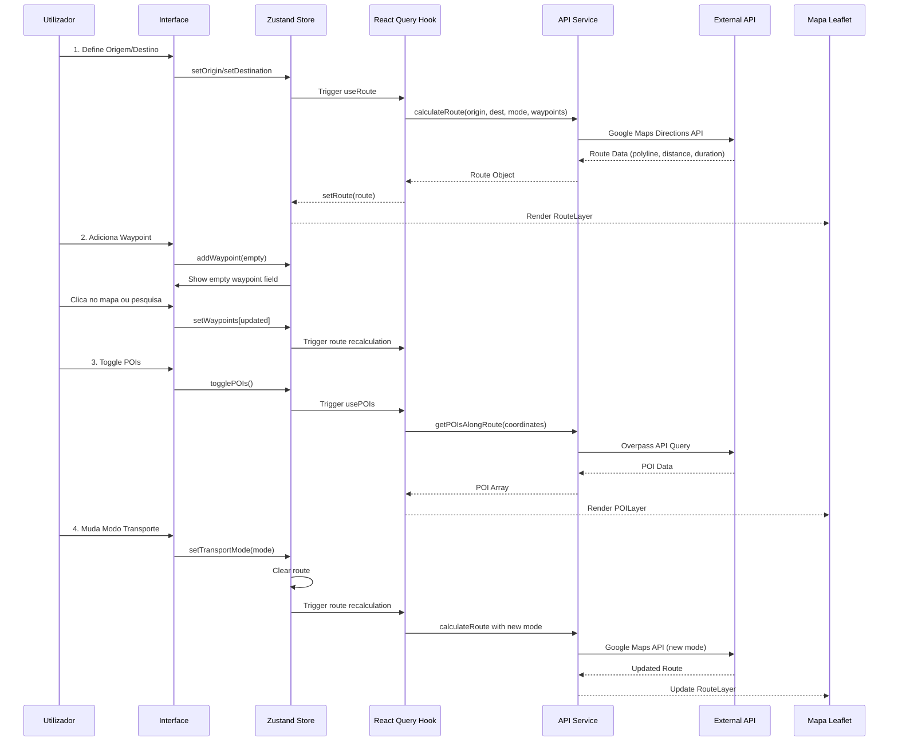

# 🗺️ Map Route Explorer - React + Vite

> **Sistema Interativo de Rotas e Exploração de Locais com OpenStreetMap**

Uma aplicação web moderna desenvolvida em React + Vite que permite aos utilizadores explorar mapas baseados em dados do OpenStreetMap, traçar rotas entre pontos de interesse e obter informações relevantes sobre o trajeto.

**Versão**: 3.0.0 | **Status**: Em desenvolvimento

## 🚀 Início Rápido

### Pré-requisitos

- Node.js 18+ e npm
- Git

### Instalação

```bash
# Instalar dependências
npm install

# Iniciar servidor de desenvolvimento
npm run dev

# A aplicação estará disponível em http://localhost:3000
```

### Build para Produção

```bash
# Criar build de produção
npm run build

# Pré-visualizar build
npm run preview
```

## 📋 Funcionalidades

### ✅ Implementadas

- **Visualização de Mapa**: Mapa interativo com Leaflet e tiles do OpenStreetMap
- **Cálculo de Rotas**: Integração com **Google Maps Directions API** para rotas precisas e tempo de viagem real
- **Pontos de Interesse (POIs)**: Exibição automática de restaurantes, cafés, postos de combustível, estacionamentos e atrações ao longo da rota
- **Pesquisa de Localização**: API Nominatim para geocodificação e pesquisa
- **Geolocalização**: Suporte para obter localização atual do navegador
- **Modos de Transporte**: Carro, Bicicleta e A pé com recálculo automático de rotas
- **Informações de Rota**: Distância total e tempo estimado preciso (com dados de tráfego para carros)
- **Integração Google Maps**: Abrir rota diretamente no Google Maps app
- **Interface Moderna**: Design responsivo com Tailwind CSS, otimizado para mobile

### 🔜 Planeadas

- Chatbot n8n para assistência de roteamento
- Múltiplos destinos (waypoints)
- Perfil altimétrico da rota

## 🛠️ Tecnologias

- **React 18** - Framework UI
- **Vite 5** - Build tool e dev server
- **TypeScript** - Tipagem estática
- **Leaflet** - Biblioteca de mapas
- **React Leaflet** - Bindings React para Leaflet
- **Zustand** - State management
- **React Query** - Cache e sincronização de dados
- **Axios** - Cliente HTTP
- **Tailwind CSS** - Framework CSS utility-first
- **Lucide React** - Ícones

## 🏗️ Arquitetura e Integrações

```mermaid
graph TB
    subgraph "Frontend - React Application"
        UI[MapRouteExplorer<br/>Componente Principal]
        
        subgraph "Componentes UI"
            MapC[MapContainer<br/>Leaflet Map]
            Search[LocationSearch<br/>Pesquisa & Waypoints]
            RouteInfo[RouteInfo<br/>Info da Rota]
            Transport[TransportModeSelector<br/>Modo Transporte]
        end
        
        subgraph "State Management - Zustand"
            MapStore[(MapStore<br/>Center, Zoom, Selected)]
            RouteStore[(RouteStore<br/>Origin, Dest, Waypoints, Route)]
            POIStore[(POIStore<br/>POI Enabled)]
            SearchStore[(SearchStore<br/>Query, Results)]
        end
        
        subgraph "Data Fetching - React Query"
            useRoute[useRoute Hook<br/>Route Calculation]
            usePOIs[usePOIs Hook<br/>POI Fetching]
            useGeocoding[useGeocoding Hook<br/>Location Search]
            useGeolocation[useGeolocation Hook<br/>Browser Geolocation]
        end
        
        subgraph "API Services"
            GoogleMaps[Google Maps Service<br/>Directions API]
            POIService[POI Service<br/>Overpass API]
            Nominatim[Nominatim Service<br/>Geocoding]
        end
    end
    
    subgraph "External APIs"
        GMapsAPI[Google Maps<br/>Directions API<br/>JavaScript SDK]
        OverpassAPI[Overpass API<br/>OpenStreetMap<br/>POI Data]
        NominatimAPI[Nominatim API<br/>OpenStreetMap<br/>Geocoding]
        BrowserGeo[Browser<br/>Geolocation API]
    end
    
    subgraph "Map Rendering"
        Leaflet[Leaflet Map<br/>OpenStreetMap Tiles]
        RouteLayer[RouteLayer<br/>Route Polyline]
        MarkerLayer[MarkerLayer<br/>Origin/Dest/Waypoints]
        POILayer[POILayer<br/>POI Markers]
    end
    
    UI --> MapC
    UI --> Search
    UI --> RouteInfo
    UI --> Transport
    
    MapC --> Leaflet
    MapC --> RouteLayer
    MapC --> MarkerLayer
    MapC --> POILayer
    
    Search --> MapStore
    Search --> RouteStore
    Search --> SearchStore
    Search --> useGeocoding
    Search --> useGeolocation
    
    RouteInfo --> RouteStore
    RouteInfo --> POIStore
    RouteInfo --> useRoute
    
    Transport --> RouteStore
    
    RouteLayer --> RouteStore
    MarkerLayer --> RouteStore
    POILayer --> RouteStore
    POILayer --> POIStore
    POILayer --> usePOIs
    
    useRoute --> RouteStore
    useRoute --> GoogleMaps
    usePOIs --> RouteStore
    usePOIs --> POIStore
    usePOIs --> POIService
    useGeocoding --> SearchStore
    useGeocoding --> Nominatim
    useGeolocation --> BrowserGeo
    
    GoogleMaps --> GMapsAPI
    POIService --> OverpassAPI
    Nominatim --> NominatimAPI
    
    style UI fill:#3b82f6,color:#fff
    style MapStore fill:#10b981,color:#fff
    style RouteStore fill:#10b981,color:#fff
    style POIStore fill:#10b981,color:#fff
    style SearchStore fill:#10b981,color:#fff
    style GMapsAPI fill:#ef4444,color:#fff
    style OverpassAPI fill:#f59e0b,color:#fff
    style NominatimAPI fill:#f59e0b,color:#fff
```



## 🔄 Fluxo de Lógica da Aplicação



## 📁 Estrutura do Projeto

```
src/
├── components/          # Componentes React
│   ├── map/            # Componentes do mapa
│   ├── route/          # Componentes de rota
│   └── search/          # Componentes de pesquisa
├── hooks/              # Custom hooks
├── services/           # Serviços de API
│   └── api/           # Clientes de API (OSRM, Nominatim)
├── store/             # Stores Zustand
├── types/             # Definições TypeScript
└── constants/         # Constantes e configurações
```

## ⚙️ Configuração

### Google Maps API Key (REQUIRED)

Esta aplicação usa **Google Maps Directions API** para rotas precisas. Você precisa configurar uma chave de API.

1. **Obter API Key**:
   - Acesse https://console.cloud.google.com/
   - Crie um projeto ou selecione um existente
   - Ative "Directions API" e "Maps JavaScript API"
   - Crie uma chave de API em "APIs & Services" > "Credentials"

2. **Configurar**:
   Crie um ficheiro `.env.local` na raiz do projeto:
   ```env
   VITE_GOOGLE_MAPS_API_KEY=sua_chave_api_aqui
   ```

📖 **Guia completo**: Veja [docs/GOOGLE_MAPS_SETUP.md](docs/GOOGLE_MAPS_SETUP.md) para instruções detalhadas.

### Outras Configurações (Opcional)

```env
VITE_NOMINATIM_BASE_URL=https://nominatim.openstreetmap.org
VITE_MAP_DEFAULT_CENTER_LAT=38.7223
VITE_MAP_DEFAULT_CENTER_LNG=-9.1393
VITE_MAP_DEFAULT_ZOOM=13
```

## 📖 Utilização

1. **Pesquisar Localização** (opcional)
   - Digite um endereço no campo de pesquisa
   - Ou clique no botão de geolocalização para usar sua localização atual

2. **Selecionar Pontos**
   - Clique no mapa para marcar origem (marcador verde)
   - Clique novamente para marcar destino (marcador vermelho)

3. **Calcular Rota**
   - Escolha o modo de transporte (Carro, Bicicleta, A pé)
   - A rota será calculada automaticamente

4. **Visualizar Informações**
   - Distância e tempo estimado aparecem no painel inferior esquerdo
   - Clique em "Limpar" para reiniciar

## 🧪 Testes

```bash
# Executar testes
npm test
```

## 📚 Documentação

A documentação técnica detalhada está disponível no código-fonte. Principais pontos:

- **State Management**: Zustand stores em `src/store/`
- **API Integration**: Serviços em `src/services/api/`
- **Custom Hooks**: React Query hooks em `src/hooks/`
- **Components**: Componentes React organizados por funcionalidade em `src/components/`

## 📝 Scripts Disponíveis

- `npm run dev` - Inicia servidor de desenvolvimento
- `npm run build` - Cria build de produção
- `npm run preview` - Pré-visualiza build de produção
- `npm run lint` - Executa ESLint
- `npm test` - Executa testes

## 🤝 Contribuição

1. Fork o projeto
2. Crie uma branch (`git checkout -b feature/nova-funcionalidade`)
3. Commit suas mudanças (`git commit -m 'feat: adicionar nova funcionalidade'`)
4. Push para a branch (`git push origin feature/nova-funcionalidade`)
5. Abra um Pull Request

## 📄 Licença

Este projeto está licenciado sob a Licença MIT - veja o ficheiro [LICENSE](LICENSE) para detalhes.

---

**Desenvolvido para a disciplina de Arquitetura e Desenho de Software**  
**ISCTE-IUL | Engenharia Informática | 2025**

