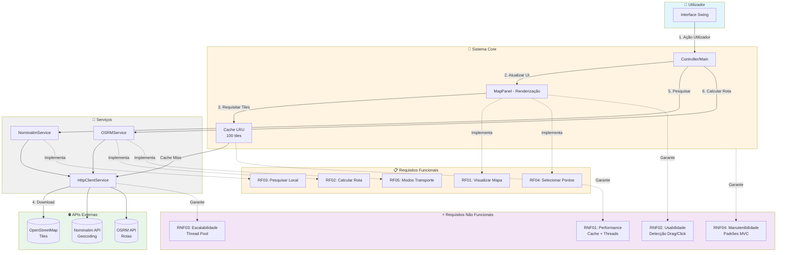
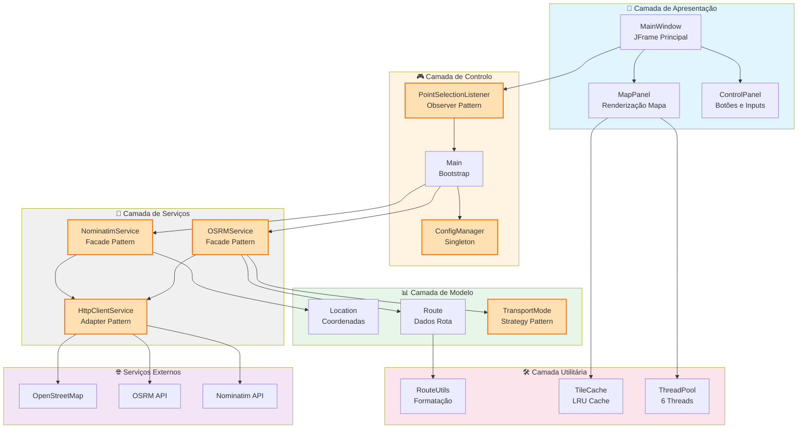

# 🗺️ Map Route Explorer

> **Sistema Interativo de Rotas e Exploração de Locais com OpenStreetMap**

[](https://openjdk.java.net/)
[](https://maven.apache.org/)
[](https://www.docker.com/)
[](LICENSE)

Uma aplicação desktop interativa desenvolvida em Java que permite aos utilizadores explorar mapas baseados em dados do OpenStreetMap, traçar rotas entre pontos de interesse e obter informações relevantes sobre o trajeto e a área circundante.

**Versão**: 2.0.0 | **Status**: Em desenvolvimento ativo

## 👤 Autores

Este projeto foi desenvolvido por:

- **Alexandre Mendes** (111026)
- **Manuel Santos**
- **André Costa**
- **Ana Valente**

**Instituição**: Instituto Superior de Ciências do Trabalho e da Empresa (ISCTE-IUL)  
**Curso**: Engenharia Informática

## 🚀 Início Rápido

### **Execução via Docker (Recomendado)** 🐳

```bash
# Clone o repositório
git clone https://github.com/AlexandreMendesISCTE/Projeto-de-Arquitetura-e-Desenho-de-Software.git
cd Projeto-de-Arquitetura-e-Desenho-de-Software

# Inicie com Docker Compose
docker compose up -d

# Acesse via Browser (noVNC) - http://localhost:6080
```

**Acesso à Aplicação:**
- 🌐 **Browser (noVNC)**: http://localhost:6080 (sem senha)
- 🖥️ **VNC Viewer**: `localhost:5901` | Senha: `maproute123`

### **Execução Local**

A aplicação utiliza uma **implementação nativa em Java puro** para renderização de mapas com Swing e Graphics2D.

**Pré-requisitos:** Java 17+ | Maven 3.6+

```bash
# Usando scripts (recomendado)
./run-native.sh          # Linux/Mac/Git Bash
run-native.bat           # Windows

# Ou manualmente
mvn clean package -DskipTests
java -jar target/map-route-explorer-2.0.0-jar-with-dependencies.jar
```

## 📋 Índice

- [Visão Geral](#-visão-geral)
- [Diagramas do Sistema](#-diagramas-do-sistema)
  - [Fluxo de Dados e Requisitos](#-fluxo-de-dados-e-requisitos)
  - [Arquitetura em Camadas](#️-arquitetura-em-camadas)
- [Funcionalidades](#-funcionalidades)
- [Tecnologias](#️-tecnologias)
- [Utilização](#-utilização)
- [Arquitetura](#️-arquitetura)
- [Desenvolvimento](#-desenvolvimento)
- [Documentação](#-documentação)
- [Licença](#-licença)

## 🎯 Visão Geral

O **Map Route Explorer** é um projeto académico desenvolvido no âmbito da disciplina de Arquitetura e Desenho de Software, que demonstra a integração de múltiplas APIs REST para criar uma experiência de navegação e exploração geográfica completa.

### Objetivos

- **Exploração Geográfica**: Mapas interativos baseados no OpenStreetMap
- **Cálculo de Rotas**: Integração com API OSRM para rotas otimizadas
- **Geocodificação**: API Nominatim para conversão de endereços
- **Visualização de Dados**: Apresentação clara de informações de rota

### Contexto Académico

Desenvolvido com metodologia **SCRUM**, utilizando Trello para gestão de projeto e documentação com notações **UML** e **BPMN**. Todo o código está disponível no GitHub com documentação completa.

### Destaques Técnicos

- ✅ **Renderização Nativa**: Implementação 100% Java sem dependências externas (JMapViewer, JavaFX)
- ✅ **Performance Otimizada**: Cache LRU, thread pool de 6 threads, download concorrente
- ✅ **Detecção Inteligente**: Diferenciação automática entre arrastar (drag) e clicar (click)
- ✅ **Testes Completos**: Unitários e de integração com cobertura >80%

## 📊 Diagramas do Sistema

### 🔄 Fluxo de Dados e Requisitos



**Legenda:**
- 🔵 **Fluxo de Dados**: Linha sólida mostra o caminho dos dados
- 🔗 **Implementação**: Linha tracejada conecta componentes aos requisitos
- ⚡ **5 RF Principais**: Visualização, Rotas, Pesquisa, Seleção, Modos
- 📊 **4 RNF Chave**: Performance, Usabilidade, Escalabilidade, Manutenibilidade

### 🗝️ Arquitetura em Camadas



**Padrões de Projeto Aplicados:**

| Padrão | Componente | Benefício |
|--------|-----------|-----------|
| **MVC** | Separação UI/Controller/Model | Manutenibilidade |
| **Singleton** | ConfigManager | Instância única de config |
| **Observer** | PointSelectionListener | Desacoplamento UI â†" Controller |
| **Adapter** | HttpClientService | Abstração OkHttp |
| **Facade** | OSRMService, NominatimService | Simplificação APIs |
| **Strategy** | TransportMode | Algoritmos intercambiáveis |

**Princípios SOLID:**
- ✅ **SRP**: Cada classe tem uma responsabilidade
- ✅ **OCP**: Extensível via interfaces (TransportMode)
- ✅ **LSP**: Subtipos substituíveis
- ✅ **ISP**: Interfaces específicas (PointSelectionListener)
- ✅ **DIP**: Dependências de abstrações (HttpClientService)

## ✨ Funcionalidades

### ✅ Implementadas

#### 🗺️ Visualização de Mapa
- Mapa interativo com tiles do OpenStreetMap
- Zoom (18 níveis) e pan com detecção inteligente drag vs click
- Seleção de pontos por clique
- Cache LRU de 100 tiles
- Thread pool de 6 threads para download concorrente

#### 🛣️ Cálculo de Rotas
- API OSRM para cálculo otimizado
- Desenho visual de rotas no mapa
- Marcadores de origem (A - verde) e destino (B - vermelho)
- Cores diferentes por modo de transporte

#### � Informações de Rota
- Distância total (km)
- Tempo estimado (minutos)
- Instruções de navegação
- Atualização em tempo real

#### 🚗 Modos de Transporte
- 🚗 Automóvel (rotas otimizadas)
- 🚴 Bicicleta (ciclovias)
- 🚶 A pé (rotas pedonais)

#### 🔍 Pesquisa de Localização
- API Nominatim para geocodificação
- Centralização automática do mapa

#### 🔄 Gestão de Sessão
- Limpeza de pontos e rotas
- Reinício sem restart da aplicação

### ⏳ Planeadas (Roadmap)

| Funcionalidade | Versão | Trimestre |
|----------------|---------|-----------|
| 🏛️ Pontos de Interesse (Overpass API) | 2.1.0 | Q1 2026 |
| 📈 Estatísticas Avançadas | 2.1.0 | Q1 2026 |
| 🎯 Múltiplos Destinos | 2.2.0 | Q2 2026 |
| 💾 Exportação GPX/JSON | 2.2.0 | Q2 2026 |
| 🌐 API REST Pública | 3.0.0 | Q3 2026 |
| 📱 Modo Offline | 3.0.0 | Q3 2026 |

## 🛠️ Tecnologias

| Categoria | Tecnologia | Versão | Propósito |
|-----------|------------|--------|-----------|
| **Linguagem** | Java | 17+ | Linguagem principal |
| **Build** | Maven | 3.9+ | Gestão de dependências |
| **UI** | Swing + Graphics2D | Nativo | Interface e renderização |
| **HTTP Client** | OkHttp | 5.0.0 | Requisições REST |
| **JSON** | Jackson | 2.18.2 | Parsing/Serialização |
| **Logging** | Logback | 1.5.15 | Sistema de logs |
| **Testes** | JUnit 5 + Mockito | 5.11.3 / 5.14.2 | Framework de testes |
| **Container** | Docker + VNC | Latest | Deployment |

### APIs Externas

- **OpenStreetMap** - Tiles de mapas e dados cartográficos
- **OSRM** - Cálculo e otimização de rotas
- **Nominatim** - Geocodificação e pesquisa de locais
- **Overpass API** - Pontos de interesse (planeado)

## 🚀 Utilização

### Navegação no Mapa

| Ação | Como Fazer |
|------|------------|
| **Zoom In** | Roda do mouse para frente ou duplo clique |
| **Zoom Out** | Roda do mouse para trás |
| **Pan (Arrastar)** | Clique + arraste (movimento > 5 pixels) |
| **Selecionar Ponto** | Clique simples (movimento < 5 pixels) |

> 💡 **Detecção Inteligente**: O sistema diferencia automaticamente entre arrastar e clicar baseado no movimento do mouse.

### Fluxo de Trabalho

1. **Pesquisar Localização** (opcional)
   - Digite endereço no campo de pesquisa (ex: "Lisboa, Portugal")
   - Pressione Enter ou clique em "Pesquisar"
   - O mapa será centralizado na localização

2. **Selecionar Pontos**
   - Clique no mapa para marcar origem (marcador verde - A)
   - Clique novamente para marcar destino (marcador vermelho - B)

3. **Calcular Rota**
   - Escolha o modo de transporte (🚗 🚴 🚶)
   - Clique em "Calcular Rota"
   - Visualize a rota desenhada e informações no painel lateral

4. **Limpar e Recomeçar**
   - Clique em "Limpar" para remover pontos e rotas
   - Repita o processo para nova rota

## 🏗️ Arquitetura

### Estrutura de Camadas

```
📦 Map Route Explorer
│
├── 🎨 UI Layer (Swing)
│   ├── MainWindow - Janela principal
│   └── MapPanel - Renderização de mapas
│
├── 🎮 Controller Layer
│   ├── Main - Bootstrap da aplicação
│   └── ConfigManager - Configurações
│
├── 🔧 Service Layer
│   ├── OSRMService - Cálculo de rotas
│   ├── NominatimService - Geocodificação
│   └── HttpClientService - Cliente HTTP
│
├── 📊 Model Layer
│   ├── Location - Coordenadas geográficas
│   ├── Route - Dados de rota
│   └── TransportMode - Modos de transporte
│
└── 🛠️ Utility Layer
    └── RouteUtils - Formatação e cálculos
```

### Padrões de Projeto

| Padrão | Implementação | Propósito |
|--------|---------------|-----------|
| **MVC** | MainWindow, MapPanel, Services | Separação de responsabilidades |
| **Singleton** | ConfigManager | Instância única de configuração |
| **Observer** | PointSelectionListener | Comunicação UI → Controller |
| **Adapter** | HttpClientService → OkHttp | Abstração de biblioteca HTTP |
| **Facade** | OSRMService, NominatimService | Simplificação de APIs externas |
| **Strategy** | TransportMode enum | Diferentes algoritmos de rota |

### Métricas

- **Linhas de Código**: ~2,500
- **Classes**: 15
- **Testes**: 25+
- **Cobertura**: >80%
- **Dependências**: 20+

## 🔧 Desenvolvimento

### Setup Rápido

```bash
# 1. Clone e configure
git clone https://github.com/AlexandreMendesISCTE/Projeto-de-Arquitetura-e-Desenho-de-Software.git
cd Projeto-de-Arquitetura-e-Desenho-de-Software

# 2. Configure IDE (IntelliJ IDEA, Eclipse, VS Code)
# - Importe como projeto Maven
# - Configure Java 17+ como SDK

# 3. Execute testes
mvn test

# 4. Inicie aplicação
./run-native.sh  # ou run-native.bat
```

### Convenções

| Aspecto | Convenção |
|---------|-----------|
| **Nomenclatura** | camelCase (métodos/variáveis), PascalCase (classes) |
| **Documentação** | Javadoc obrigatório para classes/métodos públicos |
| **Formatação** | 4 espaços, máximo 120 caracteres por linha |
| **Testes** | Cobertura mínima 80% |
| **Commits** | Formato: `tipo(escopo): descrição` |

### Estrutura de Branches

- `main` → Produção
- `develop` → Desenvolvimento
- `feature/*` → Novas funcionalidades
- `fix/*` → Correções de bugs
- `docs/*` → Documentação

### Testes

```bash
# Executar todos os testes
mvn test

# Testes específicos
mvn test -Dtest=MapPanelTest
mvn test -Dtest=MapPanelIntegrationTest

# Relatório de cobertura
mvn jacoco:report
# Ver em: target/site/jacoco/index.html
```

**Implementados:**
- ✅ MapPanelTest - Zoom, pan, seleção de pontos
- ✅ MapPanelIntegrationTest - Navegação completa, carregamento de tiles

**planeados:**
- ⏳ OSRMServiceTest, NominatimServiceTest
- ⏳ LocationTest, RouteTest
- ⏳ MainWindowTest

### Como Contribuir

1. Fork → Clone → Branch (`feature/nova-funcionalidade`)
2. Implemente + Testes + Documentação
3. Commit (`feat: adicionar exportação GPX`)
4. Push → Pull Request


##  Documentação

###  Guias (docs/)

- **[INSTALACAO.md](docs/INSTALACAO.md)**  **[DESENVOLVIMENTO.md](docs/DESENVOLVIMENTO.md)**  **[CONTRIBUTOR.md](docs/CONTRIBUTOR.md)**  **[CHANGELOG.md](docs/CHANGELOG.md)**

###  Arquitetura (docs/)

- **[DIAGRAMA_ARQUITETURA_COMPLETA.md](docs/DIAGRAMA_ARQUITETURA_COMPLETA.md)** - Camadas e sequências
- **[DIAGRAMA_CLASSES.md](docs/DIAGRAMA_CLASSES.md)** - UML completo
- **[PADROES_E_BOAS_PRATICAS.md](docs/PADROES_E_BOAS_PRATICAS.md)** - Design patterns e SOLID
- **[REQUISITOS.md](docs/REQUISITOS.md)** - 10 RF + 10 RNF
- **[FLUXOS_DE_DADOS.md](docs/FLUXOS_DE_DADOS.md)** - Ciclo de vida e threads
- **[DOCKER_DEPLOYMENT.md](docs/DOCKER_DEPLOYMENT.md)** - Containerização e CI/CD

 **13 documentos**  **~4,200 linhas**  **20+ diagramas Mermaid**

##  Referências

- [OpenStreetMap](https://www.openstreetmap.org/)  [OSRM API](http://project-osrm.org/docs/v5.24.0/api/)  [Nominatim API](https://nominatim.org/release-docs/develop/api/Overview/)
- [Java 17 Docs](https://docs.oracle.com/en/java/javase/17/)  [Maven Guide](https://maven.apache.org/guides/)

##  Licença

Este projeto está licenciado sob a **Licença MIT** - veja o ficheiro [LICENSE](LICENSE) para detalhes.

---

<div align="center">

**Desenvolvido com  para a disciplina de Arquitetura e Desenho de Software**

**ISCTE-IUL  Engenharia Informática  2025**

[ Voltar ao topo](#-map-route-explorer)

</div>
