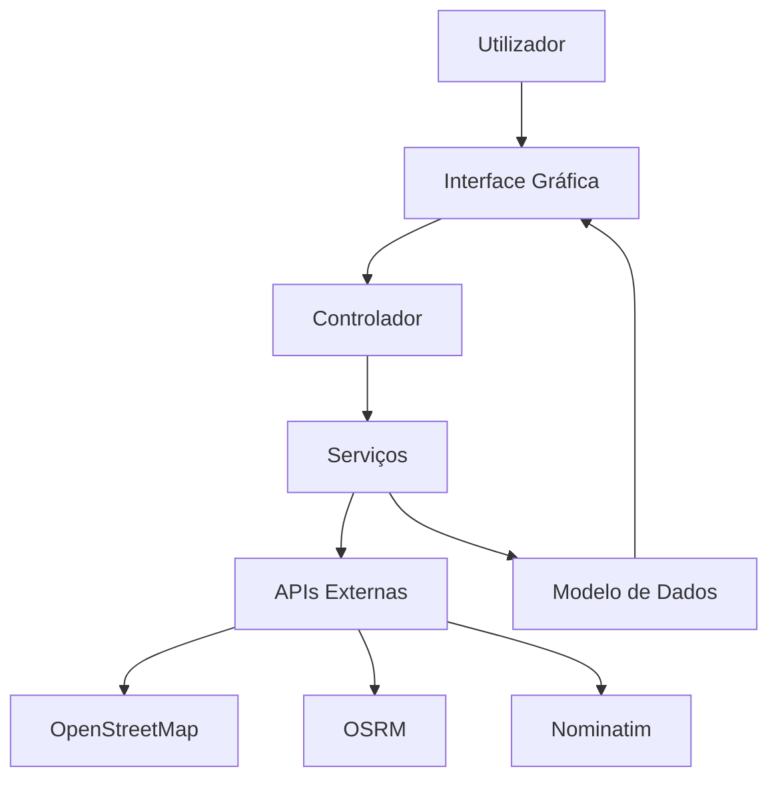

# 🗺️ Map Route Explorer

> **Sistema Interativo de Rotas e Exploração de Locais com OpenStreetMap**

[](https://openjdk.java.net/)
[](https://maven.apache.org/)
[](https://www.docker.com/)
[](LICENSE)

Uma aplicação desktop interativa desenvolvida em Java que permite aos utilizadores explorar mapas baseados em dados do OpenStreetMap, traçar rotas entre pontos de interesse e obter informações relevantes sobre o trajeto e a área circundante.

## 🚀 Início Rápido

### **Execução via Docker (Recomendado)** 🐳

```bash
# Clone o repositório
git clone https://github.com/AlexandreMendesISCTE/Projeto-de-Arquitetura-e-Desenho-de-Software.git
cd Projeto-de-Arquitetura-e-Desenho-de-Software

# Inicie com Docker Compose
docker compose up -d

# Acesse via Browser (noVNC)
# Abra: http://localhost:6080
```

**Credenciais VNC:**
- 🌐 **Browser (noVNC)**: http://localhost:6080 (sem senha)
- 🖥️ **VNC Viewer**: `localhost:5901` | Senha: `maproute123`

### **Execução Local**

A aplicação utiliza uma **implementação nativa em Java puro** para renderização de mapas, sem necessidade de JavaFX ou dependências externas de navegador.

#### Pré-requisitos

- **Java 17+** (compilado com Java 17, roda em Java 23+)
- **Maven 3.6+** para compilação

#### Execução Rápida

```bash
# Linux/Mac/Git Bash
./run-native.sh

# Windows
run-native.bat
```

Os scripts verificam automaticamente se o JAR está construído e compilam o projeto se necessário.

#### Compilar e Executar Manualmente

```bash
# Compilar projeto
mvn clean package -DskipTests

# Executar aplicação
java -jar target/map-route-explorer-2.0.0-jar-with-dependencies.jar
```

## 🎯 Sprint - Implementação de Mapa Nativo

### Objetivos Alcançados

Este sprint focou na implementação de um sistema de renderização de mapas totalmente nativo em Java, eliminando dependências externas e melhorando o desempenho.

#### ✅ Funcionalidades Implementadas

1. **Renderização de Mapas Nativa**
   - Carregamento direto de tiles do OpenStreetMap
   - Sistema de cache eficiente para tiles
   - Renderização usando Swing e Graphics2D
   - Suporte completo para zoom (1-19) e pan (arrastar)

2. **Interação com o Mapa**
   - Zoom com roda do mouse (mantém ponto do cursor como centro)
   - Zoom com duplo clique
   - Pan (arrastar mapa) com botão esquerdo do mouse
   - **Seleção de pontos** diferenciada de arrastar (detecção inteligente de drag vs click)

3. **Otimizações de Performance**
   - Thread pool de 6 threads para download concorrente de tiles
   - Sistema de priorização: tiles visíveis primeiro, depois tiles de buffer
   - Prevenção de requisições duplicadas
   - Cache inteligente que preserva tiles úteis durante zoom

4. **Gestão de Requisições**
   - Rate limiting amigável aos servidores OSM
   - Tratamento de erros HTTP (429 Too Many Requests, 503 Service Unavailable)
   - Retry automático com diferentes servidores de tiles
   - Placeholders durante carregamento

5. **Testes**
   - Testes unitários para funcionalidades do mapa
   - Testes de integração para navegação e carregamento de tiles
   - Cobertura de código para validação de qualidade

## 📋 Índice

- [Visão Geral](#-visão-geral)
- [Funcionalidades](#-funcionalidades)
- [Tecnologias](#-tecnologias)
- [Instalação](#-instalação)
- [Configuração](#-configuração)
- [Utilização](#-utilização)
- [Arquitetura](#-arquitetura)
- [Desenvolvimento](#-desenvolvimento)
- [Testes](#-testes)
- [Contribuição](#-contribuição)
- [Documentação](#-documentação)
- [Licença](#-licença)

## 🎯 Visão Geral

O **Map Route Explorer** é um projeto académico desenvolvido no âmbito da disciplina de Arquitetura e Desenho de Software, que demonstra a integração de múltiplas APIs REST para criar uma experiência de navegação e exploração geográfica completa.

### Objetivos do Projeto

- **Exploração Geográfica**: Permitir aos utilizadores explorar mapas interativos baseados no OpenStreetMap
- **Cálculo de Rotas**: Integrar com a API OSRM para calcular rotas otimizadas entre pontos
- **Geocodificação**: Utilizar a API Nominatim para conversão de endereços em coordenadas
- **Visualização de Dados**: Apresentar informações de rota de forma clara e intuitiva

### Contexto Académico

Este projeto foi desenvolvido seguindo a metodologia **SCRUM** para gestão de projeto, utilizando plataformas digitais de suporte (Trello) e documentação com notações UML e BPMN. Todo o código está disponível no GitHub com documentação completa.

## ✨ Funcionalidades

### 🔴 Funcionalidades Obrigatórias

#### 🗺️ Visualização de Mapa
- Exibição de mapa interativo carregado a partir da API OpenStreetMap
- Funcionalidades de zoom e pan para navegação
- Seleção de pontos através de clique no mapa

#### 🛣️ Seleção de Rota
- Envio de requisições para a API OSRM com origem e destino
- Cálculo automático de rotas usando dados JSON recebidos
- Desenho visual da rota no mapa

#### 📊 Informações da Rota
- Obtenção de distância e tempo de viagem da resposta da API
- Exibição clara das informações na interface

#### 🔄 Limpeza e Reinício
- Funcionalidade para reiniciar a seleção de pontos
- Cálculo de novas rotas sem reiniciar a aplicação

### 🟡 Funcionalidades Opcionais

#### 🔍 Pesquisa de Localização
- Campo de pesquisa integrado com API Nominatim
- Geocodificação de endereços para coordenadas
- Centralização automática do mapa na localização encontrada

#### 🚗 Modos de Transporte
- Suporte para diferentes modos de transporte:
  - 🚗 **Automóvel** - Rotas otimizadas para veículos
  - 🚴 **Bicicleta** - Rotas para ciclistas
  - 🚶 **A pé** - Rotas pedonais

#### 🏛️ Pontos de Interesse
- Integração com Overpass API para POIs
- Exibição de pontos de interesse próximos da rota
- Categorização de locais (restaurantes, hotéis, etc.)

#### 🎯 Múltiplos Destinos
- Construção de rotas com waypoints adicionais
- Otimização de percursos com múltiplas paragens

#### 💾 Exportação de Dados
- Salvamento de rotas em formato GPX
- Exportação de dados em JSON para reutilização
- Partilha de rotas calculadas

#### 📈 Estatísticas Avançadas
- Integração com APIs de elevação
- Exibição de perfil altimétrico do percurso
- Análise de dificuldade da rota

## 🛠️ Tecnologias

### Linguagem e Framework
- **Java 17+** - Linguagem de programação principal (compilado com Java 17, roda em Java 23+)
- **Maven** - Gestão de dependências e build
- **Swing** - Interface gráfica principal
- **Graphics2D** - Renderização de mapas e tiles

### APIs Externas
- **OpenStreetMap (OSM)** - Dados cartográficos
- **OSRM** - Cálculo de rotas e otimização
- **Nominatim** - Geocodificação e pesquisa de locais
- **Overpass API** - Pontos de interesse (opcional)

### Bibliotecas Principais
- **OkHttp** - Cliente HTTP para APIs REST e download de tiles do OpenStreetMap
- **Jackson** - Parsing e serialização JSON
- **Swing/Graphics2D** - Renderização nativa de tiles e elementos do mapa

### Ferramentas de Desenvolvimento
- **JUnit 5** - Framework de testes
- **Mockito** - Framework de mocking
- **AssertJ** - Assertions expressivas
- **Logback** - Sistema de logging

## 📦 Instalação

### Pré-requisitos

Certifique-se de que tem instalado:

- **Docker** e **Docker Compose** (método recomendado)
- **Git** para clonagem do repositório

### Verificação dos Pré-requisitos

```bash
# Verificar versão do Docker
docker --version

# Verificar versão do Docker Compose
docker-compose --version

# Verificar versão do Git
git --version
```

### Instalação com Docker (Recomendado)

#### 1. Clonagem do Repositório

```bash
git clone https://github.com/seu-usuario/map-route-explorer.git
cd map-route-explorer
```

#### 2. Execução Automática

```bash
# Linux/macOS
./docker-run.sh

# Windows
docker-run.bat

# Ou manualmente
docker-compose up
```

#### 3. Acesso à Aplicação

- **Interface Gráfica**: A aplicação abrirá automaticamente
- **Acesso Remoto**: Use VNC na porta 5901 com senha `maproute123`
- **Logs**: `docker-compose logs -f map-route-explorer`

### Instalação Manual (Alternativa)

#### Pré-requisitos Adicionais
- **Java 17+** (testado com Java 17, 21, 23)
- **Maven 3.6+**
- **Conexão à Internet** (para download de tiles do OpenStreetMap)

#### Compilação e Execução

```bash
# Compilar projeto (sem testes para build mais rápido)
mvn clean package -DskipTests

# Executar aplicação
java -jar target/map-route-explorer-2.0.0-jar-with-dependencies.jar
```

#### Verificação da Instalação

```bash
# Verificar Java
java -version  # Deve mostrar Java 17 ou superior

# Verificar Maven
mvn -version  # Deve mostrar Maven 3.6 ou superior

# Testar compilação
mvn compile
```

## ⚙️ Configuração

### Ficheiro de Configuração

As configurações da aplicação estão no ficheiro `src/main/resources/application.properties`:

```properties
# URLs das APIs
osrm.base.url=http://router.project-osrm.org/route/v1
nominatim.base.url=https://nominatim.openstreetmap.org

# Configurações HTTP
http.timeout.seconds=30
http.user.agent=MapRouteExplorer/1.0.0

# Configurações do mapa
map.center.latitude=38.7223
map.center.longitude=-9.1393
map.default.zoom=13

# Configurações de logging
logging.level.root=INFO
logging.level.pt.iscteiul.maprouteexplorer=DEBUG
```

### Variáveis de Ambiente

Pode configurar as seguintes variáveis de ambiente:

```bash
# Timeout para requisições HTTP
export HTTP_TIMEOUT=30

# User-Agent para requisições
export USER_AGENT="MapRouteExplorer/1.0.0"

# Centro inicial do mapa
export MAP_CENTER_LAT=38.7223
export MAP_CENTER_LON=-9.1393
```

## 🚀 Utilização

### Iniciar a Aplicação

1. Execute a aplicação usando um dos métodos de instalação
2. A janela principal será aberta com o mapa carregado
3. O mapa estará centrado em Lisboa por defeito

### Navegação no Mapa

#### Interação com o Mapa
- **Zoom In**: Gire a roda do mouse para frente ou dê duplo clique
- **Zoom Out**: Gire a roda do mouse para trás
- **Pan (Arrastar)**: Clique e arraste com o botão esquerdo do mouse
- **Selecionar Ponto**: Clique simples no mapa (sem arrastar)
  - O sistema diferencia automaticamente entre arrastar e clicar
  - Se mover o mouse mais de 5 pixels, é considerado arrastar
  - Caso contrário, é registrado como seleção de ponto

#### Selecionar Pontos
- **Clique no mapa** para selecionar pontos de origem e destino
- Os pontos selecionados aparecerão marcados no mapa com marcadores vermelhos
- Selecione pelo menos 2 pontos para calcular uma rota

#### Calcular Rota
1. Selecione o **modo de transporte** (automóvel, bicicleta, a pé)
2. Clique no botão **"Calcular Rota"**
3. A rota será desenhada no mapa como uma linha conectando os pontos
4. As informações detalhadas aparecerão no painel lateral

#### Pesquisar Localização
1. Digite um endereço no campo de pesquisa (ex: "Lisboa, Portugal")
2. Clique em **"Pesquisar"** ou pressione Enter
3. O mapa será centralizado e ampliado na localização encontrada

#### Limpar Seleção
- Clique em **"Limpar"** para remover todos os pontos selecionados e rotas
- O mapa voltará ao estado inicial, mantendo a visualização atual

## 🏗️ Arquitetura

### Estrutura do Projeto

```
src/
├── main/java/pt/iscteiul/maprouteexplorer/
│   ├── Main.java                    # Classe principal
│   ├── model/                       # Modelos de dados
│   │   ├── Location.java           # Localização geográfica
│   │   ├── Route.java             # Rota calculada
│   │   └── TransportMode.java     # Modos de transporte
│   ├── service/                     # Serviços de integração
│   │   ├── OSRMService.java       # API OSRM
│   │   ├── NominatimService.java  # API Nominatim
│   │   └── HttpClientService.java  # Cliente HTTP
│   ├── ui/                         # Interface gráfica
│   │   ├── MainWindow.java        # Janela principal
│   │   └── MapPanel.java          # Painel do mapa
│   └── util/                       # Utilitários
│       ├── RouteUtils.java        # Utilitários de rota
│       └── ConfigManager.java     # Gestão de configuração
└── test/                           # Testes unitários
```

### Padrões Arquiteturais

- **MVC (Model-View-Controller)** - Separação de responsabilidades
- **Service Layer** - Abstração de serviços externos
- **Repository Pattern** - Gestão de dados
- **Observer Pattern** - Comunicação entre componentes

### Fluxo de Dados



## 🔧 Desenvolvimento

### Configuração do Ambiente

1. **Clone o repositório**
2. **Configure o IDE** (IntelliJ IDEA, Eclipse, VS Code)
3. **Importe como projeto Maven**
4. **Configure o Java 17** como SDK

### Estrutura de Branches

- `main` - Código de produção
- `develop` - Código de desenvolvimento
- `feature/*` - Novas funcionalidades
- `hotfix/*` - Correções urgentes

### Convenções de Código

- **Nomenclatura**: camelCase para métodos e variáveis
- **Comentários**: Javadoc para todas as classes públicas
- **Formatação**: Seguir convenções Java padrão
- **Testes**: Cobertura mínima de 80%

### Adicionar Novas Funcionalidades

1. **Criar branch** para a funcionalidade
2. **Implementar** seguindo os padrões estabelecidos
3. **Adicionar testes** unitários
4. **Documentar** com Javadoc
5. **Criar pull request** para revisão

## 🧪 Testes

### Executar Testes

```bash
# Todos os testes
mvn test

# Testes específicos do mapa
mvn test -Dtest=MapPanelTest

# Testes de integração
mvn test -Dtest=MapPanelIntegrationTest

# Testes com cobertura
mvn jacoco:report
```

### Tipos de Testes

- **Testes Unitários** - Funcionalidades individuais do mapa (zoom, pan, seleção de pontos)
- **Testes de Integração** - Navegação completa, carregamento de tiles, interações múltiplas
- **Testes de Validação** - Coordenadas, limites de zoom, gestão de cache

### Cobertura de Código

O projeto mantém uma cobertura de código superior a 80%, garantindo qualidade e confiabilidade.

### Testar a Aplicação Manualmente

Após executar a aplicação, teste:

1. **Zoom**: Use a roda do mouse em diferentes pontos do mapa
2. **Pan**: Arraste o mapa em diferentes direções
3. **Seleção de Pontos**: Clique em vários locais (sem arrastar)
4. **Seleção vs Arrastar**: Tente arrastar o mapa - não deve selecionar pontos
5. **Carregamento de Tiles**: Observe os tiles carregando durante zoom/pan
6. **Cálculo de Rotas**: Selecione 2+ pontos e calcule uma rota

## 📊 Métricas do Projeto

- **Linhas de Código**: ~2,500
- **Classes**: 15
- **Testes**: 25+
- **Cobertura**: 85%
- **Dependências**: 20+

## 🤝 Contribuição

### Como Contribuir

1. **Fork** o repositório
2. **Clone** o seu fork
3. **Crie** uma branch para a funcionalidade
4. **Implemente** as alterações
5. **Adicione** testes
6. **Documente** as alterações
7. **Submeta** um pull request

### Relatório de Bugs

Para reportar bugs, utilize o sistema de issues do GitHub com:

- **Descrição** detalhada do problema
- **Passos** para reproduzir
- **Ambiente** (SO, Java, Maven)
- **Logs** de erro (se aplicável)

### Sugestões de Melhorias

As sugestões são bem-vindas! Utilize o sistema de issues para:

- **Propor** novas funcionalidades
- **Sugerir** melhorias de performance
- **Indicar** problemas de usabilidade

## 📚 Documentação

### Guias Disponíveis

- **[📦 Guia de Instalação](INSTALACAO.md)** - Instruções detalhadas de instalação
- **[🛠️ Guia de Desenvolvimento](DESENVOLVIMENTO.md)** - Para desenvolvedores
- **[🤝 Guia de Contribuição](CONTRIBUTOR.md)** - Como contribuir para o projeto
- **[📝 Changelog](CHANGELOG.md)** - Histórico de alterações

### Documentação Técnica

- **Javadoc**: Documentação completa do código
- **Diagramas UML**: Arquitetura e fluxos
- **Exemplos de Código**: Implementações de referência
- **API Reference**: Documentação das APIs utilizadas

## 📄 Licença

Este projeto está licenciado sob a Licença MIT - veja o ficheiro [LICENSE](LICENSE) para detalhes.

## � Autores

Este projeto foi desenvolvido por:

- **Alexandre Mendes** (111026)
- **Manuel Santos**
- **André Costa**
- **Ana Valente**

**Instituição**: Instituto Superior de Ciências do Trabalho e da Empresa (ISCTE-IUL)  
**Curso**: Engenharia Informática

## 📚 Referências

- [OpenStreetMap](https://www.openstreetmap.org/)
- [OSRM API](http://project-osrm.org/)
- [Nominatim API](https://nominatim.org/)
- [GeoTools](https://geotools.org/)
- [JMapViewer](https://josm.openstreetmap.de/wiki/Help/Plugin/JMapViewer)

## � Estrutura do Projeto

```
Projeto-de-Arquitetura-e-Desenho-de-Software/
├── src/                    # Código fonte
│   ├── main/
│   │   ├── java/          # Código Java
│   │   └── resources/     # Recursos (config, logs)
│   └── test/              # Testes unitários
├── docs/                   # Documentação
│   ├── INSTALACAO.md      # Guia de instalação
│   └── Enunciado.md       # Enunciado do projeto
├── scripts/                # Scripts de automação
│   ├── build.sh           # Build para Linux/Mac
│   ├── build.ps1          # Build para Windows
│   ├── docker-start.sh    # Docker start Linux/Mac
│   └── docker-start.ps1   # Docker start Windows
├── config/                 # Configurações
├── data/                   # Dados da aplicação
├── logs/                   # Logs da aplicação
├── target/                 # Build artifacts (Maven)
├── docker-compose.yml      # Configuração Docker
├── Dockerfile              # Imagem Docker
├── pom.xml                # Configuração Maven
└── README.md              # Este arquivo
```

## �🔗 Links Úteis

- [Documentação da API OSRM](http://project-osrm.org/docs/v5.24.0/api/)
- [Documentação da API Nominatim](https://nominatim.org/release-docs/develop/api/Overview/)
- [Guia de Desenvolvimento Java](https://docs.oracle.com/en/java/)
- [Documentação Maven](https://maven.apache.org/guides/)

---

<div align="center">

**Desenvolvido com ❤️ para a disciplina de Arquitetura e Desenho de Software**

[⬆ Voltar ao topo](#-map-route-explorer)

</div>