# 🏗️ Arquitetura e Segurança - Map Route Explorer

## Índice
1. [Visão Geral da Arquitetura](#visão-geral-da-arquitetura)
2. [Diagrama de Contexto (C4 Level 1)](#diagrama-de-contexto-c4-level-1)
3. [Diagrama de Containers (C4 Level 2)](#diagrama-de-containers-c4-level-2)
4. [Diagrama de Componentes (C4 Level 3)](#diagrama-de-componentes-c4-level-3)
5. [Diagrama de Deployment](#diagrama-de-deployment)
6. [Arquitetura de Segurança](#arquitetura-de-segurança)
7. [Fluxo de Dados e Comunicação](#fluxo-de-dados-e-comunicação)
8. [Modelo de Ameaças](#modelo-de-ameaças)

---

## Visão Geral da Arquitetura

O Map Route Explorer é uma aplicação web moderna baseada em arquitetura **SPA (Single Page Application)** com deployment containerizado. A aplicação segue os princípios de:

- **Separação de Responsabilidades**: Frontend, APIs externas e proxy reverso
- **Stateless**: Não mantém estado no servidor
- **API-First**: Integração com múltiplas APIs externas
- **Containerização**: Deploy via Docker com Nginx

### Stack Tecnológico

| Camada | Tecnologia | Propósito |
|--------|------------|-----------|
| Frontend | React 18 + TypeScript | Interface do utilizador |
| Build Tool | Vite 5 | Bundling e dev server |
| State Management | Zustand | Estado global da aplicação |
| Data Fetching | React Query | Cache e sincronização |
| Styling | Tailwind CSS | UI responsiva |
| Maps | Leaflet + React Leaflet | Renderização de mapas |
| Web Server | Nginx Alpine | Servir assets e proxy |
| Container | Docker | Deployment e isolamento |

---

## Diagrama de Contexto (C4 Level 1)

Este diagrama mostra o sistema Map Route Explorer e suas interações com utilizadores e sistemas externos.

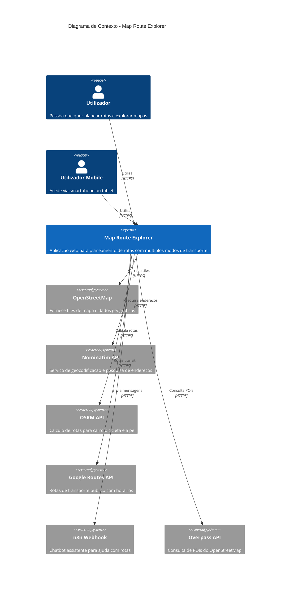

---

## Diagrama de Containers (C4 Level 2)

Este diagrama detalha os containers que compõem o sistema.

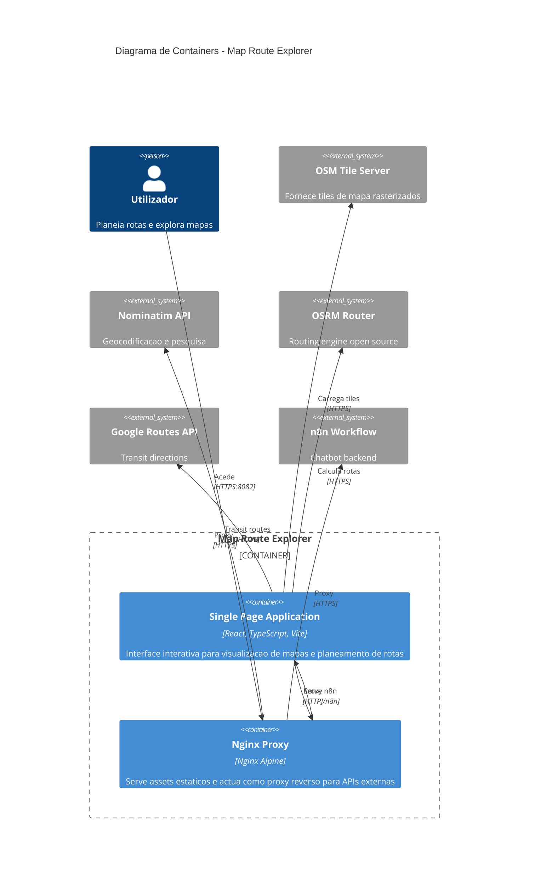

---

## Diagrama de Componentes (C4 Level 3)

Este diagrama mostra os componentes internos da aplicação React.

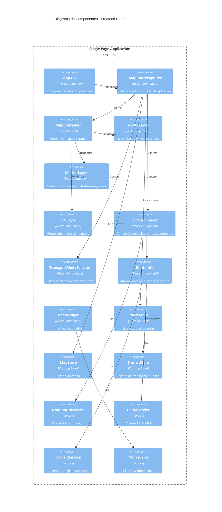

---

## Diagrama de Deployment

```mermaid
C4Deployment
    title Diagrama de Deployment - Producao

    Deployment_Node(browser, "Browser do Utilizador", "Chrome, Firefox, Safari, Edge") {
        Container(client_spa, "SPA React", "JavaScript Bundle", "Aplicacao cliente executada no browser")
    }

    Deployment_Node(docker_host, "Docker Host", "Linux/Windows com Docker") {
        Deployment_Node(docker_network, "Docker Network", "map-route-explorer-network") {
            Deployment_Node(container, "Container Docker", "nginx:alpine") {
                Container(nginx_server, "Nginx", "Web Server", "Serve ficheiros estaticos e proxy reverso")
                Container(static_files, "Static Files", "/usr/share/nginx/html", "Bundle React compilado")
            }
        }
    }

    Deployment_Node(external_apis, "APIs Externas", "Internet") {
        Container(nominatim_ext, "Nominatim", "nominatim.openstreetmap.org", "Geocoding service")
        Container(osrm_ext, "OSRM", "router.project-osrm.org", "Routing service")
        Container(google_ext, "Google Routes", "routes.googleapis.com", "Transit API")
        Container(n8n_ext, "n8n", "yocomsn8n.duckdns.org", "Chatbot webhook")
    }

    Rel(browser, docker_host, "HTTPS", "8082")
    Rel(client_spa, nginx_server, "HTTP Requests")
    Rel(nginx_server, static_files, "Serve")
    Rel(nginx_server, nominatim_ext, "Proxy", "HTTPS")
    Rel(nginx_server, n8n_ext, "Proxy", "HTTPS")
    Rel(client_spa, osrm_ext, "Direct", "HTTPS")
    Rel(client_spa, google_ext, "Direct", "HTTPS")
```

---

## Arquitetura de Segurança

### Diagrama de Segurança - Fluxo de Dados

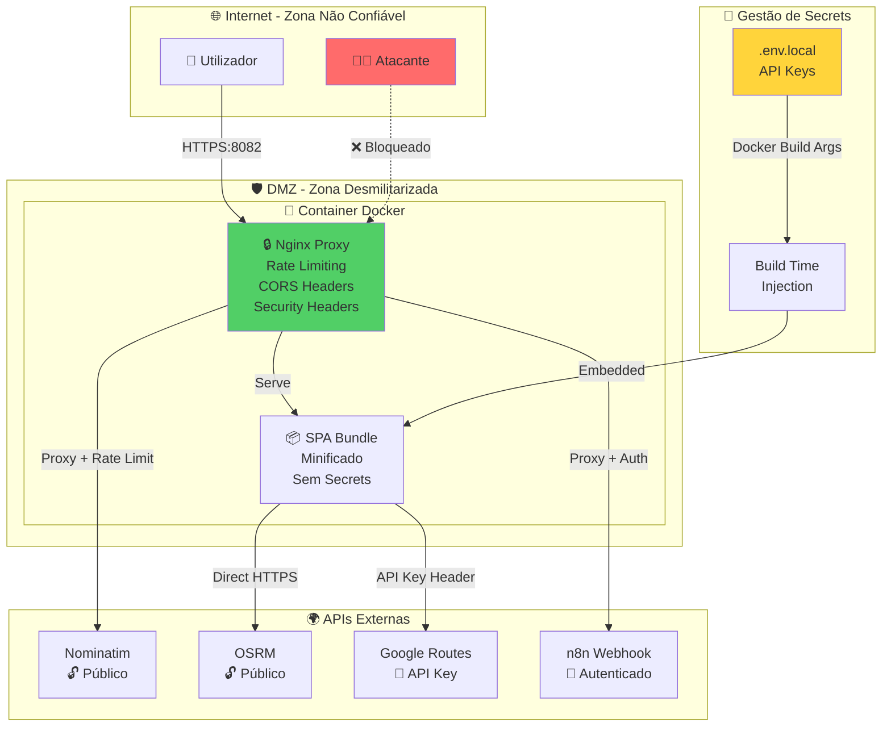

### Controlos de Segurança Implementados

```mermaid
flowchart LR
    subgraph Layer1["Camada 1: Rede"]
        FW["🔥 Docker Network<br/>Isolamento"]
        DNS["🌐 DNS Resolver<br/>8.8.8.8"]
    end

    subgraph Layer2["Camada 2: Transporte"]
        TLS["🔒 HTTPS/TLS<br/>Todas as APIs"]
        HSTS["📜 HSTS Header<br/>Força HTTPS"]
    end

    subgraph Layer3["Camada 3: Aplicação"]
        CORS["🚫 CORS<br/>Whitelist Origins"]
        CSP["🛡️ CSP Headers<br/>Previne XSS"]
        RL["⏱️ Rate Limiting<br/>Previne DoS"]
    end

    subgraph Layer4["Camada 4: Dados"]
        NoStore["💾 No Storage<br/>Stateless"]
        Sanitize["🧹 Input Sanitization<br/>XSS Prevention"]
        APIKeys["🔑 API Keys<br/>Build-time Only"]
    end

    Layer1 --> Layer2 --> Layer3 --> Layer4
```

---

## Fluxo de Dados e Comunicação

### Fluxo de Cálculo de Rota

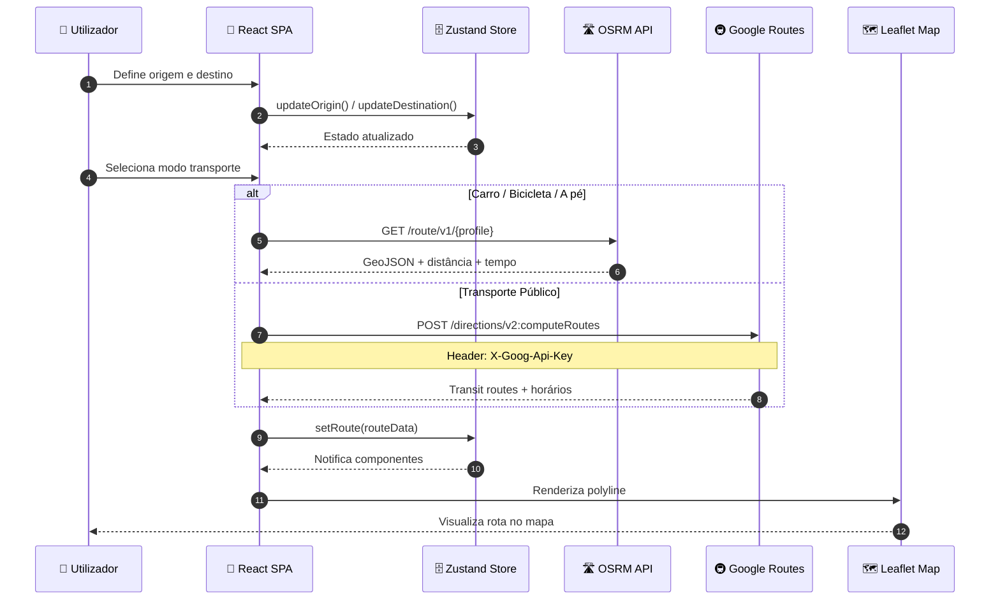

### Fluxo de Pesquisa de Localização

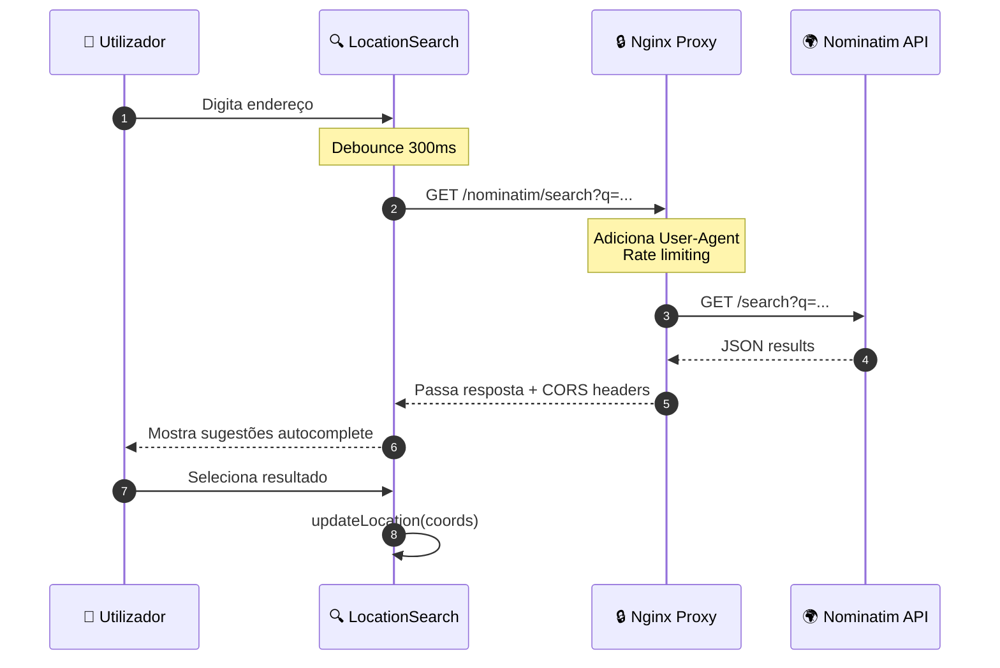

### Fluxo de Segurança - API Key Protection

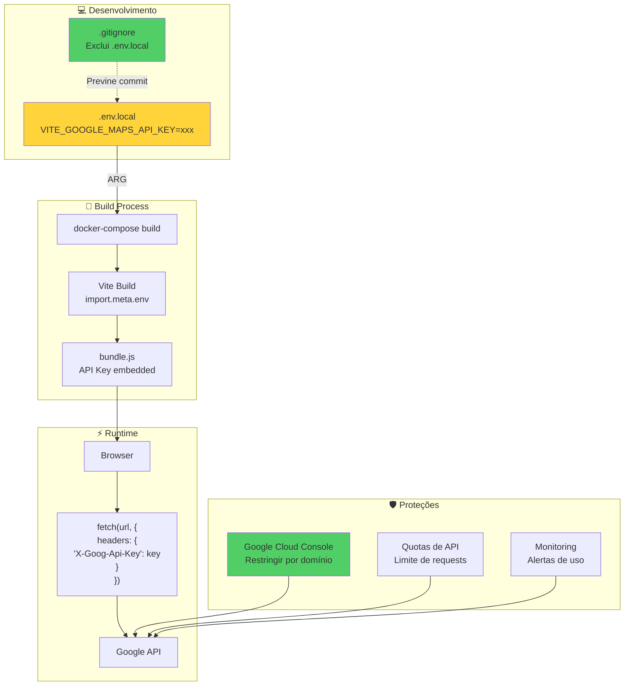

---

## Modelo de Ameaças

### Matriz de Ameaças STRIDE

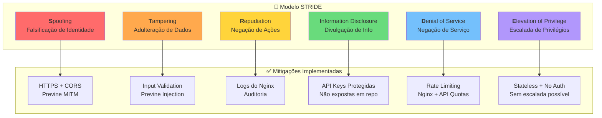

### Superfície de Ataque

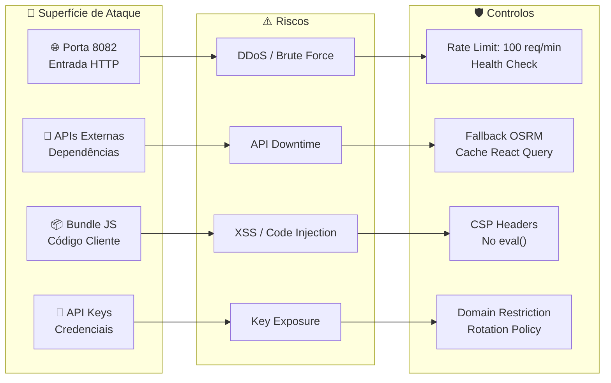

---

## Configuração de Segurança do Nginx

### Headers de Segurança Recomendados

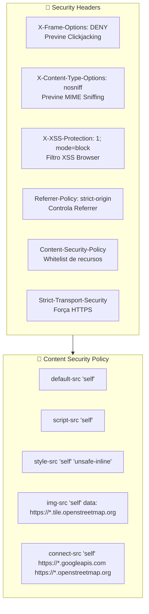

---

## Checklist de Segurança

### Controlos Implementados ✅

| Controlo | Status | Descrição |
|----------|--------|-----------|
| HTTPS para APIs | ✅ | Todas as comunicações encriptadas |
| CORS configurado | ✅ | Nginx adiciona headers apropriados |
| API Keys em .env | ✅ | Não commitadas no repositório |
| .gitignore | ✅ | Exclui ficheiros sensíveis |
| Rate Limiting | ✅ | Nginx limita requests |
| Health Check | ✅ | Docker health check configurado |
| Gzip Compression | ✅ | Reduz bandwidth |
| Cache Headers | ✅ | Assets com cache longo |
| No Server Version | ✅ | Nginx não expõe versão |
| DNS Resolver | ✅ | Usa Google DNS (8.8.8.8) |

### Controlos Recomendados 🔜

| Controlo | Prioridade | Descrição |
|----------|------------|-----------|
| WAF | Alta | Web Application Firewall |
| CSP Headers | Alta | Content Security Policy |
| API Key Rotation | Média | Rotação periódica de keys |
| Audit Logs | Média | Centralização de logs |
| Penetration Testing | Baixa | Testes de segurança |

---

## Resumo da Arquitetura

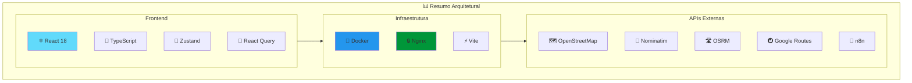

---

*Documento de Arquitetura e Segurança - Map Route Explorer v3.0*  
*Gerado em 10/12/2025*
