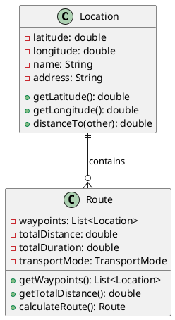
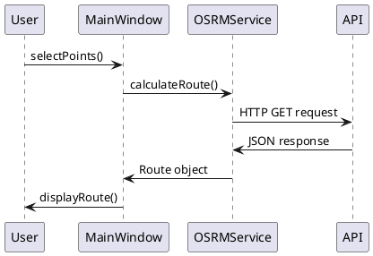

# 🛠️ Guia de Desenvolvimento - Map Route Explorer

Este guia fornece informações detalhadas para desenvolvedores que pretendem contribuir para o projeto Map Route Explorer.

## � Autores

Este projeto foi desenvolvido por:

- **Alexandre Mendes** (111026)
- **Manuel Santos**
- **André Costa**
- **Ana Valente**

**Instituição**: Instituto Superior de Ciências do Trabalho e da Empresa (ISCTE-IUL)  
**Curso**: Engenharia Informática

## �📋 Índice

- [Configuração do Ambiente](#-configuração-do-ambiente)
- [Estrutura do Projeto](#-estrutura-do-projeto)
- [Convenções de Código](#-convenções-de-código)
- [Fluxo de Desenvolvimento](#-fluxo-de-desenvolvimento)
- [Testes](#-testes)
- [Documentação](#-documentação)
- [Debugging](#-debugging)
- [Performance](#-performance)
- [Segurança](#-segurança)

## 🔧 Configuração do Ambiente

### Pré-requisitos para Desenvolvimento

| Ferramenta | Versão | Propósito |
|------------|--------|-----------|
| **Docker** | 24.0+ | Containerização (recomendado) |
| **Docker Compose** | 2.23+ | Orquestração de containers |
| **Git** | 2.43+ | Controlo de versões |
| **IDE** | Qualquer | Desenvolvimento |
| **Java** | 17+ | Linguagem principal (para desenvolvimento local) |
| **Maven** | 3.9+ | Build e dependências (para desenvolvimento local) |

### Desenvolvimento com Docker

#### Configuração Inicial

```bash
# Clonar repositório
git clone https://github.com/AlexandreMendesISCTE/Projeto-de-Arquitetura-e-Desenho-de-Software.git
cd Projeto-de-Arquitetura-e-Desenho-de-Software

# Tornar scripts executáveis
chmod +x docker-run.sh

# Executar aplicação
./docker-run.sh
```

#### Comandos Docker Úteis

```bash
# Construir imagem
docker-compose build

# Executar aplicação
docker-compose up

# Executar em background
docker-compose up -d

# Parar aplicação
docker-compose down

# Ver logs
docker-compose logs -f map-route-explorer

# Aceder ao container
docker-compose exec map-route-explorer bash

# Limpar recursos
docker-compose down -v
docker system prune -f
```

#### Desenvolvimento com Hot Reload

```yaml
# docker-compose.dev.yml
version: '3.9'
services:
  map-route-explorer:
    build: .
    volumes:
      - ./src:/app/src
      - ./target:/app/target
    environment:
      - JAVA_OPTS=-Xmx1g -Xms512m -Djava.awt.headless=false
    ports:
      - "5900:5900"
```

### Configuração do IDE

#### IntelliJ IDEA

1. **Configurações Recomendadas**
   ```properties
   # File → Settings → Editor → Code Style → Java
   - Tab size: 4
   - Indent: 4
   - Continuation indent: 8
   - Wrapping: Wrap if long
   ```

2. **Plugins Essenciais**
   - Lombok
   - Maven Helper
   - SonarLint
   - CheckStyle-IDEA

3. **Configuração de Run/Debug**
   ```xml
   <!-- Run Configuration -->
   Main class: pt.iscteiul.maprouteexplorer.Main
   VM options: -Xmx2g -Xms1g
   Program arguments: (vazio)
   ```

#### Eclipse

1. **Configurações de Formatação**
   ```properties
   # Window → Preferences → Java → Code Style → Formatter
   - Tab policy: Spaces only
   - Tab size: 4
   - Indentation size: 4
   ```

2. **Plugins Recomendados**
   - M2E (Maven Integration)
   - Checkstyle
   - SpotBugs

#### Visual Studio Code

1. **Extensões Essenciais**
   ```json
   {
     "recommendations": [
       "vscjava.vscode-java-pack",
       "vscjava.vscode-maven",
       "redhat.java",
       "gabrielbb.vscode-lombok"
     ]
   }
   ```

2. **Configurações**
   ```json
   {
     "java.configuration.updateBuildConfiguration": "automatic",
     "java.compile.nullAnalysis.mode": "automatic",
     "java.format.settings.url": "https://raw.githubusercontent.com/google/styleguide/gh-pages/eclipse-java-google-style.xml"
   }
   ```

## 📁 Estrutura do Projeto

### Organização de Pacotes

```
src/main/java/pt/iscteiul/maprouteexplorer/
├── Main.java                          # Ponto de entrada
├── model/                              # Modelos de domínio
│   ├── Location.java                  # Entidade geográfica
│   ├── Route.java                     # Entidade de rota
│   └── TransportMode.java             # Enum de transporte
├── service/                            # Camada de serviços
│   ├── OSRMService.java               # Serviço OSRM
│   ├── NominatimService.java          # Serviço Nominatim
│   ├── HttpClientService.java         # Interface HTTP
│   ├── OkHttpClientService.java       # Implementação HTTP
│   └── exceptions/                    # Exceções de serviços
│       ├── OSRMException.java         # Exceção OSRM
│       └── NominatimException.java    # Exceção Nominatim
├── ui/                                 # Interface gráfica
│   ├── MainWindow.java                # Janela principal
│   ├── MapPanel.java                  # Painel do mapa
│   └── PointSelectionListener.java    # Interface de eventos
└── util/                               # Utilitários
    ├── RouteUtils.java                # Utilitários de rota
    └── ConfigManager.java             # Gestão de configuração
```

### Estrutura de Testes

> **✅ Implementação Atual**: O projeto possui testes unitários e de integração para funcionalidades do mapa, incluindo zoom, pan, seleção de pontos e carregamento de tiles.

```
src/test/java/pt/iscteiul/maprouteexplorer/
├── model/
│   ├── LocationTest.java              # Testes de Location (planeado)
│   ├── RouteTest.java                 # Testes de Route (planeado)
│   └── TransportModeTest.java         # Testes de TransportMode (planeado)
├── service/
│   ├── OSRMServiceTest.java           # Testes de OSRM (planeado)
│   ├── NominatimServiceTest.java      # Testes de Nominatim (planeado)
│   └── HttpClientServiceTest.java     # Testes de HTTP (planeado)
├── ui/
│   ├── MainWindowTest.java            # Testes de UI (planeado)
│   ├── MapPanelTest.java              # ✅ Testes de mapa (implementado)
│   └── MapPanelIntegrationTest.java   # ✅ Testes de integração (implementado)
└── util/
    ├── RouteUtilsTest.java            # Testes de utilitários (planeado)
    └── ConfigManagerTest.java         # Testes de configuração (planeado)
```

**Testes Implementados:**
- ✅ `MapPanelTest`: Testes unitários de zoom, pan e seleção de pontos
- ✅ `MapPanelIntegrationTest`: Testes de integração para navegação completa no mapa
- ✅ Cobertura de diferenciação entre arrastar (drag) e clicar (click)
- ✅ Validação de coordenadas e limites de zoom

## 📝 Convenções de Código

### Nomenclatura

#### Classes e Interfaces
```java
// ✅ Correto
public class LocationService { }
public interface HttpClientService { }

// ❌ Incorreto
public class locationService { }
public interface httpClientService { }
```

#### Métodos e Variáveis
```java
// ✅ Correto
public void calculateRoute() { }
private String userName = "admin";

// ❌ Incorreto
public void CalculateRoute() { }
private String user_name = "admin";
```

#### Constantes
```java
// ✅ Correto
public static final String API_BASE_URL = "https://api.example.com";
private static final int MAX_RETRIES = 3;

// ❌ Incorreto
public static final String apiBaseUrl = "https://api.example.com";
```

### Documentação Javadoc

#### Classe
```java
/**
 * Serviço para integração com a API OSRM (Open Source Routing Machine).
 * 
 * Esta classe fornece métodos para calcular rotas, distâncias e tempos
 * de viagem utilizando a API OSRM. Suporta diferentes modos de transporte
 * e permite cálculos de rotas entre múltiplos pontos.
 * 
 * @author Alexandre Mendes
 * @version 1.0.0
 * @since 1.0.0
 */
public class OSRMService {
    // implementação
}
```

#### Método
```java
/**
 * Calcula uma rota entre dois pontos.
 * 
 * @param origin ponto de origem
 * @param destination ponto de destino
 * @param transportMode modo de transporte
 * @return rota calculada
 * @throws IOException se ocorrer erro na comunicação com a API
 * @throws OSRMException se a API retornar erro
 */
public Route calculateRoute(Location origin, Location destination, TransportMode transportMode) 
        throws IOException, OSRMException {
    // implementação
}
```

### Formatação de Código

#### Indentação
```java
// ✅ Correto - 4 espaços
public class Example {
    private String field;
    
    public void method() {
        if (condition) {
            doSomething();
        }
    }
}

// ❌ Incorreto - tabs ou 2 espaços
public class Example {
	private String field;
	
	public void method() {
		if (condition) {
			doSomething();
		}
	}
}
```

#### Quebras de Linha
```java
// ✅ Correto - quebras lógicas
public Route calculateRoute(Location origin, Location destination, 
                          TransportMode transportMode) 
        throws IOException, OSRMException {
    // implementação
}

// ❌ Incorreto - linhas muito longas
public Route calculateRoute(Location origin, Location destination, TransportMode transportMode) throws IOException, OSRMException {
    // implementação
}
```

### Tratamento de Exceções

```java
// ✅ Correto - exceções específicas
try {
    String response = httpClient.get(url);
    return parseResponse(response);
} catch (IOException e) {
    logger.error("Erro de comunicação com a API", e);
    throw new OSRMException("Falha na comunicação", e);
} catch (JSONException e) {
    logger.error("Erro ao processar resposta JSON", e);
    throw new OSRMException("Resposta inválida da API", e);
}

// ❌ Incorreto - captura genérica
try {
    String response = httpClient.get(url);
    return parseResponse(response);
} catch (Exception e) {
    // muito genérico
}
```

## 🔄 Fluxo de Desenvolvimento

### 1. Configuração Inicial

```bash
# Clonar repositório
git clone https://github.com/AlexandreMendesISCTE/Projeto-de-Arquitetura-e-Desenho-de-Software.git
cd Projeto-de-Arquitetura-e-Desenho-de-Software

# Criar branch de desenvolvimento
git checkout -b develop

# Configurar upstream
git remote add upstream https://github.com/AlexandreMendesISCTE/Projeto-de-Arquitetura-e-Desenho-de-Software.git
```

### 2. Ciclo de Desenvolvimento

#### Criar Nova Funcionalidade
```bash
# Criar branch para funcionalidade
git checkout -b feature/nova-funcionalidade

# Desenvolver funcionalidade
# ... código ...

# Adicionar testes
# ... testes ...

# Commit com mensagem descritiva
git add .
git commit -m "feat: adicionar funcionalidade de exportação GPX

- Implementar método exportToGPX() na classe Route
- Adicionar testes unitários para exportação
- Documentar novo método com Javadoc"
```

#### Padrões de Commit

```bash
# Tipos de commit
feat: nova funcionalidade
fix: correção de bug
docs: documentação
style: formatação
refactor: refatoração
test: testes
chore: tarefas de manutenção

# Exemplos
git commit -m "feat: adicionar suporte a múltiplos destinos"
git commit -m "fix: corrigir erro de parsing JSON"
git commit -m "docs: atualizar README com novas instruções"
```

### 3. Processo de Code Review

#### Checklist de Review

- [ ] **Código**
  - [ ] Segue convenções de nomenclatura
  - [ ] Tem documentação Javadoc
  - [ ] Trata exceções adequadamente
  - [ ] Não tem código comentado desnecessário

- [ ] **Testes**
  - [ ] Cobertura adequada (>80%)
  - [ ] Testes unitários passam
  - [ ] Testes de integração passam
  - [ ] Não há testes duplicados

- [ ] **Performance**
  - [ ] Não há vazamentos de memória
  - [ ] Operações I/O são otimizadas
  - [ ] Não há loops infinitos

- [ ] **Segurança**
  - [ ] Validação de entrada
  - [ ] Sanitização de dados
  - [ ] Não expõe informações sensíveis

### 4. Integração Contínua

> **📝 Nota**: A configuração de CI/CD está planeada para implementação futura.

#### Pipeline de CI/CD (planeado)

```yaml
# .github/workflows/ci.yml
name: CI/CD Pipeline

on:
  push:
    branches: [ main, develop ]
  pull_request:
    branches: [ main ]

jobs:
  test:
    runs-on: ubuntu-latest
    steps:
    - uses: actions/checkout@v3
    - name: Set up JDK 17
      uses: actions/setup-java@v3
      with:
        java-version: '17'
        distribution: 'temurin'
    - name: Cache Maven dependencies
      uses: actions/cache@v3
      with:
        path: ~/.m2
        key: ${{ runner.os }}-m2-${{ hashFiles('**/pom.xml') }}
    - name: Run tests
      run: mvn test
    - name: Generate coverage report
      run: mvn jacoco:report
    - name: Upload coverage
      uses: codecov/codecov-action@v3
```

## 🧪 Testes

### Estratégia de Testes

#### Testes Unitários (70%)
```java
@Test
void testCalculateDistance() {
    // Given
    Location lisboa = new Location(38.7223, -9.1393);
    Location porto = new Location(41.1579, -8.6291);
    
    // When
    double distance = lisboa.distanceTo(porto);
    
    // Then
    assertThat(distance).isCloseTo(274.0, within(10.0));
}
```

#### Testes de Integração (20%)
```java
@Test
void testOSRMServiceIntegration() {
    // Given
    OSRMService service = new OSRMService(httpClient);
    Location origin = new Location(38.7223, -9.1393);
    Location destination = new Location(40.4168, -3.7038);
    
    // When
    Route route = service.calculateRoute(origin, destination, TransportMode.DRIVING);
    
    // Then
    assertThat(route).isNotNull();
    assertThat(route.getWaypoints()).hasSize(2);
    assertThat(route.getTotalDistance()).isGreaterThan(0);
}
```

#### Testes de Interface (10%)
```java
@Test
void testMapPanelClick() {
    // Given
    MapPanel panel = new MapPanel();
    PointSelectionListener listener = mock(PointSelectionListener.class);
    panel.setPointSelectionListener(listener);
    
    // When
    panel.handleMapClick(100, 200);
    
    // Then
    verify(listener).onPointSelected(any(Location.class));
}
```

### Configuração de Testes

#### Maven Surefire
```xml
<plugin>
    <groupId>org.apache.maven.plugins</groupId>
    <artifactId>maven-surefire-plugin</artifactId>
    <version>3.5.2</version>
    <configuration>
        <includes>
            <include>**/*Test.java</include>
            <include>**/*Tests.java</include>
        </includes>
        <excludes>
            <exclude>**/*IntegrationTest.java</exclude>
        </excludes>
    </configuration>
</plugin>
```

#### Maven Failsafe
```xml
<plugin>
    <groupId>org.apache.maven.plugins</groupId>
    <artifactId>maven-failsafe-plugin</artifactId>
    <version>3.5.2</version>
    <configuration>
        <includes>
            <include>**/*IntegrationTest.java</include>
        </includes>
    </configuration>
</plugin>
```

### Cobertura de Código

#### JaCoCo Configuration
```xml
<plugin>
    <groupId>org.jacoco</groupId>
    <artifactId>jacoco-maven-plugin</artifactId>
    <version>0.8.8</version>
    <executions>
        <execution>
            <goals>
                <goal>prepare-agent</goal>
            </goals>
        </execution>
        <execution>
            <id>report</id>
            <phase>test</phase>
            <goals>
                <goal>report</goal>
            </goals>
        </execution>
    </executions>
</plugin>
```

## 📚 Documentação

### Javadoc

#### Gerar Documentação
```bash
# Gerar Javadoc
mvn javadoc:javadoc

# Abrir documentação
open target/site/apidocs/index.html
```

#### Configuração Javadoc
```xml
<plugin>
    <groupId>org.apache.maven.plugins</groupId>
    <artifactId>maven-javadoc-plugin</artifactId>
    <version>3.11.2</version>
    <configuration>
        <source>17</source>
        <encoding>UTF-8</encoding>
        <docencoding>UTF-8</docencoding>
        <charset>UTF-8</charset>
        <doclint>none</doclint>
        <additionalJOption>-Xdoclint:none</additionalJOption>
    </configuration>
</plugin>
```

### Documentação Técnica

#### Diagramas UML


#### Diagramas de Sequência


## 🐛 Debugging

### Configuração de Debug

#### IntelliJ IDEA
1. **Configurar Breakpoints**
   - Clique na margem esquerda do editor
   - Configure condições se necessário

2. **Configurar Run/Debug**
   ```xml
   <!-- Run Configuration -->
   Main class: pt.iscteiul.maprouteexplorer.Main
   VM options: -Xdebug -Xrunjdwp:transport=dt_socket,server=y,suspend=n,address=5005
   ```

#### Eclipse
1. **Debug Configuration**
   - Run → Debug Configurations
   - Java Application → New
   - Main class: `pt.iscteiul.maprouteexplorer.Main`

#### VS Code
```json
{
    "version": "0.2.0",
    "configurations": [
        {
            "type": "java",
            "name": "Debug Map Route Explorer",
            "request": "launch",
            "mainClass": "pt.iscteiul.maprouteexplorer.Main",
            "projectName": "map-route-explorer"
        }
    ]
}
```

### Logging para Debug

#### Configuração Logback
```xml
<!-- logback.xml -->
<configuration>
    <appender name="CONSOLE" class="ch.qos.logback.core.ConsoleAppender">
        <encoder>
            <pattern>%d{HH:mm:ss.SSS} [%thread] %-5level %logger{36} - %msg%n</pattern>
        </encoder>
    </appender>
    
    <logger name="pt.iscteiul.maprouteexplorer" level="DEBUG"/>
    <logger name="okhttp3" level="INFO"/>
    
    <root level="INFO">
        <appender-ref ref="CONSOLE"/>
    </root>
</configuration>
```

#### Uso de Logging
```java
public class OSRMService {
    private static final Logger logger = LoggerFactory.getLogger(OSRMService.class);
    
    public Route calculateRoute(Location origin, Location destination, TransportMode mode) {
        logger.debug("Calculando rota de {} para {} usando {}", 
                    origin, destination, mode);
        
        try {
            String url = buildUrl(origin, destination, mode);
            logger.debug("URL da requisição: {}", url);
            
            String response = httpClient.get(url);
            logger.debug("Resposta recebida: {}", response);
            
            return parseResponse(response);
        } catch (Exception e) {
            logger.error("Erro ao calcular rota", e);
            throw new OSRMException("Falha no cálculo da rota", e);
        }
    }
}
```

## ⚡ Performance

### Otimizações de Código

#### Cache de Resultados
```java
public class OSRMService {
    private final Map<String, Route> routeCache = new ConcurrentHashMap<>();
    
    public Route calculateRoute(Location origin, Location destination, TransportMode mode) {
        String cacheKey = generateCacheKey(origin, destination, mode);
        
        return routeCache.computeIfAbsent(cacheKey, key -> {
            logger.debug("Cache miss para chave: {}", key);
            return doCalculateRoute(origin, destination, mode);
        });
    }
}
```

#### Pool de Conexões HTTP
```java
public class OkHttpClientService {
    private final OkHttpClient client;
    
    public OkHttpClientService() {
        this.client = new OkHttpClient.Builder()
                .connectionPool(new ConnectionPool(10, 5, TimeUnit.MINUTES))
                .connectTimeout(30, TimeUnit.SECONDS)
                .readTimeout(30, TimeUnit.SECONDS)
                .writeTimeout(30, TimeUnit.SECONDS)
                .build();
    }
}
```

### Profiling

#### JProfiler
```bash
# Executar com profiling
java -agentpath:/path/to/jprofiler/bin/linux-x64/libjprofilerti.so=port=8849 \
     -jar target/map-route-explorer-1.0.0-jar-with-dependencies.jar
```

#### VisualVM
```bash
# Executar com JMX
java -Dcom.sun.management.jmxremote \
     -Dcom.sun.management.jmxremote.port=9999 \
     -Dcom.sun.management.jmxremote.authenticate=false \
     -Dcom.sun.management.jmxremote.ssl=false \
     -jar target/map-route-explorer-1.0.0-jar-with-dependencies.jar
```

## 🔒 Segurança

### Validação de Entrada

```java
public class Location {
    public Location(double latitude, double longitude) {
        validateCoordinates(latitude, longitude);
        this.latitude = latitude;
        this.longitude = longitude;
    }
    
    private void validateCoordinates(double lat, double lon) {
        if (lat < -90.0 || lat > 90.0) {
            throw new IllegalArgumentException("Latitude deve estar entre -90 e 90");
        }
        if (lon < -180.0 || lon > 180.0) {
            throw new IllegalArgumentException("Longitude deve estar entre -180 e 180");
        }
    }
}
```

### Sanitização de URLs

```java
public class OSRMService {
    private String buildUrl(Location origin, Location destination, TransportMode mode) {
        String baseUrl = ConfigManager.getOSRMBaseUrl();
        String coordinates = String.format("%.6f,%.6f;%.6f,%.6f",
                sanitizeCoordinate(origin.getLongitude()),
                sanitizeCoordinate(origin.getLatitude()),
                sanitizeCoordinate(destination.getLongitude()),
                sanitizeCoordinate(destination.getLatitude()));
        
        return String.format("%s/%s/%s", baseUrl, mode.getApiCode(), coordinates);
    }
    
    private double sanitizeCoordinate(double coordinate) {
        return Math.max(-180, Math.min(180, coordinate));
    }
}
```

### Configuração de Segurança

```properties
# application.properties
# Desabilitar SSL verification apenas para desenvolvimento
http.ssl.verify=false

# Timeout para prevenir ataques de negação de serviço
http.timeout.seconds=30

# Rate limiting
http.rate.limit.requests=100
http.rate.limit.window=60
```

---

<div align="center">

**Desenvolvimento produtivo e de qualidade! 🚀**

[⬆ Voltar ao topo](#-guia-de-desenvolvimento---map-route-explorer)

</div>
