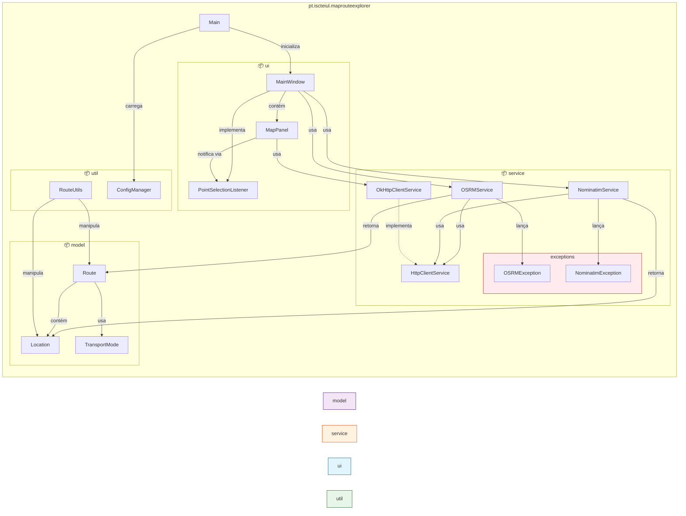

# 🏗️ Diagrama Completo de Arquitetura - Map Route Explorer

**Versão**: 2.0.0  
**Data**: 5 de Novembro de 2025

## 👥 Autores

Este projeto foi desenvolvido por:

- **Alexandre Mendes** (111026)
- **Manuel Santos**
- **André Costa**
- **Ana Valente**

**Instituição**: Instituto Superior de Ciências do Trabalho e da Empresa (ISCTE-IUL)  
**Curso**: Engenharia Informática

---

## 📊 1. Visão Arquitetural Completa do Sistema

Este diagrama apresenta todas as camadas da aplicação, suas responsabilidades e interações.

```mermaid
graph TB
    subgraph "🎯 CAMADA DE APRESENTAÇÃO (UI Layer)"
        UI[MainWindow.java<br/>Janela Principal Swing<br/>Responsável por: Orquestração UI,<br/>Coordenação de eventos,<br/>Gestão de painéis]
        MAP[MapPanel.java<br/>Renderização de Mapas<br/>Graphics2D + Swing<br/>Gestão de Tiles OSM,<br/>Cache LRU 100 tiles,<br/>Zoom 18 níveis, Pan]
        LISTENER[PointSelectionListener.java<br/>Interface Observer<br/>Comunicação UI → Controller]
        
        UI -->|contém| MAP
        MAP -->|notifica via| LISTENER
        LISTENER -->|callback para| UI
    end
    
    subgraph "🎮 CAMADA DE CONTROLO (Controller Layer)"
        MAIN[Main.java<br/>Ponto de Entrada<br/>Inicialização da aplicação,<br/>Bootstrap de serviços,<br/>Configuração Logback]
        CONFIG[ConfigManager.java<br/>Gestão de Configuração<br/>application.properties,<br/>Variáveis de ambiente]
        
        MAIN -->|inicializa| UI
        MAIN -->|carrega| CONFIG
    end
    
    subgraph "💼 CAMADA DE SERVIÇOS (Service Layer)"
        OSRM[OSRMService.java<br/>Integração API OSRM<br/>Cálculo de rotas otimizadas,<br/>Suporte múltiplos modos transporte,<br/>Parsing JSON com Jackson]
        NOMINATIM[NominatimService.java<br/>Integração API Nominatim<br/>Geocodificação endereço → coords,<br/>Pesquisa de localizações,<br/>Rate limiting respeitoso]
        HTTP_INT[HttpClientService.java<br/>Interface Abstrata HTTP<br/>Contrato: get, post<br/>Dependency Injection]
        HTTP_IMPL[OkHttpClientService.java<br/>Implementação OkHttp<br/>Download tiles OSM,<br/>Retry automático,<br/>Tratamento 429/503,<br/>Thread pool 6 threads]
        
        OSRM -->|depende de| HTTP_INT
        NOMINATIM -->|depende de| HTTP_INT
        HTTP_INT <-.implementado por.-|Padrão Strategy| HTTP_IMPL
        
        OSRMException[OSRMException.java<br/>Exceção Específica OSRM]
        NominatimException[NominatimException.java<br/>Exceção Específica Nominatim]
        
        OSRM -->|lança| OSRMException
        NOMINATIM -->|lança| NominatimException
    end
    
    subgraph "🗂️ CAMADA DE MODELO (Domain Layer)"
        LOCATION[Location.java<br/>Entidade Geográfica<br/>latitude, longitude, name, address<br/>distanceTo usando Haversine]
        ROUTE[Route.java<br/>Entidade Agregadora<br/>waypoints, totalDistance,<br/>totalDuration, transportMode<br/>Cálculo de métricas]
        TRANSPORT[TransportMode.java<br/>Enum Strategy Pattern<br/>CAR, BIKE, FOOT<br/>Estratégias de navegação]
        
        ROUTE -->|contém lista de| LOCATION
        ROUTE -->|associado a| TRANSPORT
    end
    
    subgraph "🔧 CAMADA DE UTILITÁRIOS (Utility Layer)"
        UTILS[RouteUtils.java<br/>Utilitários de Cálculo<br/>Distâncias Haversine,<br/>Conversões de unidades,<br/>Formatação de dados]
        
        UTILS -->|usa| LOCATION
        UTILS -->|usa| ROUTE
    end
    
    subgraph "🌐 APIS EXTERNAS (External Systems)"
        OSM_API[OpenStreetMap<br/>Tiles do Mapa<br/>Dados cartográficos<br/>https://tile.openstreetmap.org/]
        OSRM_API[OSRM API<br/>Cálculo de Rotas<br/>Otimização de trajetos<br/>https://router.project-osrm.org/]
        NOMINATIM_API[Nominatim API<br/>Geocodificação<br/>Pesquisa de locais<br/>https://nominatim.openstreetmap.org/]
        
        HTTP_IMPL -->|requisições HTTP| OSM_API
        OSRM -->|requisições REST| OSRM_API
        NOMINATIM -->|requisições REST| NOMINATIM_API
    end
    
    subgraph "📦 RECURSOS (Resources Layer)"
        PROPS[application.properties<br/>Configurações Centralizadas<br/>URLs APIs, timeouts,<br/>configurações padrão mapa]
        LOGBACK[logback.xml<br/>Configuração Logging<br/>Níveis de log, rotação,<br/>formatação de mensagens]
        
        CONFIG -->|carrega| PROPS
        MAIN -->|configura| LOGBACK
    end
    
    subgraph "🧪 CAMADA DE TESTES (Test Layer - planeado)"
        TEST_LOCATION[LocationTest.java<br/>Testes Unitários Location<br/>Validação coordenadas,<br/>Cálculos distância]
        TEST_ROUTE[RouteTest.java<br/>Testes Unitários Route<br/>Validação waypoints,<br/>Métricas de rota]
        TEST_OSRM[OSRMServiceTest.java<br/>Testes Integração OSRM<br/>Mocking HTTP,<br/>Validação JSON parsing]
        TEST_MAP[MapPanelTest.java<br/>Testes Interface<br/>Navegação, zoom,<br/>seleção de pontos]
        
        TEST_LOCATION -.testa.-> LOCATION
        TEST_ROUTE -.testa.-> ROUTE
        TEST_OSRM -.testa.-> OSRM
        TEST_MAP -.testa.-> MAP
    end
    
    %% Conexões entre camadas
    UI -->|usa serviços| OSRM
    UI -->|usa serviços| NOMINATIM
    UI -->|manipula modelo| LOCATION
    UI -->|manipula modelo| ROUTE
    
    OSRM -->|retorna| ROUTE
    NOMINATIM -->|retorna| LOCATION
    
    HTTP_IMPL -->|baixa tiles| MAP
    
    style UI fill:#e1f5ff,stroke:#01579b,stroke-width:3px
    style MAP fill:#e1f5ff,stroke:#01579b,stroke-width:3px
    style OSRM fill:#fff3e0,stroke:#e65100,stroke-width:3px
    style NOMINATIM fill:#fff3e0,stroke:#e65100,stroke-width:3px
    style HTTP_IMPL fill:#fff3e0,stroke:#e65100,stroke-width:3px
    style LOCATION fill:#f3e5f5,stroke:#4a148c,stroke-width:3px
    style ROUTE fill:#f3e5f5,stroke:#4a148c,stroke-width:3px
    style TRANSPORT fill:#f3e5f5,stroke:#4a148c,stroke-width:3px
    style MAIN fill:#e8f5e9,stroke:#1b5e20,stroke-width:3px
    style CONFIG fill:#e8f5e9,stroke:#1b5e20,stroke-width:3px
```

### 📝 Descrição das Camadas

#### 🎯 Camada de Apresentação (UI Layer)
Responsável pela interface gráfica e interação com o utilizador.

- **MainWindow.java**: Janela principal que orquestra toda a interface
- **MapPanel.java**: Painel de renderização do mapa com suporte a tiles OSM
- **PointSelectionListener.java**: Interface Observer para comunicação entre componentes

#### 🎮 Camada de Controlo (Controller Layer)
Responsável pela inicialização e configuração da aplicação.

- **Main.java**: Ponto de entrada da aplicação
- **ConfigManager.java**: Gestão centralizada de configurações

#### 💼 Camada de Serviços (Service Layer)
Responsável pela lógica de negócio e integração com APIs externas.

- **OSRMService.java**: Cálculo de rotas otimizadas
- **NominatimService.java**: Geocodificação e pesquisa de locais
- **HttpClientService.java**: Interface abstrata para cliente HTTP
- **OkHttpClientService.java**: Implementação concreta usando OkHttp

#### 🗂️ Camada de Modelo (Domain Layer)
Responsável pelas entidades de domínio.

- **Location.java**: Representa uma localização geográfica
- **Route.java**: Representa uma rota calculada
- **TransportMode.java**: Define modos de transporte

#### 🔧 Camada de Utilitários (Utility Layer)
Responsável por funções auxiliares e utilitárias.

- **RouteUtils.java**: Cálculos e formatações relacionados a rotas

---

## 🎨 2. Diagrama de Pacotes e Dependências

Este diagrama mostra a organização dos pacotes e suas dependências.



### 📋 Estrutura de Pacotes

```
pt.iscteiul.maprouteexplorer/
├── Main.java                          # Ponto de entrada
├── model/                             # Entidades de domínio
│   ├── Location.java                  # Localização geográfica
│   ├── Route.java                     # Rota calculada
│   └── TransportMode.java             # Modos de transporte
├── service/                           # Serviços de negócio
│   ├── OSRMService.java              # Integração OSRM
│   ├── NominatimService.java         # Integração Nominatim
│   ├── HttpClientService.java        # Interface HTTP
│   ├── OkHttpClientService.java      # Implementação HTTP
│   └── exceptions/                    # Exceções específicas
│       ├── OSRMException.java
│       └── NominatimException.java
├── ui/                                # Interface gráfica
│   ├── MainWindow.java               # Janela principal
│   ├── MapPanel.java                 # Painel do mapa
│   └── PointSelectionListener.java   # Interface Observer
└── util/                              # Utilitários
    ├── RouteUtils.java               # Cálculos de rotas
    └── ConfigManager.java            # Gestão de configuração
```

---

## 🔄 3. Diagrama de Sequência - Fluxo Completo

Este diagrama mostra o fluxo completo de cálculo de uma rota.

```mermaid
sequenceDiagram
    actor User as 👤 Utilizador
    participant UI as MainWindow<br/>(View)
    participant MAP as MapPanel<br/>(View)
    participant LISTENER as PointSelectionListener<br/>(Observer)
    participant OSRM as OSRMService<br/>(Service)
    participant HTTP as OkHttpClientService<br/>(HTTP Client)
    participant API as OSRM API<br/>(External)
    participant MODEL as Route<br/>(Model)
    
    User->>MAP: Clica em origem no mapa
    activate MAP
    MAP->>MAP: Deteta clique (MouseListener)
    MAP->>MAP: Converte pixel → coordenadas
    MAP->>LISTENER: onPointSelected(Location origem)
    deactivate MAP
    
    activate LISTENER
    LISTENER->>UI: Notifica seleção de origem
    deactivate LISTENER
    
    activate UI
    UI->>UI: Armazena origem
    UI->>MAP: Desenha marcador de origem
    deactivate UI
    
    User->>MAP: Clica em destino no mapa
    activate MAP
    MAP->>MAP: Deteta clique (MouseListener)
    MAP->>MAP: Converte pixel → coordenadas
    MAP->>LISTENER: onPointSelected(Location destino)
    deactivate MAP
    
    activate LISTENER
    LISTENER->>UI: Notifica seleção de destino
    deactivate LISTENER
    
    activate UI
    UI->>UI: Armazena destino
    UI->>MAP: Desenha marcador de destino
    UI->>OSRM: calculateRoute(origem, destino, TransportMode.CAR)
    deactivate UI
    
    activate OSRM
    OSRM->>OSRM: Valida coordenadas
    OSRM->>OSRM: Constrói URL API<br/>(lat1,lon1;lat2,lon2)
    OSRM->>HTTP: get(url)
    deactivate OSRM
    
    activate HTTP
    HTTP->>HTTP: Cria requisição HTTP GET
    HTTP->>HTTP: Adiciona headers<br/>(User-Agent, timeout)
    HTTP->>API: Requisição HTTP
    deactivate HTTP
    
    activate API
    API->>API: Calcula rota otimizada<br/>(algoritmo OSRM)
    API->>HTTP: Resposta JSON<br/>{routes, waypoints, distance, duration}
    deactivate API
    
    activate HTTP
    HTTP->>HTTP: Valida status code (200)
    HTTP->>OSRM: Retorna JSON string
    deactivate HTTP
    
    activate OSRM
    OSRM->>OSRM: Parse JSON (Jackson)<br/>ObjectMapper.readValue()
    OSRM->>MODEL: new Route(waypoints, distance, duration)
    activate MODEL
    MODEL->>MODEL: Valida dados
    MODEL->>MODEL: Calcula métricas adicionais
    MODEL->>OSRM: Retorna Route
    deactivate MODEL
    OSRM->>UI: Retorna Route
    deactivate OSRM
    
    activate UI
    UI->>UI: Formata informações<br/>(km, minutos)
    UI->>MAP: Desenha rota no mapa<br/>(polyline Graphics2D)
    UI->>UI: Atualiza painel de info<br/>(distância, tempo)
    UI->>User: Exibe rota calculada
    deactivate UI
```

### 🎬 Descrição do Fluxo

1. **Seleção de Origem**: Utilizador clica no mapa
2. **Conversão de Coordenadas**: Pixel → Latitude/Longitude
3. **Notificação**: Observer notifica MainWindow
4. **Marcador Visual**: Origem marcada no mapa
5. **Seleção de Destino**: Utilizador clica no destino
6. **Cálculo de Rota**: OSRMService constrói requisição
7. **Requisição HTTP**: Enviada para API OSRM
8. **Processamento**: API calcula rota otimizada
9. **Parsing**: JSON convertido em objeto Route
10. **Visualização**: Rota desenhada no mapa
11. **Informações**: Distância e tempo exibidos

---

## 📚 Legenda de Cores

- 🔵 **Azul**: Camada de Apresentação (UI)
- 🟢 **Verde**: Camada de Controlo
- 🟠 **Laranja**: Camada de Serviços
- 🟣 **Roxo**: Camada de Modelo
- 🔴 **Vermelho**: Exceções e Erros

---

## 📖 Referências

- [Main.java](../src/main/java/pt/iscteiul/maprouteexplorer/Main.java)
- [Documentação OSRM](https://project-osrm.org/)
- [Documentação Nominatim](https://nominatim.org/)
- [OpenStreetMap](https://www.openstreetmap.org/)

---

**Documento criado em**: 5 de Novembro de 2025  
**Última atualização**: 5 de Novembro de 2025
