# 📐 Diagrama de Classes Detalhado - Map Route Explorer

**Versão**: 2.0.0  
**Data**: 5 de Novembro de 2025  
**Autor**: Alexandre Mendes (111026)

---

## 🏛️ Diagrama de Classes Completo

Este diagrama apresenta todas as classes do sistema com seus atributos, métodos e relacionamentos.

```mermaid
classDiagram
    %% ========================================
    %% CAMADA DE MODELO
    %% ========================================
    class Location {
        -double latitude
        -double longitude
        -String name
        -String address
        +Location(lat, lon, name, addr)
        +getLatitude() double
        +getLongitude() double
        +getName() String
        +getAddress() String
        +setName(name) void
        +setAddress(address) void
        +distanceTo(Location other) double
        +equals(Object obj) boolean
        +hashCode() int
        +toString() String
    }
    
    class Route {
        -List~Location~ waypoints
        -double totalDistance
        -double totalDuration
        -TransportMode transportMode
        -List~String~ instructions
        +Route(waypoints, distance, duration, mode)
        +getWaypoints() List~Location~
        +getTotalDistance() double
        +getTotalDuration() double
        +getTransportMode() TransportMode
        +getInstructions() List~String~
        +addInstruction(String instruction) void
        +getFormattedDistance() String
        +getFormattedDuration() String
        +toString() String
    }
    
    class TransportMode {
        <<enumeration>>
        CAR
        BIKE
        FOOT
        +getOSRMProfile() String
        +getMaxSpeed() double
        +getDescription() String
    }
    
    Route "1" *-- "2..*" Location : contains
    Route "1" --> "1" TransportMode : uses
    
    %% ========================================
    %% CAMADA DE SERVIÇOS
    %% ========================================
    class OSRMService {
        -HttpClientService httpClient
        -String baseUrl
        -int timeout
        -int maxRetries
        +OSRMService(httpClient)
        +calculateRoute(origin, dest, mode) Route
        +calculateDistanceAndDuration(origin, dest) double[]
        +getRouteInstructions(route) List~String~
        +isServiceAvailable() boolean
        -parseRouteResponse(json) Route
        -buildRequestUrl(origin, dest, mode) String
        -validateCoordinates(location) void
        -decodePolyline(encoded) List~Location~
    }
    
    class NominatimService {
        -HttpClientService httpClient
        -String baseUrl
        -int rateLimit
        -long lastRequestTime
        +NominatimService(httpClient)
        +searchLocation(query) List~Location~
        +reverseGeocode(lat, lon) Location
        +searchNearby(lat, lon, radius) List~Location~
        -parseSearchResponse(json) List~Location~
        -parseReverseResponse(json) Location
        -respectRateLimit() void
        -buildSearchUrl(query) String
    }
    
    class HttpClientService {
        <<interface>>
        +get(url) String
        +post(url, body) String
        +setTimeout(millis) void
        +addHeader(key, value) void
        +getTimeout() int
    }
    
    class OkHttpClientService {
        -OkHttpClient client
        -int timeout
        -Map~String,String~ headers
        -ExecutorService executor
        +OkHttpClientService()
        +get(url) String
        +post(url, body) String
        +downloadTile(x, y, zoom) BufferedImage
        +setTimeout(millis) void
        +addHeader(key, value) void
        +shutdown() void
        -executeRequest(request) Response
        -handleErrorResponse(code) void
        -retryWithBackoff(request, attempt) Response
    }
    
    HttpClientService <|.. OkHttpClientService : implements
    OSRMService --> HttpClientService : depends on
    NominatimService --> HttpClientService : depends on
    OSRMService ..> Route : creates
    NominatimService ..> Location : creates
    
    %% ========================================
    %% EXCEÇÕES
    %% ========================================
    class OSRMException {
        -int statusCode
        -String errorMessage
        -String requestUrl
        +OSRMException(message)
        +OSRMException(message, cause)
        +OSRMException(message, statusCode)
        +getStatusCode() int
        +getRequestUrl() String
    }
    
    class NominatimException {
        -int statusCode
        -String errorMessage
        -String query
        +NominatimException(message)
        +NominatimException(message, cause)
        +NominatimException(message, statusCode)
        +getStatusCode() int
        +getQuery() String
    }
    
    Exception <|-- OSRMException
    Exception <|-- NominatimException
    OSRMService ..> OSRMException : throws
    NominatimService ..> NominatimException : throws
    
    %% ========================================
    %% CAMADA DE UI
    %% ========================================
    class MainWindow {
        -JFrame frame
        -MapPanel mapPanel
        -JTextField searchField
        -JButton calcRouteBtn
        -JButton clearBtn
        -JLabel distanceLabel
        -JLabel durationLabel
        -JComboBox~TransportMode~ transportCombo
        -Location selectedOrigin
        -Location selectedDestination
        -Route currentRoute
        -OSRMService osrmService
        -NominatimService nominatimService
        +MainWindow()
        +show() void
        +hide() void
        -initializeComponents() void
        -setupEventListeners() void
        -setupLayout() void
        +onPointSelected(location) void
        -calculateRoute() void
        -clearSelection() void
        -searchLocation(query) void
        -displayRouteInfo(route) void
        -showError(message) void
    }
    
    class MapPanel {
        -int zoom
        -double centerLat
        -double centerLon
        -int tileSize
        -Map~String,BufferedImage~ tileCache
        -int maxCacheSize
        -ExecutorService tileLoader
        -List~Location~ markers
        -Route currentRoute
        -PointSelectionListener listener
        -Point dragStart
        -boolean isDragging
        +MapPanel()
        +setCenter(lat, lon) void
        +setZoom(level) void
        +zoomIn() void
        +zoomOut() void
        +addMarker(location) void
        +drawRoute(route) void
        +clearMap() void
        +setListener(listener) void
        #paintComponent(g) void
        -loadTile(x, y, zoom) void
        -getCachedTile(key) BufferedImage
        -putCachedTile(key, tile) void
        -latLonToPixel(lat, lon) Point
        -pixelToLatLon(x, y) Location
        -latLonToTile(lat, lon, zoom) Point
        -handleMouseClick(event) void
        -handleMouseDrag(event) void
        -handleMouseWheel(event) void
        -drawMarker(g, location, color, label) void
        -drawPolyline(g, waypoints) void
    }
    
    class PointSelectionListener {
        <<interface>>
        +onPointSelected(location) void
    }
    
    JFrame <|-- MainWindow
    JPanel <|-- MapPanel
    MainWindow ..|> PointSelectionListener : implements
    MainWindow "1" *-- "1" MapPanel : contains
    MapPanel --> PointSelectionListener : notifies
    MainWindow --> OSRMService : uses
    MainWindow --> NominatimService : uses
    MainWindow ..> Route : displays
    MapPanel --> OkHttpClientService : uses for tiles
    MapPanel --> Location : displays
    MapPanel --> Route : displays
    
    %% ========================================
    %% CAMADA DE UTILITÁRIOS
    %% ========================================
    class RouteUtils {
        <<utility>>
        +calculateHaversineDistance(loc1, loc2)$ double
        +formatDistance(meters)$ String
        +formatDuration(seconds)$ String
        +convertToKilometers(meters)$ double
        +convertToMinutes(seconds)$ double
        +convertToMiles(meters)$ double
        +convertToHours(seconds)$ double
        +bearingBetween(loc1, loc2)$ double
    }
    
    class ConfigManager {
        -Properties properties
        -String configFile
        -static ConfigManager instance
        -ConfigManager()
        +getInstance()$ ConfigManager
        +getProperty(key) String
        +getProperty(key, defaultValue) String
        +getIntProperty(key) int
        +getIntProperty(key, defaultValue) int
        +getDoubleProperty(key) double
        +getDoubleProperty(key, defaultValue) double
        +getBooleanProperty(key) boolean
        +getBooleanProperty(key, defaultValue) boolean
        +loadConfiguration() void
        +reloadConfiguration() void
        +setProperty(key, value) void
        +saveConfiguration() void
    }
    
    RouteUtils ..> Location : manipulates
    RouteUtils ..> Route : manipulates
    
    %% ========================================
    %% CLASSE PRINCIPAL
    %% ========================================
    class Main {
        -static Logger logger
        -static ConfigManager config
        -static OSRMService osrmService
        -static NominatimService nominatimService
        +main(args)$ void
        -initializeLogging()$ void
        -loadConfiguration()$ ConfigManager
        -createServices(config)$ void
        -createHttpClient()$ HttpClientService
        -launchGUI()$ void
        -setupShutdownHook()$ void
    }
    
    Main ..> MainWindow : creates
    Main ..> ConfigManager : uses
    Main ..> OSRMService : initializes
    Main ..> NominatimService : initializes
    Main ..> OkHttpClientService : initializes
```

---

## 📋 Descrição Detalhada das Classes

### 🗂️ Camada de Modelo (Model Layer)

#### Location.java
**Propósito**: Representa uma localização geográfica com coordenadas e informações descritivas.

**Atributos**:
- `latitude`: Latitude em graus decimais (-90 a 90)
- `longitude`: Longitude em graus decimais (-180 a 180)
- `name`: Nome descritivo do local
- `address`: Endereço completo formatado

**Métodos Principais**:
- `distanceTo(Location other)`: Calcula distância usando fórmula de Haversine
- `equals(Object obj)`: Comparação baseada em coordenadas
- `hashCode()`: Hash baseado em latitude e longitude

**Responsabilidades**:
- Validação de coordenadas
- Cálculo de distâncias
- Imutabilidade das coordenadas

---

#### Route.java
**Propósito**: Representa uma rota calculada com waypoints e métricas.

**Atributos**:
- `waypoints`: Lista ordenada de pontos da rota
- `totalDistance`: Distância total em metros
- `totalDuration`: Tempo total em segundos
- `transportMode`: Modo de transporte utilizado
- `instructions`: Lista de instruções de navegação

**Métodos Principais**:
- `getFormattedDistance()`: Retorna distância formatada (ex: "5.2 km")
- `getFormattedDuration()`: Retorna tempo formatado (ex: "15 min")
- `addInstruction(String)`: Adiciona instrução de navegação

**Responsabilidades**:
- Agregação de informações de rota
- Formatação de dados para exibição
- Validação de dados de rota

---

#### TransportMode.java
**Propósito**: Define estratégias de transporte disponíveis.

**Valores**:
- `CAR`: Rotas otimizadas para automóveis
- `BIKE`: Rotas para ciclistas
- `FOOT`: Rotas pedonais

**Métodos**:
- `getOSRMProfile()`: Retorna perfil OSRM correspondente
- `getMaxSpeed()`: Retorna velocidade máxima estimada

**Padrão**: Strategy Pattern

---

### 💼 Camada de Serviços (Service Layer)

#### OSRMService.java
**Propósito**: Integração com API OSRM para cálculo de rotas.

**Atributos**:
- `httpClient`: Cliente HTTP injetado
- `baseUrl`: URL base da API OSRM
- `timeout`: Timeout de requisições
- `maxRetries`: Número máximo de tentativas

**Métodos Principais**:
- `calculateRoute(origin, dest, mode)`: Calcula rota completa
- `isServiceAvailable()`: Verifica disponibilidade da API
- `decodePolyline(encoded)`: Decodifica polyline para lista de coordenadas

**Dependências**:
- HttpClientService (interface)
- Jackson (parsing JSON)

**Exceções**: Lança `OSRMException`

---

#### NominatimService.java
**Propósito**: Integração com API Nominatim para geocodificação.

**Atributos**:
- `httpClient`: Cliente HTTP injetado
- `baseUrl`: URL base da API Nominatim
- `rateLimit`: Limite de requisições (1 req/seg)
- `lastRequestTime`: Timestamp da última requisição

**Métodos Principais**:
- `searchLocation(query)`: Pesquisa por texto livre
- `reverseGeocode(lat, lon)`: Converte coordenadas em endereço
- `respectRateLimit()`: Garante respeito ao rate limit

**Responsabilidades**:
- Geocodificação e pesquisa
- Rate limiting automático
- Parsing de respostas JSON

**Exceções**: Lança `NominatimException`

---

#### HttpClientService.java (Interface)
**Propósito**: Abstração de cliente HTTP para facilitar testes e substituição.

**Métodos**:
- `get(url)`: Requisição GET
- `post(url, body)`: Requisição POST
- `setTimeout(millis)`: Configura timeout

**Padrão**: Dependency Injection + Interface Segregation Principle

---

#### OkHttpClientService.java
**Propósito**: Implementação concreta usando biblioteca OkHttp.

**Atributos**:
- `client`: Instância de OkHttpClient
- `executor`: Thread pool para downloads paralelos
- `headers`: Headers HTTP padrão

**Métodos Principais**:
- `downloadTile(x, y, zoom)`: Download de tile OSM
- `retryWithBackoff(request, attempt)`: Retry com exponential backoff
- `shutdown()`: Encerra thread pool

**Funcionalidades**:
- Download paralelo de tiles
- Retry automático em falhas
- Tratamento de erros HTTP (429, 503)
- Pool de conexões reutilizável

---

### 🎨 Camada de UI (User Interface Layer)

#### MainWindow.java
**Propósito**: Janela principal da aplicação Swing.

**Componentes**:
- `frame`: JFrame principal
- `mapPanel`: Painel do mapa
- `searchField`: Campo de pesquisa
- `calcRouteBtn`: Botão calcular rota
- `clearBtn`: Botão limpar
- `transportCombo`: Combo box de modos de transporte

**Métodos Principais**:
- `initializeComponents()`: Cria e configura componentes
- `setupEventListeners()`: Registra event listeners
- `onPointSelected(location)`: Callback do Observer
- `calculateRoute()`: Inicia cálculo de rota
- `displayRouteInfo(route)`: Exibe informações da rota

**Padrões**: MVC (Controller), Observer Pattern

---

#### MapPanel.java
**Propósito**: Painel de renderização do mapa interativo.

**Atributos**:
- `zoom`: Nível de zoom atual (0-18)
- `centerLat`, `centerLon`: Centro do mapa
- `tileCache`: Cache LRU de tiles
- `maxCacheSize`: Tamanho máximo do cache (100 tiles)
- `tileLoader`: Thread pool para carregamento assíncrono

**Métodos Principais**:
- `paintComponent(g)`: Renderização usando Graphics2D
- `loadTile(x, y, zoom)`: Carrega tile do OSM
- `latLonToPixel(lat, lon)`: Conversão coordenadas → pixels
- `pixelToLatLon(x, y)`: Conversão pixels → coordenadas
- `drawMarker(g, location, color, label)`: Desenha marcador
- `drawPolyline(g, waypoints)`: Desenha rota

**Funcionalidades**:
- Zoom (scroll do mouse)
- Pan (arrastar com mouse)
- Seleção de pontos (clique)
- Cache inteligente LRU
- Download assíncrono de tiles
- Placeholders durante carregamento

**Padrões**: MVC (View), Observer Pattern

---

#### PointSelectionListener.java (Interface)
**Propósito**: Interface Observer para comunicação UI → Controller.

**Métodos**:
- `onPointSelected(location)`: Callback quando ponto é selecionado

**Padrão**: Observer Pattern

---

### 🔧 Camada de Utilitários (Utility Layer)

#### RouteUtils.java
**Propósito**: Funções utilitárias para cálculos e formatações.

**Métodos** (todos estáticos):
- `calculateHaversineDistance(loc1, loc2)`: Distância em metros
- `formatDistance(meters)`: Formato legível (ex: "5.2 km")
- `formatDuration(seconds)`: Formato legível (ex: "15 min")
- `bearingBetween(loc1, loc2)`: Bearing entre dois pontos

**Responsabilidades**:
- Cálculos geográficos
- Conversões de unidades
- Formatação para UI

---

#### ConfigManager.java
**Propósito**: Gestão centralizada de configurações.

**Padrão**: Singleton Pattern

**Métodos**:
- `getInstance()`: Retorna instância única
- `getProperty(key)`: Obtém propriedade
- `getIntProperty(key)`: Obtém propriedade como int
- `loadConfiguration()`: Carrega application.properties
- `reloadConfiguration()`: Recarrega configurações

**Responsabilidades**:
- Carregamento de application.properties
- Acesso thread-safe a configurações
- Conversão de tipos

---

### 🚀 Classe Principal

#### Main.java
**Propósito**: Ponto de entrada da aplicação.

**Métodos**:
- `main(args)`: Entry point
- `initializeLogging()`: Configura Logback
- `loadConfiguration()`: Carrega configurações
- `createServices(config)`: Instancia serviços
- `launchGUI()`: Inicia interface gráfica
- `setupShutdownHook()`: Configura cleanup

**Responsabilidades**:
- Bootstrap da aplicação
- Injeção de dependências manual
- Configuração de logging
- Tratamento de shutdown

---

## 🔗 Relacionamentos Entre Classes

### Composição (◆)
- `MainWindow` **contém** `MapPanel`
- `Route` **contém** `List<Location>`

### Dependência (⋯>)
- `MainWindow` **usa** `OSRMService`
- `MainWindow` **usa** `NominatimService`
- `OSRMService` **cria** `Route`
- `NominatimService` **cria** `Location`

### Implementação (△)
- `OkHttpClientService` **implementa** `HttpClientService`
- `MainWindow` **implementa** `PointSelectionListener`

### Associação (→)
- `Route` **usa** `TransportMode`
- `OSRMService` **depende de** `HttpClientService`

---

## 📊 Métricas das Classes

| Classe | Atributos | Métodos | Linhas de Código | Complexidade |
|--------|-----------|---------|------------------|--------------|
| Location | 4 | 10 | ~80 | Baixa |
| Route | 5 | 12 | ~120 | Baixa |
| TransportMode | 3 valores | 3 | ~40 | Baixa |
| OSRMService | 4 | 15 | ~300 | Média |
| NominatimService | 4 | 12 | ~250 | Média |
| OkHttpClientService | 4 | 10 | ~200 | Média |
| MainWindow | 12 | 15 | ~400 | Alta |
| MapPanel | 11 | 20 | ~500 | Alta |
| RouteUtils | 0 | 8 | ~150 | Baixa |
| ConfigManager | 3 | 15 | ~180 | Baixa |
| Main | 4 | 6 | ~120 | Baixa |

**Total**: ~2,400 linhas de código produtivo

---

## 📖 Referências

- [Código Fonte](../src/main/java/pt/iscteiul/maprouteexplorer/)
- [Testes](../src/test/java/pt/iscteiul/maprouteexplorer/)
- [Documentação API](../target/apidocs/)

---

**Documento criado em**: 5 de Novembro de 2025
