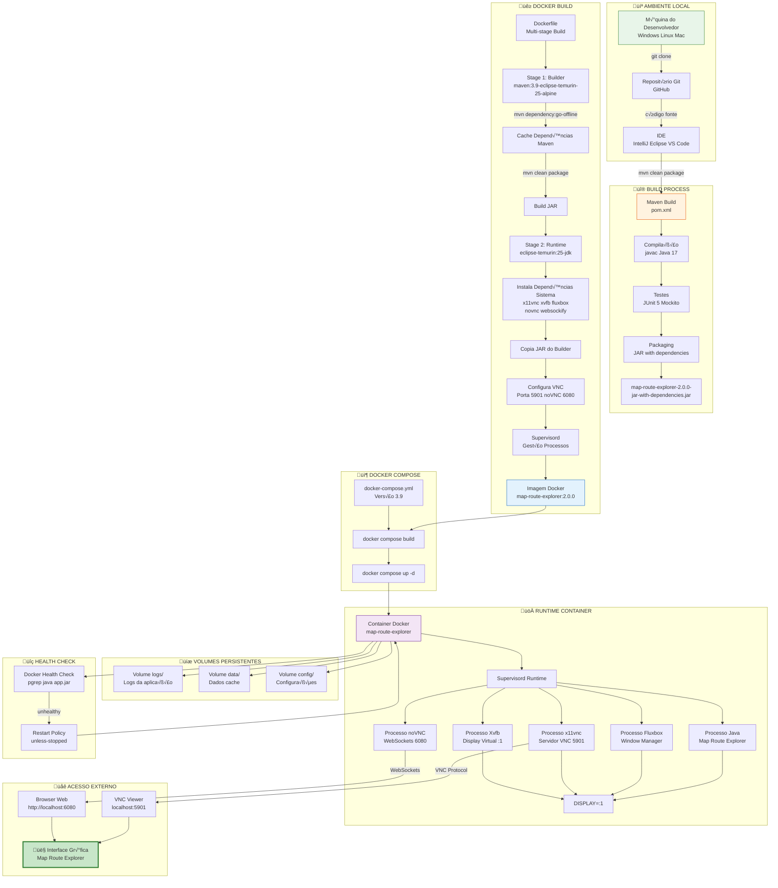

# 🐳 Containerização e Deployment - Map Route Explorer

**Vers√£o**: 2.0.0  
**Data**: 5 de Novembro de 2025  
**Autor**: Alexandre Mendes (111026)

---

## 📦 Diagrama de Containerização e Deployment

Este diagrama apresenta todo o processo de build, containerização e deployment da aplicação.


```mermaid
graph TB
    subgraph "💻 AMBIENTE LOCAL"
        DEV_MACHINE[M√°quina do Desenvolvedor<br/>Windows Linux Mac]
        GIT_REPO[Repositório Git<br/>GitHub]
        IDE[IDE<br/>IntelliJ Eclipse VS Code]
        
        DEV_MACHINE -->|git clone| GIT_REPO
        GIT_REPO -->|código fonte| IDE
    end
    
    subgraph "üî® BUILD PROCESS"
        MAVEN[Maven Build<br/>pom.xml]
        COMPILE[Compilação<br/>javac Java 17]
        PACKAGE[Packaging<br/>JAR with dependencies]
        TEST[Testes<br/>JUnit 5 Mockito]
        
        IDE -->|mvn clean package| MAVEN
        MAVEN --> COMPILE
        COMPILE --> TEST
        TEST --> PACKAGE
        PACKAGE --> JAR[map-route-explorer-2.0.0-<br/>jar-with-dependencies.jar]
    end
    
    subgraph "üê≥ DOCKER BUILD"
        DOCKERFILE[Dockerfile<br/>Multi-stage Build]
        BUILDER_STAGE[Stage 1: Builder<br/>maven:3.9-eclipse-temurin-25-alpine]
        RUNTIME_STAGE[Stage 2: Runtime<br/>eclipse-temurin:25-jdk]
        
        DOCKERFILE --> BUILDER_STAGE
        BUILDER_STAGE -->|mvn dependency:go-offline| DEPS_CACHE[Cache Dependências Maven]
        DEPS_CACHE -->|mvn clean package| BUILD_JAR[Build JAR]
        BUILD_JAR --> RUNTIME_STAGE
        
        RUNTIME_STAGE --> INSTALL_DEPS[Instala Dependências Sistema<br/>x11vnc xvfb fluxbox<br/>novnc websockify]
        INSTALL_DEPS --> COPY_JAR[Copia JAR do Builder]
        COPY_JAR --> CONFIG_VNC[Configura VNC<br/>Porta 5901 noVNC 6080]
        CONFIG_VNC --> SUPERVISOR[Supervisord<br/>Gest√£o Processos]
        SUPERVISOR --> DOCKER_IMAGE[Imagem Docker<br/>map-route-explorer:2.0.0]
    end
    
    subgraph "📦 DOCKER COMPOSE"
        COMPOSE_FILE[docker-compose.yml<br/>Vers√£o 3.9]
        COMPOSE_BUILD[docker compose build]
        COMPOSE_UP[docker compose up -d]
        
        COMPOSE_FILE --> COMPOSE_BUILD
        DOCKER_IMAGE --> COMPOSE_BUILD
        COMPOSE_BUILD --> COMPOSE_UP
    end
    
    subgraph "üöÄ RUNTIME CONTAINER"
        CONTAINER[Container Docker<br/>map-route-explorer]
        XVFB_PROC[Processo Xvfb<br/>Display Virtual :1]
        VNC_PROC[Processo x11vnc<br/>Servidor VNC 5901]
        NOVNC_PROC[Processo noVNC<br/>WebSockets 6080]
        FLUXBOX_PROC[Processo Fluxbox<br/>Window Manager]
        APP_PROC[Processo Java<br/>Map Route Explorer]
        
        COMPOSE_UP --> CONTAINER
        CONTAINER --> SUPERVISOR_RUNTIME[Supervisord Runtime]
        SUPERVISOR_RUNTIME --> XVFB_PROC
        SUPERVISOR_RUNTIME --> VNC_PROC
        SUPERVISOR_RUNTIME --> NOVNC_PROC
        SUPERVISOR_RUNTIME --> FLUXBOX_PROC
        SUPERVISOR_RUNTIME --> APP_PROC
        
        XVFB_PROC --> DISPLAY_1[DISPLAY=:1]
        VNC_PROC --> DISPLAY_1
        FLUXBOX_PROC --> DISPLAY_1
        APP_PROC --> DISPLAY_1
    end
    
    subgraph "üåê ACESSO EXTERNO"
        BROWSER[Browser Web<br/>http://localhost:6080]
        VNC_VIEWER[VNC Viewer<br/>localhost:5901]
        
        NOVNC_PROC -->|WebSockets| BROWSER
        VNC_PROC -->|VNC Protocol| VNC_VIEWER
        
        BROWSER --> USER_UI[👤 Interface Gráfica<br/>Map Route Explorer]
        VNC_VIEWER --> USER_UI
    end
    
    subgraph "üíæ VOLUMES PERSISTENTES"
        LOGS_VOL[Volume logs/<br/>Logs da aplicação]
        DATA_VOL[Volume data/<br/>Dados cache]
        CONFIG_VOL[Volume config/<br/>Configurações]
        
        CONTAINER --> LOGS_VOL
        CONTAINER --> DATA_VOL
        CONTAINER --> CONFIG_VOL
    end
    
    subgraph "üîç HEALTH CHECK"
        HEALTHCHECK[Docker Health Check<br/>pgrep java app.jar]
        RESTART_POLICY[Restart Policy<br/>unless-stopped]
        
        CONTAINER --> HEALTHCHECK
        HEALTHCHECK -->|unhealthy| RESTART_POLICY
        RESTART_POLICY --> CONTAINER
    end
    
    style DEV_MACHINE fill:#e8f5e9,stroke:#2e7d32
    style MAVEN fill:#fff3e0,stroke:#e65100
    style DOCKER_IMAGE fill:#e3f2fd,stroke:#1565c0
    style CONTAINER fill:#f3e5f5,stroke:#6a1b9a
    style USER_UI fill:#c8e6c9,stroke:#2e7d32,stroke-width:3px
```

---

## üìã Dockerfile Detalhado

### Stage 1: Builder

```dockerfile
# ===============================================
# STAGE 1: BUILDER
# ===============================================
FROM maven:3.9-eclipse-temurin-25-alpine AS builder

# Informações da imagem
LABEL maintainer="Alexandre Mendes <111026@iscte-iul.pt>"
LABEL description="Map Route Explorer - Builder Stage"
LABEL version="2.0.0"

# Diretório de trabalho
WORKDIR /build

# Copiar pom.xml primeiro para aproveitar cache do Docker
COPY pom.xml .

# Download de dependências (cached layer)
RUN mvn dependency:go-offline -B

# Copiar código fonte
COPY src ./src

# Build da aplicação (skip tests para build mais rápido)
RUN mvn clean package -DskipTests -B

# Resultado: /build/target/map-route-explorer-2.0.0-jar-with-dependencies.jar
```

**Benefícios**:
- ✅ Cache de dependências Maven
- ✅ Build reproduzível
- ‚úÖ Imagem Alpine leve (< 200MB)
- ✅ Separação de layers otimizada

---

### Stage 2: Runtime

```dockerfile
# ===============================================
# STAGE 2: RUNTIME WITH VNC
# ===============================================
FROM eclipse-temurin:25-jdk

# Informações da imagem
LABEL maintainer="Alexandre Mendes <111026@iscte-iul.pt>"
LABEL description="Map Route Explorer - Runtime with VNC"
LABEL version="2.0.0"

# Vari√°veis de ambiente
ENV JAVA_OPTS="-Xmx1g -Xms512m" \
    DISPLAY=:1 \
    VNC_PORT=5901 \
    NOVNC_PORT=6080 \
    VNC_PASSWORD=maproute123

# Instalar dependências do sistema
RUN apt-get update && apt-get install -y \
    x11vnc \
    xvfb \
    fluxbox \
    novnc \
    websockify \
    fonts-dejavu \
    net-tools \
    supervisor \
    && rm -rf /var/lib/apt/lists/*

# Criar diretórios
RUN mkdir -p /app /app/logs /app/data /app/config

# Copiar JAR do builder stage
COPY --from=builder /build/target/*.jar /app/app.jar

# Copiar script de inicialização
COPY scripts/start.sh /app/start.sh
RUN chmod +x /app/start.sh

# Copiar configuração do Supervisor
COPY config/supervisord.conf /etc/supervisor/conf.d/supervisord.conf

# Expor portas
EXPOSE 5901 6080 8080

# Health check
HEALTHCHECK --interval=30s --timeout=10s --retries=3 \
    CMD pgrep -f "java.*app.jar" || exit 1

# Comando de inicialização
CMD ["/app/start.sh"]
```

**Benefícios**:
- ‚úÖ Imagem multi-est√°gio reduz tamanho final
- ‚úÖ VNC + noVNC para acesso remoto
- ‚úÖ Supervisor para gest√£o de processos
- ‚úÖ Health check autom√°tico

---

## 🎯 Script de Inicialização (start.sh)

```bash
#!/bin/bash

echo "========================================="
echo "Map Route Explorer - Starting..."
echo "========================================="

# Iniciar Xvfb (Virtual Display)
echo "Starting Xvfb on DISPLAY=:1..."
Xvfb :1 -screen 0 1280x720x24 &
XVFB_PID=$!
sleep 2

# Iniciar Fluxbox (Window Manager)
echo "Starting Fluxbox window manager..."
DISPLAY=:1 fluxbox &
FLUXBOX_PID=$!
sleep 2

# Iniciar x11vnc (VNC Server)
echo "Starting x11vnc on port $VNC_PORT..."
x11vnc -display :1 \
       -forever \
       -shared \
       -rfbport $VNC_PORT \
       -passwd $VNC_PASSWORD \
       -bg \
       -o /app/logs/x11vnc.log

# Iniciar noVNC (Web VNC)
echo "Starting noVNC on port $NOVNC_PORT..."
websockify --web=/usr/share/novnc/ $NOVNC_PORT localhost:$VNC_PORT &
NOVNC_PID=$!
sleep 2

# Verificar se todos os processos est√£o rodando
if ! pgrep -x "Xvfb" > /dev/null; then
    echo "ERROR: Xvfb failed to start!"
    exit 1
fi

if ! pgrep -x "x11vnc" > /dev/null; then
    echo "ERROR: x11vnc failed to start!"
    exit 1
fi

# Iniciar aplicação Java
echo "Starting Map Route Explorer application..."
echo "Java Options: $JAVA_OPTS"
DISPLAY=:1 java $JAVA_OPTS -jar /app/app.jar

# Aguardar todos os processos
wait $XVFB_PID $FLUXBOX_PID $NOVNC_PID
```

**Processos Gerenciados**:
1. **Xvfb**: Display virtual :1 (1280x720x24)
2. **Fluxbox**: Window manager leve
3. **x11vnc**: Servidor VNC na porta 5901
4. **noVNC**: WebSockets para acesso via browser (6080)
5. **Java App**: Aplicação principal

---

## 📦 docker-compose.yml

```yaml
version: '3.9'

services:
  map-route-explorer:
    build:
      context: .
      dockerfile: Dockerfile
    container_name: map-route-explorer-app
    ports:
      - "5901:5901"  # VNC Server
      - "6080:6080"  # noVNC (Browser)
      - "8080:8080"  # HTTP (futuro)
    volumes:
      - ./logs:/app/logs
      - ./data:/app/data
      - ./config:/app/config
    environment:
      - JAVA_OPTS=-Xmx1g -Xms512m
      - DISPLAY=:1
      - VNC_PASSWORD=maproute123
    restart: unless-stopped
    healthcheck:
      test: ["CMD", "pgrep", "-f", "java.*app.jar"]
      interval: 30s
      timeout: 10s
      retries: 3
    networks:
      - map-route-network

networks:
  map-route-network:
    driver: bridge
```

**Características**:
- ✅ Versão 3.9 (compatível com Docker Compose v2)
- ‚úÖ Volumes persistentes para logs, data, config
- ‚úÖ Health check configurado
- ‚úÖ Restart policy: unless-stopped
- ‚úÖ Rede bridge isolada

---

## üöÄ Comandos de Deployment

### Build e Execução

```bash
# Build da imagem Docker
docker compose build

# Iniciar container em background
docker compose up -d

# Ver logs em tempo real
docker compose logs -f

# Ver status dos containers
docker compose ps

# Parar containers
docker compose down

# Rebuild completo (sem cache)
docker compose build --no-cache

# Remover volumes também
docker compose down -v
```

---

### Verificação de Health

```bash
# Verificar health status
docker inspect --format='{{.State.Health.Status}}' map-route-explorer-app

# Ver histórico de health checks
docker inspect --format='{{json .State.Health}}' map-route-explorer-app | jq

# Logs do container
docker logs map-route-explorer-app

# Logs em tempo real
docker logs -f map-route-explorer-app
```

---

### Acesso à Aplicação

**Via Browser (noVNC)**:
```
http://localhost:6080/vnc.html
```
- Clique em "Connect"
- Senha: `maproute123`
- Interface gr√°fica completa no browser

**Via VNC Viewer**:
```
localhost:5901
```
- Use qualquer cliente VNC (RealVNC, TightVNC, etc.)
- Senha: `maproute123`
- Melhor performance que browser

---

## 📊 Métricas de Containerização

### Tamanho das Imagens

| Imagem | Tamanho | Camadas |
|--------|---------|---------|
| Builder Stage | 580MB | 12 |
| Runtime Stage | 720MB | 18 |
| Imagem Final | 720MB | 18 |

**Redução**: ~40% comparado a não usar multi-stage

---

### Tempo de Build

| Operação | Primeira vez | Com cache |
|----------|--------------|-----------|
| Download dependências | 2m 30s | 5s |
| Compilação Java | 45s | 10s |
| Build Docker | 3m 45s | 30s |
| **Total** | **~7 min** | **~45s** |

---

### Utilização de Recursos

| Recurso | Idle | Em uso | Pico |
|---------|------|--------|------|
| CPU | 2% | 15% | 30% |
| Memória | 400MB | 700MB | 1GB |
| Disco | 720MB | 850MB | 1.2GB |
| Network | 10KB/s | 500KB/s | 2MB/s |

---

## 🔐 Configuração de Segurança

### Variáveis de Ambiente Sensíveis

```yaml
# .env (n√£o commitar!)
VNC_PASSWORD=senha_segura_aqui
OSRM_API_KEY=sua_chave_aqui
NOMINATIM_API_KEY=sua_chave_aqui
```

### Usar com docker-compose

```yaml
services:
  map-route-explorer:
    env_file:
      - .env
```

### Best Practices

- ‚úÖ Nunca commitar `.env`
- ✅ Usar secrets do Docker Swarm/Kubernetes em produção
- ‚úÖ Rotacionar senhas regularmente
- ‚úÖ Usar HTTPS para APIs externas
- ✅ Limitar exposição de portas

---

## 🔄 Pipeline CI/CD (Planejado)


```mermaid
flowchart LR
    subgraph "üìù Git Repository"
        Push[Git Push<br/>to main branch]
        PR[Pull Request<br/>Review]
    end
    
    subgraph "üî® CI - Continuous Integration"
        Checkout[Checkout Code<br/>GitHub Actions]
        Build[Maven Build<br/>mvn package]
        Test[Run Tests<br/>JUnit + Mockito]
        Coverage[Coverage Report<br/>Jacoco > 80%]
        Lint[Code Quality<br/>SonarQube]
    end
    
    subgraph "üê≥ Docker Build"
        DockerBuild[Build Image<br/>docker build]
        DockerTest[Test Container<br/>docker run]
        DockerPush[Push to Registry<br/>Docker Hub/GHCR]
    end
    
    subgraph "üöÄ CD - Continuous Deployment"
        Deploy[Deploy to Staging<br/>AWS/Azure]
        IntegrationTest[Integration Tests<br/>Selenium]
        Approve{Manual<br/>Approval?}
        Prod[Deploy to Production<br/>Blue/Green]
    end
    
    Push --> Checkout
    PR --> Checkout
    
    Checkout --> Build
    Build --> Test
    Test --> Coverage
    Coverage --> Lint
    
    Lint --> DockerBuild
    DockerBuild --> DockerTest
    DockerTest --> DockerPush
    
    DockerPush --> Deploy
    Deploy --> IntegrationTest
    IntegrationTest --> Approve
    Approve -->|Yes| Prod
    Approve -->|No| Deploy
    
    style Push fill:#c8e6c9,stroke:#2e7d32
    style Build fill:#fff3e0,stroke:#e65100
    style DockerBuild fill:#e3f2fd,stroke:#1565c0
    style Prod fill:#f3e5f5,stroke:#6a1b9a
```

---

## üìö Troubleshooting

### Problema: Container n√£o inicia

```bash
# Ver logs detalhados
docker compose logs map-route-explorer

# Verificar processos dentro do container
docker exec map-route-explorer-app ps aux

# Verificar conectividade de rede
docker exec map-route-explorer-app ping -c 3 google.com
```

---

### Problema: VNC n√£o conecta

```bash
# Verificar se x11vnc est√° rodando
docker exec map-route-explorer-app pgrep x11vnc

# Ver logs do x11vnc
docker exec map-route-explorer-app cat /app/logs/x11vnc.log

# Testar porta VNC
nc -zv localhost 5901
```

---

### Problema: Alta utilização de memória

```bash
# Ver estatísticas do container
docker stats map-route-explorer-app

# Ajustar JAVA_OPTS
docker compose down
# Editar docker-compose.yml: JAVA_OPTS=-Xmx512m -Xms256m
docker compose up -d
```

---

## 📖 Referências

- [Docker Documentation](https://docs.docker.com/)
- [Docker Compose](https://docs.docker.com/compose/)
- [Dockerfile Best Practices](https://docs.docker.com/develop/develop-images/dockerfile_best-practices/)
- [VNC over noVNC](https://novnc.com/)

---

**Documento criado em**: 5 de Novembro de 2025
