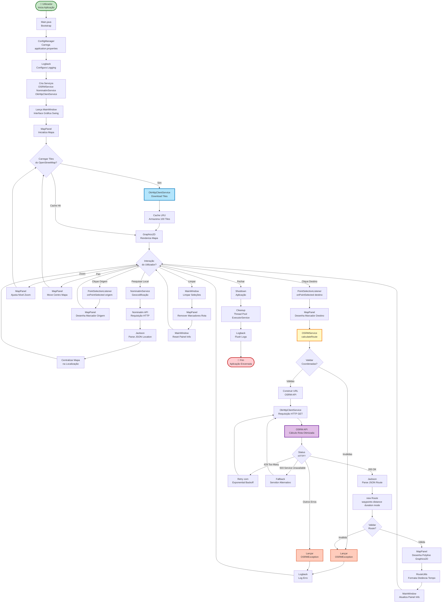
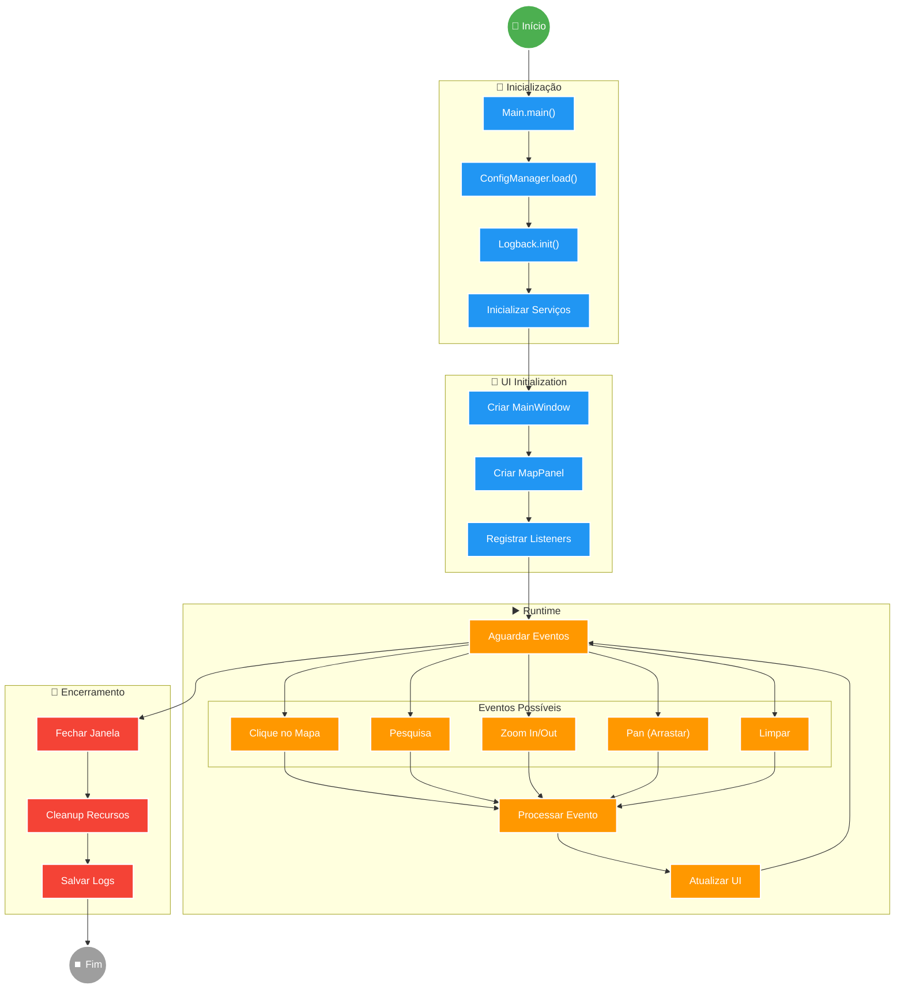
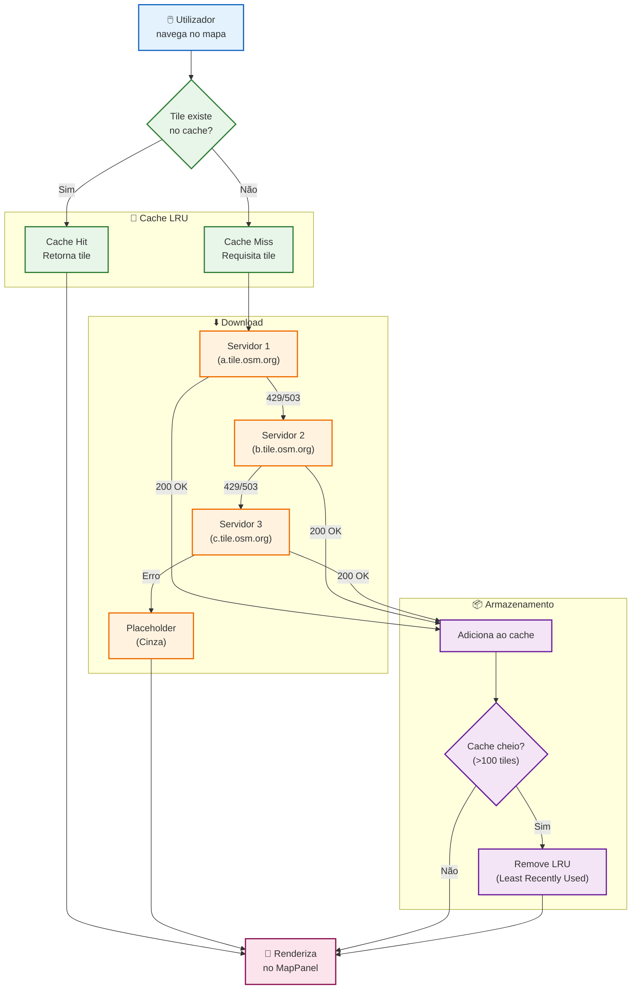
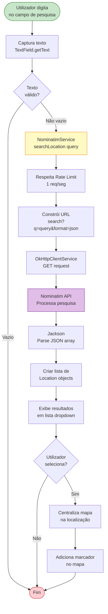
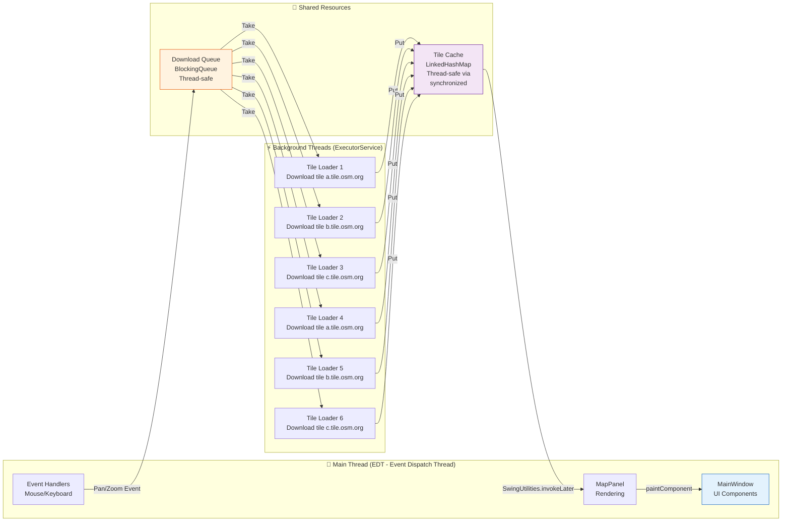
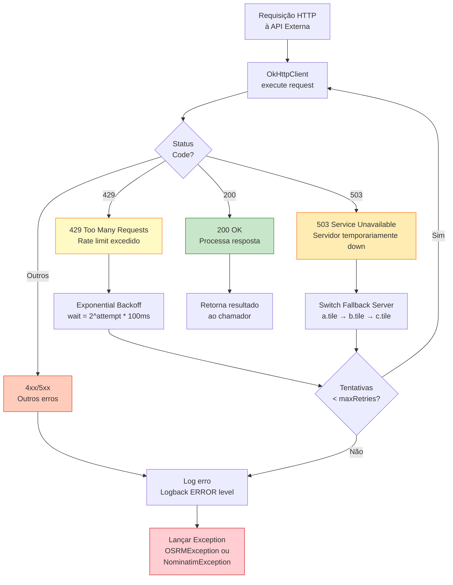

# 🌊 Fluxos de Dados e Processos - Map Route Explorer

**Versão**: 2.0.0  
**Data**: 5 de Novembro de 2025

## 👥 Autores

Este projeto foi desenvolvido por:

- **Alexandre Mendes** (111026)
- **Manuel Santos**
- **André Costa**
- **Ana Valente**

**Instituição**: Instituto Superior de Ciências do Trabalho e da Empresa (ISCTE-IUL)  
**Curso**: Engenharia Informática

---

## 🌐 Diagrama de Fluxo de Dados Completo

Este diagrama apresenta o fluxo completo de dados na aplicação, desde o início até o encerramento.



---

## 🎬 Ciclo de Vida da Aplicação



---

## 🌐 Sistema de Cache de Tiles



---

## 🔄 Processo de Cálculo de Rota (Detalhado)

```mermaid
sequenceDiagram
    actor User as 👤 Utilizador
    participant UI as MainWindow
    participant MAP as MapPanel
    participant OSRM as OSRMService
    participant HTTP as OkHttpClient
    participant API as OSRM API
    participant Model as Route
    participant Utils as RouteUtils
    
    Note over User,Utils: Fase 1: Seleção de Origem
    User->>MAP: Clica no mapa (origem)
    activate MAP
    MAP->>MAP: pixelToLatLon()
    MAP->>UI: onPointSelected(origin)
    deactivate MAP
    activate UI
    UI->>UI: selectedOrigin = location
    UI->>MAP: drawMarker(origin, GREEN, "A")
    UI->>User: Exibe marcador verde
    deactivate UI
    
    Note over User,Utils: Fase 2: Seleção de Destino
    User->>MAP: Clica no mapa (destino)
    activate MAP
    MAP->>MAP: pixelToLatLon()
    MAP->>UI: onPointSelected(destination)
    deactivate MAP
    activate UI
    UI->>UI: selectedDestination = location
    UI->>MAP: drawMarker(destination, RED, "B")
    UI->>User: Exibe marcador vermelho
    
    Note over User,Utils: Fase 3: Cálculo de Rota
    UI->>OSRM: calculateRoute(origin, dest, CAR)
    deactivate UI
    activate OSRM
    
    OSRM->>OSRM: validateCoordinates()
    alt Coordenadas Inválidas
        OSRM-->>UI: throw OSRMException
        UI-->>User: Exibe erro
    end
    
    OSRM->>OSRM: buildRequestUrl()
    Note right of OSRM: URL: /route/v1/driving/<br/>lat1,lon1;lat2,lon2
    
    OSRM->>HTTP: get(url)
    deactivate OSRM
    activate HTTP
    
    HTTP->>HTTP: new Request.Builder()
    HTTP->>HTTP: addHeader("User-Agent")
    HTTP->>API: HTTP GET
    deactivate HTTP
    activate API
    
    API->>API: Calcula rota otimizada
    Note right of API: Algoritmo de Dijkstra<br/>sobre grafo de ruas
    API->>HTTP: JSON Response
    deactivate API
    activate HTTP
    
    alt Status 429 (Too Many Requests)
        HTTP->>HTTP: wait(exponentialBackoff)
        HTTP->>API: Retry request
    else Status 503 (Service Unavailable)
        HTTP->>HTTP: switchToFallbackServer()
        HTTP->>API: Retry request
    else Status 200 (OK)
        HTTP->>OSRM: Return JSON string
    end
    deactivate HTTP
    activate OSRM
    
    Note over User,Utils: Fase 4: Parsing e Validação
    OSRM->>OSRM: ObjectMapper.readValue()
    OSRM->>OSRM: extractWaypoints()
    OSRM->>OSRM: extractDistance()
    OSRM->>OSRM: extractDuration()
    OSRM->>OSRM: decodePolyline()
    
    OSRM->>Model: new Route(waypoints, distance, duration)
    activate Model
    Model->>Model: validateData()
    Model->>OSRM: return route
    deactivate Model
    
    OSRM->>UI: return route
    deactivate OSRM
    activate UI
    
    Note over User,Utils: Fase 5: Visualização
    UI->>Utils: formatDistance(route.distance)
    activate Utils
    Utils->>UI: "5.2 km"
    deactivate Utils
    
    UI->>Utils: formatDuration(route.duration)
    activate Utils
    Utils->>UI: "15 min"
    deactivate Utils
    
    UI->>UI: distanceLabel.setText("5.2 km")
    UI->>UI: durationLabel.setText("15 min")
    UI->>MAP: drawRoute(route)
    deactivate UI
    
    activate MAP
    MAP->>MAP: drawPolyline(waypoints, BLUE)
    MAP->>User: Exibe rota no mapa
    deactivate MAP
```

---

## 🔍 Processo de Pesquisa de Localização



---

## ⚙️ Gestão de Threads e Concorrência



---

## 🔄 Tratamento de Erros e Retry



---

## 📊 Métricas de Performance

### Tempos Médios de Operações

| Operação | Tempo Médio | Tempo Máximo | Meta |
|----------|-------------|--------------|------|
| Carregamento de tile | 250ms | 500ms | < 500ms |
| Cálculo de rota | 800ms | 2000ms | < 2s |
| Parsing JSON | 50ms | 100ms | < 200ms |
| Renderização frame | 16ms | 33ms | 60 FPS |
| Geocodificação | 600ms | 1500ms | < 2s |
| Cache lookup | 1ms | 5ms | < 10ms |

### Utilização de Recursos

| Recurso | Utilização Média | Pico | Limite |
|---------|------------------|------|--------|
| Memória RAM | 400MB | 800MB | 1GB |
| CPU (idle) | 2% | 5% | - |
| CPU (cálculo rota) | 15% | 30% | - |
| Threads ativas | 8 | 12 | 20 |
| Cache size | 50 tiles | 100 tiles | 100 tiles |
| Network bandwidth | 500KB/s | 2MB/s | - |

---

## 📖 Referências

- [Diagrama de Arquitetura](./DIAGRAMA_ARQUITETURA_COMPLETA.md)
- [Diagrama de Classes](./DIAGRAMA_CLASSES.md)
- [Requisitos](./REQUISITOS.md)
- [Padrões de Projeto](./PADROES_E_BOAS_PRATICAS.md)

---

**Documento criado em**: 5 de Novembro de 2025
