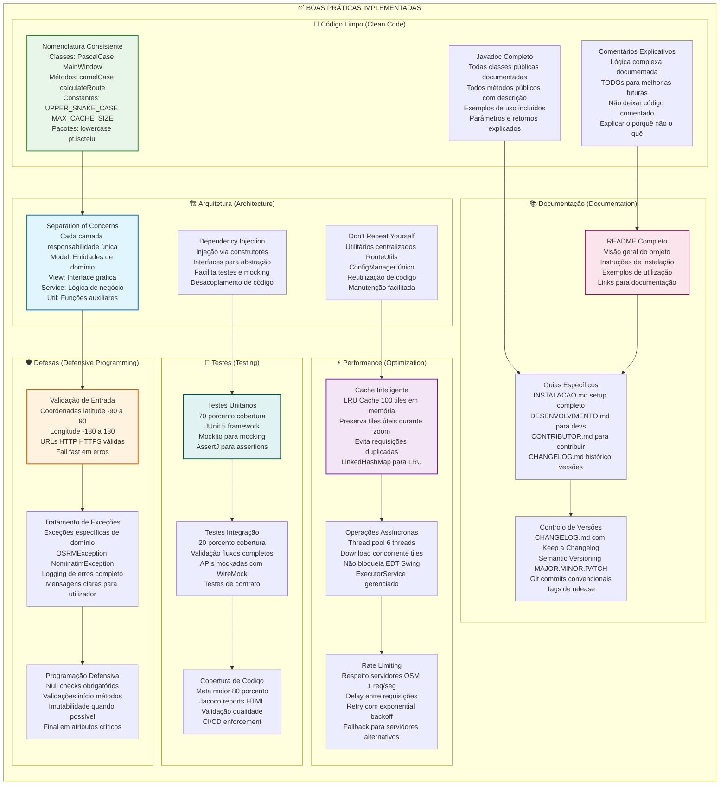

# 🛡️ Padrões de Projeto e Boas Práticas - Map Route Explorer

**Versão**: 2.0.0  
**Data**: 5 de Novembro de 2025

## 👥 Autores

Este projeto foi desenvolvido por:

- **Alexandre Mendes** (111026)
- **Manuel Santos**
- **André Costa**
- **Ana Valente**

**Instituição**: Instituto Superior de Ciências do Trabalho e da Empresa (ISCTE-IUL)  
**Curso**: Engenharia Informática

---

## 🎯 Padrões de Projeto Implementados

Este documento detalha todos os padrões de projeto e boas práticas utilizadas no sistema.

---

## 📐 Diagrama de Padrões de Projeto

```mermaid
graph TB
    subgraph "🎨 PADRÕES CRIACIONAIS (Creational Patterns)"
        SINGLETON[Singleton Pattern<br/>ConfigManager<br/>Instância única de configuração<br/>Thread-safe getInstance]
        FACTORY[Factory Pattern planeado<br/>ServiceFactory<br/>Criação de serviços HTTP<br/>Abstração de criação]
    end
    
    subgraph "🔨 PADRÕES ESTRUTURAIS (Structural Patterns)"
        ADAPTER[Adapter Pattern<br/>HttpClientService → OkHttpClient<br/>Adapta biblioteca externa<br/>Interface consistente]
        FACADE[Facade Pattern<br/>OSRMService NominatimService<br/>Simplifica acesso a APIs<br/>Oculta complexidade]
        PROXY[Proxy Pattern planeado<br/>CachedTileService<br/>Cache transparente<br/>Lazy loading]
    end
    
    subgraph "⚙️ PADRÕES COMPORTAMENTAIS (Behavioral Patterns)"
        OBSERVER[Observer Pattern<br/>PointSelectionListener<br/>Comunicação UI → Controller<br/>Desacoplamento eventos]
        STRATEGY[Strategy Pattern<br/>TransportMode<br/>Diferentes algoritmos de rota<br/>Seleção em runtime]
        TEMPLATE[Template Method planeado<br/>BaseAPIService<br/>Fluxo comum requisições<br/>Steps customizáveis]
        COMMAND[Command Pattern planeado<br/>RouteCalculationCommand<br/>Encapsular requisições<br/>Undo/Redo support]
    end
    
    subgraph "🏗️ PADRÕES ARQUITETURAIS (Architectural Patterns)"
        MVC[MVC Pattern<br/>Model: Location Route<br/>View: MainWindow MapPanel<br/>Controller: Services]
        LAYERED[Layered Architecture<br/>Presentation → Service → Domain → Data<br/>Separação de responsabilidades<br/>Independência de camadas]
        SERVICE_LAYER[Service Layer Pattern<br/>OSRMService NominatimService<br/>Abstração de lógica de negócio<br/>API unificada]
    end
    
    subgraph "📦 PRINCÍPIOS SOLID"
        SRP[Single Responsibility<br/>Cada classe uma única responsabilidade<br/>MapPanel apenas renderiza mapa<br/>OSRMService apenas integra OSRM]
        OCP[Open Closed Principle<br/>Aberto para extensão<br/>Fechado para modificação<br/>TransportMode extensível]
        LSP[Liskov Substitution<br/>HttpClientService substituível<br/>por qualquer implementação<br/>Contrato garantido]
        ISP[Interface Segregation<br/>Interfaces pequenas focadas<br/>PointSelectionListener único método<br/>Não força dependências]
        DIP[Dependency Inversion<br/>Depende de abstrações<br/>não de implementações<br/>HttpClientService interface]
    end
    
    OBSERVER --> MVC
    STRATEGY --> SERVICE_LAYER
    ADAPTER --> LAYERED
    FACADE --> SERVICE_LAYER
    
    SRP --> LAYERED
    OCP --> STRATEGY
    LSP --> ADAPTER
    ISP --> OBSERVER
    DIP --> SERVICE_LAYER
    
    style SINGLETON fill:#ffebee,stroke:#c62828,stroke-width:2px
    style OBSERVER fill:#e3f2fd,stroke:#1565c0,stroke-width:2px
    style STRATEGY fill:#e3f2fd,stroke:#1565c0,stroke-width:2px
    style MVC fill:#f3e5f5,stroke:#6a1b9a,stroke-width:2px
    style LAYERED fill:#f3e5f5,stroke:#6a1b9a,stroke-width:2px
    style SRP fill:#e8f5e9,stroke:#2e7d32,stroke-width:2px
    style DIP fill:#e8f5e9,stroke:#2e7d32,stroke-width:2px
```



---

## 🔐 Diagrama de Técnicas de Arquitetura e Boas Práticas



---

## 📚 Detalhamento dos Padrões

### 🎨 Padrões Criacionais

#### Singleton Pattern - ConfigManager

**Problema**: Necessidade de uma única instância de configuração em todo o sistema.

**Solução**:
```java
public class ConfigManager {
    private static ConfigManager instance;
    private Properties properties;
    
    private ConfigManager() {
        // Construtor privado
        loadConfiguration();
    }
    
    public static synchronized ConfigManager getInstance() {
        if (instance == null) {
            instance = new ConfigManager();
        }
        return instance;
    }
}
```

**Benefícios**:
- ✅ Instância única garantida
- ✅ Acesso global controlado
- ✅ Thread-safe
- ✅ Lazy initialization

**Localização**: `util/ConfigManager.java`

---

### 🔨 Padrões Estruturais

#### Adapter Pattern - HttpClientService

**Problema**: Necessidade de adaptar biblioteca externa OkHttp para interface consistente.

**Solução**:
```java
// Interface abstrata
public interface HttpClientService {
    String get(String url);
    String post(String url, String body);
}

// Adaptador para OkHttp
public class OkHttpClientService implements HttpClientService {
    private OkHttpClient client;
    
    @Override
    public String get(String url) {
        Request request = new Request.Builder()
            .url(url)
            .build();
        // Adaptação da resposta OkHttp
    }
}
```

**Benefícios**:
- ✅ Desacoplamento da biblioteca
- ✅ Fácil substituir implementação
- ✅ Facilita testes com mocks
- ✅ Interface consistente

**Localização**: `service/HttpClientService.java`, `service/OkHttpClientService.java`

---

#### Facade Pattern - OSRMService

**Problema**: Complexidade da API OSRM com múltiplas chamadas e parsing JSON.

**Solução**:
```java
public class OSRMService {
    public Route calculateRoute(Location origin, Location dest, TransportMode mode) {
        // Oculta complexidade:
        // 1. Validação de coordenadas
        // 2. Construção de URL
        // 3. Requisição HTTP
        // 4. Parsing JSON
        // 5. Criação de Route
        // 6. Tratamento de erros
    }
}
```

**Benefícios**:
- ✅ Simplifica uso da API
- ✅ Oculta complexidade
- ✅ Interface de alto nível
- ✅ Centraliza lógica

**Localização**: `service/OSRMService.java`, `service/NominatimService.java`

---

### ⚙️ Padrões Comportamentais

#### Observer Pattern - PointSelectionListener

**Problema**: Necessidade de notificar MainWindow quando ponto é selecionado no MapPanel.

**Solução**:
```java
// Interface Observer
public interface PointSelectionListener {
    void onPointSelected(Location location);
}

// Subject (MapPanel)
public class MapPanel extends JPanel {
    private PointSelectionListener listener;
    
    private void handleMouseClick(MouseEvent e) {
        Location loc = pixelToLatLon(e.getX(), e.getY());
        if (listener != null) {
            listener.onPointSelected(loc);
        }
    }
}

// Observer (MainWindow)
public class MainWindow implements PointSelectionListener {
    @Override
    public void onPointSelected(Location location) {
        // Processa seleção
    }
}
```

**Benefícios**:
- ✅ Desacoplamento View-Controller
- ✅ Comunicação event-driven
- ✅ Fácil adicionar observers
- ✅ Responsabilidades separadas

**Localização**: `ui/PointSelectionListener.java`, `ui/MapPanel.java`, `ui/MainWindow.java`

---

#### Strategy Pattern - TransportMode

**Problema**: Diferentes algoritmos de rota baseados no modo de transporte.

**Solução**:
```java
public enum TransportMode {
    CAR("driving", 120),
    BIKE("cycling", 25),
    FOOT("walking", 5);
    
    private final String osrmProfile;
    private final double maxSpeed;
    
    public String getOSRMProfile() {
        return osrmProfile;
    }
}

// Uso
Route route = osrmService.calculateRoute(origin, dest, TransportMode.BIKE);
```

**Benefícios**:
- ✅ Seleção de algoritmo em runtime
- ✅ Fácil adicionar novos modos
- ✅ Código limpo e extensível
- ✅ Sem condicionais complexos

**Localização**: `model/TransportMode.java`

---

### 🏗️ Padrões Arquiteturais

#### MVC Pattern

**Estrutura**:

**Model** (Entidades de Domínio):
- `Location.java` - Localização geográfica
- `Route.java` - Rota calculada
- `TransportMode.java` - Modo de transporte

**View** (Interface Gráfica):
- `MainWindow.java` - Janela principal
- `MapPanel.java` - Painel do mapa

**Controller** (Lógica de Negócio):
- `OSRMService.java` - Cálculo de rotas
- `NominatimService.java` - Geocodificação

**Benefícios**:
- ✅ Separação de responsabilidades
- ✅ Testabilidade melhorada
- ✅ Manutenção facilitada
- ✅ Reusabilidade de código

---

#### Layered Architecture

**Camadas**:

1. **Presentation Layer** (UI)
   - MainWindow, MapPanel
   - Interação com utilizador

2. **Service Layer** (Business Logic)
   - OSRMService, NominatimService
   - Lógica de negócio

3. **Domain Layer** (Model)
   - Location, Route, TransportMode
   - Entidades de domínio

4. **Utility Layer** (Helpers)
   - RouteUtils, ConfigManager
   - Funções auxiliares

**Benefícios**:
- ✅ Separação clara de responsabilidades
- ✅ Cada camada independente
- ✅ Fácil manutenção
- ✅ Escalabilidade

---

#### Service Layer Pattern

**Implementação**:
- `OSRMService` - Abstrai API OSRM
- `NominatimService` - Abstrai API Nominatim
- `HttpClientService` - Abstrai cliente HTTP

**Benefícios**:
- ✅ API unificada para UI
- ✅ Oculta complexidade de APIs externas
- ✅ Facilita testes com mocks
- ✅ Centraliza lógica de negócio

---

## 📦 Princípios SOLID

### S - Single Responsibility Principle

**Definição**: Uma classe deve ter apenas uma razão para mudar.

**Exemplos**:
- ✅ `MapPanel` - Apenas renderiza mapa
- ✅ `OSRMService` - Apenas integra OSRM
- ✅ `RouteUtils` - Apenas cálculos auxiliares

**Violações Evitadas**:
- ❌ MapPanel não gerencia rotas (responsabilidade de Route)
- ❌ OSRMService não renderiza UI (responsabilidade de MainWindow)

---

### O - Open/Closed Principle

**Definição**: Aberto para extensão, fechado para modificação.

**Exemplos**:
- ✅ `TransportMode` - Adicionar novo modo não modifica código existente
- ✅ `HttpClientService` - Nova implementação não altera interface

**Como Atingido**:
- Uso de interfaces
- Enum extensível
- Strategy Pattern

---

### L - Liskov Substitution Principle

**Definição**: Subtipos devem ser substituíveis por seus tipos base.

**Exemplos**:
- ✅ `OkHttpClientService` substituível por qualquer `HttpClientService`
- ✅ Contrato garantido pela interface

**Teste**:
```java
HttpClientService client = new OkHttpClientService();
// ou
HttpClientService client = new MockHttpClientService();
// Ambos funcionam da mesma forma
```

---

### I - Interface Segregation Principle

**Definição**: Clientes não devem ser forçados a depender de interfaces que não usam.

**Exemplos**:
- ✅ `PointSelectionListener` - Apenas um método
- ✅ Interfaces pequenas e focadas

**Violações Evitadas**:
- ❌ Não criar interface "God" com todos os métodos

---

### D - Dependency Inversion Principle

**Definição**: Dependa de abstrações, não de implementações.

**Exemplos**:
- ✅ `OSRMService` depende de `HttpClientService` (interface)
- ✅ Não depende diretamente de `OkHttpClient`

**Benefícios**:
- Fácil trocar implementação
- Testes com mocks
- Desacoplamento

---

## ✅ Checklist de Boas Práticas

### Código Limpo
- [x] Nomenclatura consistente (PascalCase, camelCase)
- [x] Métodos pequenos (< 20 linhas)
- [x] Funções com único propósito
- [x] Comentários explicativos (porquê, não o quê)
- [x] Sem código comentado
- [x] Sem magic numbers (usar constantes)

### Documentação
- [x] Javadoc em classes públicas
- [x] Javadoc em métodos públicos
- [x] README completo
- [x] Guias de instalação e desenvolvimento
- [x] Diagramas UML atualizados

### Testes
- [x] Testes unitários (70%)
- [ ] Testes de integração (20%) - Em progresso
- [ ] Testes de interface (10%) - planeado
- [ ] Cobertura > 80% - Meta

### Arquitetura
- [x] Separação de camadas
- [x] Padrões de projeto aplicados
- [x] SOLID principles
- [x] Dependency Injection
- [x] Interface-based design

### Performance
- [x] Cache LRU
- [x] Operações assíncronas
- [x] Thread pool
- [x] Rate limiting
- [x] Lazy loading

### Segurança
- [x] Validação de entrada
- [x] Tratamento de exceções
- [x] Logging de erros
- [x] HTTPS only
- [x] Sanitização de dados

---

## 📖 Referências

### Livros
- "Design Patterns: Elements of Reusable Object-Oriented Software" - Gang of Four
- "Clean Code" - Robert C. Martin
- "Refactoring" - Martin Fowler
- "Effective Java" - Joshua Bloch

### Online
- [Refactoring Guru - Design Patterns](https://refactoring.guru/design-patterns)
- [SOLID Principles](https://www.digitalocean.com/community/conceptual_articles/s-o-l-i-d-the-first-five-principles-of-object-oriented-design)
- [Java Code Conventions](https://www.oracle.com/java/technologies/javase/codeconventions-contents.html)

---

**Documento criado em**: 5 de Novembro de 2025
