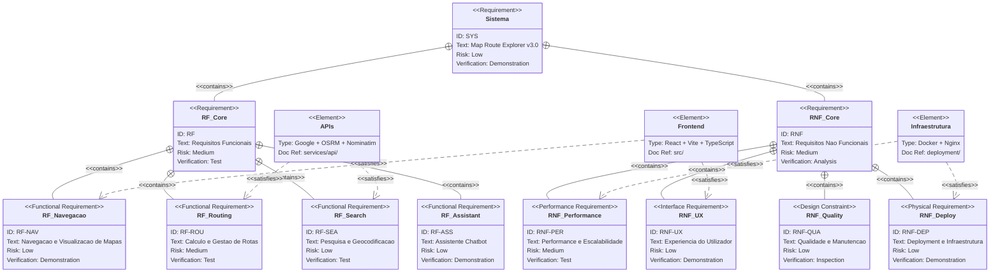

# 📋 Requisitos do Sistema - Map Route Explorer

## Índice
1. [Requisitos Funcionais](#requisitos-funcionais)
2. [Requisitos Não Funcionais](#requisitos-não-funcionais)
3. [Diagrama de Requisitos](#diagrama-de-requisitos)

---

## Requisitos Funcionais

### RF01 - Visualização de Mapa
- **Descrição**: O sistema deve permitir visualizar um mapa interativo baseado em OpenStreetMap
- **Prioridade**: Alta
- **Status**: ✅ Implementado

### RF02 - Pesquisa de Localização
- **Descrição**: O sistema deve permitir pesquisar endereços e locais através de texto
- **Prioridade**: Alta
- **Status**: ✅ Implementado
- **Detalhes**: Integração com API Nominatim para geocodificação

### RF03 - Geolocalização
- **Descrição**: O sistema deve obter a localização atual do utilizador via GPS/navegador
- **Prioridade**: Alta
- **Status**: ✅ Implementado

### RF04 - Cálculo de Rotas
- **Descrição**: O sistema deve calcular rotas entre origem e destino
- **Prioridade**: Alta
- **Status**: ✅ Implementado
- **Detalhes**: Integração com Google Maps Directions API e OSRM

### RF05 - Múltiplos Modos de Transporte
- **Descrição**: O sistema deve suportar diferentes modos de transporte (carro, bicicleta, a pé, transporte público)
- **Prioridade**: Alta
- **Status**: ✅ Implementado

### RF06 - Transporte Público (Transit)
- **Descrição**: O sistema deve calcular rotas de transporte público com horários em tempo real
- **Prioridade**: Alta
- **Status**: ✅ Implementado
- **Detalhes**: Google Routes API para Transit

### RF07 - Waypoints (Paragens Intermédias)
- **Descrição**: O sistema deve permitir adicionar até 5 paragens intermédias na rota
- **Prioridade**: Média
- **Status**: ✅ Implementado

### RF08 - Informações de Rota
- **Descrição**: O sistema deve exibir distância total e tempo estimado da rota
- **Prioridade**: Alta
- **Status**: ✅ Implementado

### RF09 - Comparação de Tempos
- **Descrição**: O sistema deve comparar tempos de viagem entre diferentes modos de transporte
- **Prioridade**: Média
- **Status**: ✅ Implementado

### RF10 - Pontos de Interesse (POIs)
- **Descrição**: O sistema deve exibir POIs ao longo da rota (restaurantes, postos de combustível, etc.)
- **Prioridade**: Média
- **Status**: ✅ Implementado

### RF11 - Auto-fit de Mapa
- **Descrição**: O sistema deve ajustar automaticamente o zoom para mostrar toda a rota
- **Prioridade**: Baixa
- **Status**: ✅ Implementado

### RF12 - Integração Google Maps
- **Descrição**: O sistema deve permitir abrir a rota diretamente no Google Maps
- **Prioridade**: Baixa
- **Status**: ✅ Implementado

### RF13 - Chatbot Assistente
- **Descrição**: O sistema deve ter um chatbot para assistência de roteamento via n8n
- **Prioridade**: Baixa
- **Status**: ✅ Implementado

### RF14 - Exportação de Rotas
- **Descrição**: O sistema deve permitir exportar rotas em diferentes formatos
- **Prioridade**: Baixa
- **Status**: 🔜 Planeado

### RF15 - Histórico de Rotas
- **Descrição**: O sistema deve guardar histórico de rotas pesquisadas
- **Prioridade**: Baixa
- **Status**: 🔜 Planeado

---

## Requisitos Não Funcionais

### RNF01 - Desempenho
- **Descrição**: O cálculo de rotas deve ser concluído em menos de 3 segundos
- **Métrica**: Tempo de resposta < 3s para 95% das requisições
- **Prioridade**: Alta

### RNF02 - Responsividade
- **Descrição**: A interface deve ser responsiva e funcionar em dispositivos móveis
- **Métrica**: Compatível com ecrãs de 320px a 4K
- **Prioridade**: Alta

### RNF03 - Disponibilidade
- **Descrição**: O sistema deve estar disponível 99% do tempo
- **Métrica**: Uptime >= 99%
- **Prioridade**: Alta

### RNF04 - Escalabilidade
- **Descrição**: O sistema deve suportar múltiplos utilizadores simultâneos
- **Métrica**: Suporte a pelo menos 100 utilizadores concorrentes
- **Prioridade**: Média

### RNF05 - Usabilidade
- **Descrição**: A interface deve ser intuitiva e fácil de usar
- **Métrica**: Utilizador consegue traçar rota em menos de 30 segundos
- **Prioridade**: Alta

### RNF06 - Compatibilidade
- **Descrição**: O sistema deve funcionar nos principais navegadores
- **Métrica**: Chrome, Firefox, Safari, Edge (últimas 2 versões)
- **Prioridade**: Alta

### RNF07 - Segurança
- **Descrição**: As chaves de API devem ser protegidas e não expostas no código cliente
- **Métrica**: Nenhuma chave exposta em repositório público
- **Prioridade**: Alta

### RNF08 - Manutenibilidade
- **Descrição**: O código deve seguir padrões de qualidade e ser bem documentado
- **Métrica**: Cobertura de TypeScript 100%, ESLint sem warnings
- **Prioridade**: Média

### RNF09 - Portabilidade
- **Descrição**: O sistema deve ser facilmente deployável via Docker
- **Métrica**: Deploy em menos de 5 minutos com Docker Compose
- **Prioridade**: Média

### RNF10 - Internacionalização
- **Descrição**: O sistema deve suportar múltiplos idiomas (PT/EN)
- **Métrica**: Suporte a Português e Inglês
- **Prioridade**: Baixa

---

## Diagrama de Requisitos

### Diagrama de Requisitos Funcionais

```mermaid
requirementDiagram

    requirement RF_Sistema {
        id: RF00
        text: "Map Route Explorer - Sistema de Rotas"
        risk: low
        verifymethod: demonstration
    }

    functionalRequirement RF_Mapa {
        id: RF01
        text: "Visualizacao de Mapa Interativo OpenStreetMap"
        risk: low
        verifymethod: demonstration
    }

    functionalRequirement RF_Pesquisa {
        id: RF02
        text: "Pesquisa de Localizacao por Texto"
        risk: low
        verifymethod: test
    }

    functionalRequirement RF_Geolocalizacao {
        id: RF03
        text: "Obtencao de Localizacao GPS do Utilizador"
        risk: low
        verifymethod: test
    }

    functionalRequirement RF_Rotas {
        id: RF04
        text: "Calculo de Rotas entre Origem e Destino"
        risk: medium
        verifymethod: test
    }

    functionalRequirement RF_Transportes {
        id: RF05
        text: "Suporte a Multiplos Modos de Transporte"
        risk: medium
        verifymethod: test
    }

    functionalRequirement RF_Transit {
        id: RF06
        text: "Rotas de Transporte Publico com Horarios"
        risk: high
        verifymethod: test
    }

    functionalRequirement RF_Waypoints {
        id: RF07
        text: "Adicao de ate 5 Paragens Intermedias"
        risk: low
        verifymethod: test
    }

    functionalRequirement RF_InfoRota {
        id: RF08
        text: "Exibicao de Distancia e Tempo Estimado"
        risk: low
        verifymethod: demonstration
    }

    functionalRequirement RF_Comparacao {
        id: RF09
        text: "Comparacao de Tempos entre Modos"
        risk: low
        verifymethod: demonstration
    }

    functionalRequirement RF_POIs {
        id: RF10
        text: "Exibicao de Pontos de Interesse"
        risk: low
        verifymethod: demonstration
    }

    functionalRequirement RF_AutoFit {
        id: RF11
        text: "Ajuste Automatico de Zoom do Mapa"
        risk: low
        verifymethod: demonstration
    }

    functionalRequirement RF_GoogleMaps {
        id: RF12
        text: "Integracao com Google Maps App"
        risk: low
        verifymethod: test
    }

    functionalRequirement RF_Chatbot {
        id: RF13
        text: "Chatbot Assistente via n8n"
        risk: medium
        verifymethod: demonstration
    }

    element Leaflet {
        type: Biblioteca
        docref: "react-leaflet"
    }

    element NominatimAPI {
        type: API Externa
        docref: "nominatim.openstreetmap.org"
    }

    element GoogleRoutesAPI {
        type: API Externa
        docref: "routes.googleapis.com"
    }

    element OSRMAPI {
        type: API Externa
        docref: "router.project-osrm.org"
    }

    element n8nWebhook {
        type: Servico
        docref: "n8n workflow"
    }

    RF_Sistema - contains -> RF_Mapa
    RF_Sistema - contains -> RF_Pesquisa
    RF_Sistema - contains -> RF_Geolocalizacao
    RF_Sistema - contains -> RF_Rotas
    RF_Sistema - contains -> RF_Chatbot

    RF_Rotas - contains -> RF_Transportes
    RF_Rotas - contains -> RF_Waypoints
    RF_Rotas - contains -> RF_InfoRota

    RF_Transportes - contains -> RF_Transit
    RF_Transportes - derives -> RF_Comparacao

    RF_Mapa - contains -> RF_POIs
    RF_Mapa - contains -> RF_AutoFit
    RF_Mapa - derives -> RF_GoogleMaps

    Leaflet - satisfies -> RF_Mapa
    NominatimAPI - satisfies -> RF_Pesquisa
    GoogleRoutesAPI - satisfies -> RF_Transit
    GoogleRoutesAPI - satisfies -> RF_Rotas
    OSRMAPI - satisfies -> RF_Rotas
    n8nWebhook - satisfies -> RF_Chatbot
```

### Diagrama de Requisitos Não Funcionais

```mermaid
requirementDiagram

    requirement RNF_Sistema {
        id: RNF00
        text: "Requisitos Nao Funcionais do Sistema"
        risk: medium
        verifymethod: analysis
    }

    performanceRequirement RNF_Desempenho {
        id: RNF01
        text: "Calculo de rotas em menos de 3 segundos"
        risk: medium
        verifymethod: test
    }

    interfaceRequirement RNF_Responsividade {
        id: RNF02
        text: "Interface responsiva 320px a 4K"
        risk: low
        verifymethod: demonstration
    }

    performanceRequirement RNF_Disponibilidade {
        id: RNF03
        text: "Disponibilidade minima de 99 porcento"
        risk: high
        verifymethod: analysis
    }

    performanceRequirement RNF_Escalabilidade {
        id: RNF04
        text: "Suporte a 100 utilizadores concorrentes"
        risk: medium
        verifymethod: test
    }

    interfaceRequirement RNF_Usabilidade {
        id: RNF05
        text: "Tracar rota em menos de 30 segundos"
        risk: low
        verifymethod: demonstration
    }

    interfaceRequirement RNF_Compatibilidade {
        id: RNF06
        text: "Compativel com Chrome Firefox Safari Edge"
        risk: low
        verifymethod: test
    }

    designConstraint RNF_Seguranca {
        id: RNF07
        text: "Chaves API protegidas e nao expostas"
        risk: high
        verifymethod: inspection
    }

    designConstraint RNF_Manutenibilidade {
        id: RNF08
        text: "TypeScript 100 porcento e ESLint sem warnings"
        risk: low
        verifymethod: analysis
    }

    physicalRequirement RNF_Portabilidade {
        id: RNF09
        text: "Deploy via Docker em menos de 5 minutos"
        risk: low
        verifymethod: demonstration
    }

    interfaceRequirement RNF_Internacionalizacao {
        id: RNF10
        text: "Suporte a Portugues e Ingles"
        risk: low
        verifymethod: inspection
    }

    element Docker {
        type: Plataforma
        docref: "docker-compose.yml"
    }

    element TailwindCSS {
        type: Framework
        docref: "tailwindcss"
    }

    element TypeScript {
        type: Linguagem
        docref: "tsconfig.json"
    }

    element ReactQuery {
        type: Biblioteca
        docref: "tanstack/react-query"
    }

    element Nginx {
        type: Servidor
        docref: "nginx.conf"
    }

    RNF_Sistema - contains -> RNF_Desempenho
    RNF_Sistema - contains -> RNF_Responsividade
    RNF_Sistema - contains -> RNF_Disponibilidade
    RNF_Sistema - contains -> RNF_Escalabilidade
    RNF_Sistema - contains -> RNF_Usabilidade
    RNF_Sistema - contains -> RNF_Compatibilidade
    RNF_Sistema - contains -> RNF_Seguranca
    RNF_Sistema - contains -> RNF_Manutenibilidade
    RNF_Sistema - contains -> RNF_Portabilidade
    RNF_Sistema - contains -> RNF_Internacionalizacao

    Docker - satisfies -> RNF_Portabilidade
    Nginx - satisfies -> RNF_Disponibilidade
    TailwindCSS - satisfies -> RNF_Responsividade
    TypeScript - satisfies -> RNF_Manutenibilidade
    ReactQuery - satisfies -> RNF_Desempenho
```

### Diagrama Geral - Visão Completa

---

## Matriz de Rastreabilidade

| Requisito | Componente/Serviço | Ficheiro |
|-----------|-------------------|----------|
| RF01 - Mapa | MapContainer | `src/components/map/MapContainer.tsx` |
| RF02 - Pesquisa | LocationSearch | `src/components/search/LocationSearch.tsx` |
| RF03 - Geolocalização | useGeolocation | `src/hooks/useGeolocation.ts` |
| RF04 - Rotas | RouteLayer, osrm.service | `src/components/map/RouteLayer.tsx` |
| RF05 - Transportes | TransportModeSelector | `src/components/route/TransportModeSelector.tsx` |
| RF06 - Transit | transit.service | `src/services/api/transit.service.ts` |
| RF07 - Waypoints | MapRouteExplorer | `src/components/MapRouteExplorer.tsx` |
| RF08 - Info Rota | RouteInfo | `src/components/route/RouteInfo.tsx` |
| RF09 - Comparação | RouteInfo | `src/components/route/RouteInfo.tsx` |
| RF10 - POIs | POILayer, poi.service | `src/components/map/POILayer.tsx` |
| RF11 - AutoFit | AutoFitBounds | `src/components/map/AutoFitBounds.tsx` |
| RF12 - Google Maps | export.utils | `src/utils/export.utils.ts` |
| RF13 - Chatbot | ChatWidget | `src/components/ChatWidget.tsx` |

---

## Histórico de Versões

| Versão | Data | Alterações |
|--------|------|------------|
| 1.0 | 2025-12-10 | Documento inicial com requisitos funcionais e não funcionais |
