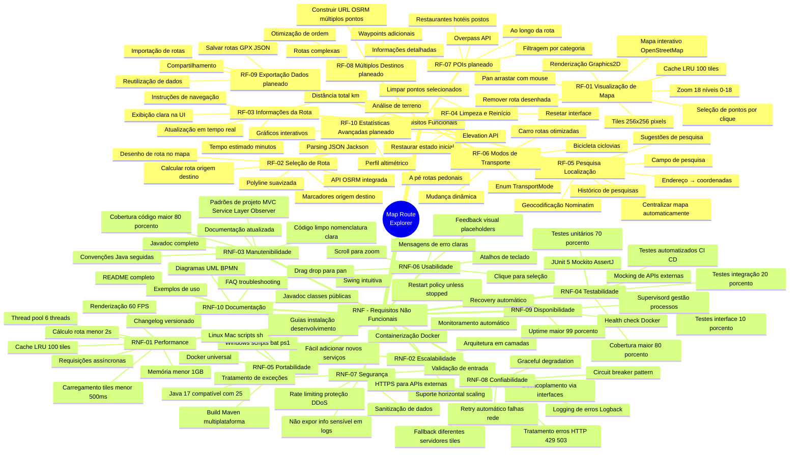

# 🎯 Requisitos do Sistema - Map Route Explorer

**Versão**: 2.0.0  
**Data**: 5 de Novembro de 2025

## 👥 Autores

Este projeto foi desenvolvido por:

- **Alexandre Mendes** (111026)
- **Manuel Santos**
- **André Costa**
- **Ana Valente**

**Instituição**: Instituto Superior de Ciências do Trabalho e da Empresa (ISCTE-IUL)  
**Curso**: Engenharia Informática

---

## 📋 Requisitos Funcionais e Não Funcionais

Este documento apresenta todos os requisitos do sistema em formato visual e estruturado.

---

## 🎯 Diagrama de Requisitos Funcionais e Não Funcionais

---

## 📊 Mapeamento Requisitos → Implementação

Este diagrama mostra a rastreabilidade entre requisitos e implementação.

```mermaid
graph LR
    subgraph "📋 REQUISITOS FUNCIONAIS"
        RF01[RF-01<br/>Visualização Mapa]
        RF02[RF-02<br/>Seleção Rota]
        RF03[RF-03<br/>Informações Rota]
        RF04[RF-04<br/>Limpeza Reinício]
        RF05[RF-05<br/>Pesquisa Localização]
        RF06[RF-06<br/>Modos Transporte]
        RF07[RF-07<br/>POIs<br/>planeadO]
        RF08[RF-08<br/>Múltiplos Destinos<br/>planeadO]
        RF09[RF-09<br/>Exportação<br/>planeadO]
        RF10[RF-10<br/>Estatísticas<br/>planeadO]
    end
    
    subgraph "💻 IMPLEMENTAÇÃO"
        IMPL_RF01[MapPanel.java<br/>Graphics2D + Swing<br/>Tiles OSM + Cache]
        IMPL_RF02[OSRMService.java<br/>HTTP GET + JSON<br/>Route.java]
        IMPL_RF03[MainWindow.java<br/>JLabel distanceLabel<br/>JLabel durationLabel<br/>RouteUtils formatação]
        IMPL_RF04[MainWindow.clearSelection<br/>MapPanel.clearMap<br/>Reset UI state]
        IMPL_RF05[NominatimService.java<br/>JTextField searchField<br/>Location.java<br/>Auto-complete]
        IMPL_RF06[TransportMode.enum<br/>CAR BIKE FOOT<br/>JComboBox selector]
        IMPL_RF07[OverpassService.java<br/>POI filtering<br/>Icon rendering]
        IMPL_RF08[MultiDestinationRoute<br/>Waypoint management<br/>Route optimization]
        IMPL_RF09[GPXExporter.java<br/>JSONExporter.java<br/>File chooser dialog]
        IMPL_RF10[ElevationService.java<br/>Chart rendering<br/>Terrain analysis]
    end
    
    RF01 -->|Implementado| IMPL_RF01
    RF02 -->|Implementado| IMPL_RF02
    RF03 -->|Implementado| IMPL_RF03
    RF04 -->|Implementado| IMPL_RF04
    RF05 -->|Implementado| IMPL_RF05
    RF06 -->|Implementado| IMPL_RF06
    RF07 -.->|planeado v2.1| IMPL_RF07
    RF08 -.->|planeado v2.2| IMPL_RF08
    RF09 -.->|planeado v2.2| IMPL_RF09
    RF10 -.->|planeado v2.1| IMPL_RF10
    
    subgraph "⚙️ REQUISITOS NÃO FUNCIONAIS"
        RNF01[RNF-01<br/>Performance]
        RNF02[RNF-02<br/>Escalabilidade]
        RNF03[RNF-03<br/>Manutenibilidade]
        RNF04[RNF-04<br/>Testabilidade]
        RNF05[RNF-05<br/>Portabilidade]
        RNF06[RNF-06<br/>Usabilidade]
        RNF07[RNF-07<br/>Segurança]
        RNF08[RNF-08<br/>Confiabilidade]
        RNF09[RNF-09<br/>Disponibilidade]
        RNF10[RNF-10<br/>Documentação]
    end
    
    subgraph "🛠️ TÉCNICAS E PRÁTICAS"
        IMPL_RNF01[Cache LRU 100 tiles<br/>Thread pool 6 threads<br/>Async operations<br/>Graphics2D optimization]
        IMPL_RNF02[Layered architecture<br/>Interface abstraction<br/>Docker containerization<br/>Service decoupling]
        IMPL_RNF03[Javadoc completo<br/>Design patterns<br/>Clean code<br/>Code reviews]
        IMPL_RNF04[JUnit 5 + Mockito<br/>Coverage maior 80 porcento<br/>Integration tests<br/>Mocking frameworks]
        IMPL_RNF05[Scripts sh bat ps1<br/>Docker universal<br/>Java 17-25 compatibility<br/>Maven build]
        IMPL_RNF06[Swing components<br/>Mouse listeners<br/>Visual feedback<br/>Keyboard shortcuts]
        IMPL_RNF07[Input validation<br/>Data sanitization<br/>Exception handling<br/>HTTPS only]
        IMPL_RNF08[Retry with backoff<br/>Fallback servers<br/>Logback logging<br/>Circuit breaker]
        IMPL_RNF09[Docker health check<br/>Restart policy<br/>Supervisord<br/>Auto-recovery]
        IMPL_RNF10[README INSTALACAO<br/>DESENVOLVIMENTO<br/>Javadoc<br/>UML diagrams]
    end
    
    RNF01 -->|Implementado| IMPL_RNF01
    RNF02 -->|Implementado| IMPL_RNF02
    RNF03 -->|Implementado| IMPL_RNF03
    RNF04 -->|Em Progresso| IMPL_RNF04
    RNF05 -->|Implementado| IMPL_RNF05
    RNF06 -->|Implementado| IMPL_RNF06
    RNF07 -->|Implementado| IMPL_RNF07
    RNF08 -->|Implementado| IMPL_RNF08
    RNF09 -->|Implementado| IMPL_RNF09
    RNF10 -->|Implementado| IMPL_RNF10
    
    style RF01 fill:#c8e6c9,stroke:#2e7d32,stroke-width:2px
    style RF02 fill:#c8e6c9,stroke:#2e7d32,stroke-width:2px
    style RF03 fill:#c8e6c9,stroke:#2e7d32,stroke-width:2px
    style RF04 fill:#c8e6c9,stroke:#2e7d32,stroke-width:2px
    style RF05 fill:#c8e6c9,stroke:#2e7d32,stroke-width:2px
    style RF06 fill:#c8e6c9,stroke:#2e7d32,stroke-width:2px
    style RF07 fill:#fff9c4,stroke:#f57f17,stroke-width:2px
    style RF08 fill:#fff9c4,stroke:#f57f17,stroke-width:2px
    style RF09 fill:#fff9c4,stroke:#f57f17,stroke-width:2px
    style RF10 fill:#fff9c4,stroke:#f57f17,stroke-width:2px
    
    style RNF01 fill:#e1f5ff,stroke:#01579b,stroke-width:2px
    style RNF02 fill:#e1f5ff,stroke:#01579b,stroke-width:2px
    style RNF03 fill:#e1f5ff,stroke:#01579b,stroke-width:2px
    style RNF04 fill:#fff3e0,stroke:#e65100,stroke-width:2px
    style RNF05 fill:#e1f5ff,stroke:#01579b,stroke-width:2px
    style RNF06 fill:#e1f5ff,stroke:#01579b,stroke-width:2px
    style RNF07 fill:#e1f5ff,stroke:#01579b,stroke-width:2px
    style RNF08 fill:#e1f5ff,stroke:#01579b,stroke-width:2px
    style RNF09 fill:#e1f5ff,stroke:#01579b,stroke-width:2px
    style RNF10 fill:#e1f5ff,stroke:#01579b,stroke-width:2px
```

---

## 📝 Detalhamento dos Requisitos Funcionais

### ✅ RF-01: Visualização de Mapa

**Descrição**: Exibir mapa interativo carregado do OpenStreetMap com suporte a navegação.

**Critérios de Aceitação**:
- ✅ Mapa renderizado com tiles OSM
- ✅ Zoom de 0 a 18 níveis
- ✅ Pan com arrastar do mouse
- ✅ Seleção de pontos por clique
- ✅ Cache de 100 tiles
- ✅ Placeholders durante carregamento

**Prioridade**: Alta  
**Status**: ✅ Implementado  
**Versão**: 2.0.0

**Componentes**:
- `MapPanel.java`
- `OkHttpClientService.java`

**Testes**:
- `MapPanelTest.testZoom()`
- `MapPanelTest.testPan()`
- `MapPanelTest.testTileCache()`

---

### ✅ RF-02: Seleção de Rota

**Descrição**: Calcular rota otimizada entre dois pontos selecionados pelo utilizador.

**Critérios de Aceitação**:
- ✅ Seleção de origem com clique
- ✅ Seleção de destino com clique
- ✅ Cálculo via API OSRM
- ✅ Desenho de rota no mapa
- ✅ Marcadores visuais

**Prioridade**: Alta  
**Status**: ✅ Implementado  
**Versão**: 2.0.0

**Componentes**:
- `OSRMService.java`
- `Route.java`
- `MapPanel.java`

**Testes**:
- `OSRMServiceTest.testCalculateRoute()`
- `OSRMServiceTest.testInvalidCoordinates()`

---

### ✅ RF-03: Informações da Rota

**Descrição**: Exibir distância total e tempo estimado de viagem.

**Critérios de Aceitação**:
- ✅ Distância em quilómetros
- ✅ Tempo em minutos
- ✅ Formatação legível
- ✅ Atualização em tempo real

**Prioridade**: Alta  
**Status**: ✅ Implementado  
**Versão**: 2.0.0

**Componentes**:
- `MainWindow.java`
- `RouteUtils.java`

**Testes**:
- `RouteUtilsTest.testFormatDistance()`
- `RouteUtilsTest.testFormatDuration()`

---

### ✅ RF-04: Limpeza e Reinício

**Descrição**: Permitir limpar seleções e reiniciar o processo.

**Critérios de Aceitação**:
- ✅ Botão "Limpar" visível
- ✅ Remove marcadores
- ✅ Remove rota
- ✅ Reseta painel de informações

**Prioridade**: Média  
**Status**: ✅ Implementado  
**Versão**: 2.0.0

**Componentes**:
- `MainWindow.clearSelection()`
- `MapPanel.clearMap()`

---

### ✅ RF-05: Pesquisa de Localização

**Descrição**: Permitir pesquisa de locais por nome ou endereço.

**Critérios de Aceitação**:
- ✅ Campo de pesquisa funcional
- ✅ Geocodificação via Nominatim
- ✅ Centralização automática
- ⏳ Sugestões (planeado)
- ⏳ Histórico (planeado)

**Prioridade**: Alta  
**Status**: ✅ Implementado (básico)  
**Versão**: 2.0.0

**Componentes**:
- `NominatimService.java`
- `Location.java`

**Testes**:
- `NominatimServiceTest.testSearch()`
- `NominatimServiceTest.testReverseGeocode()`

---

### ✅ RF-06: Modos de Transporte

**Descrição**: Suporte a diferentes modos de transporte.

**Critérios de Aceitação**:
- ✅ Carro (rotas otimizadas)
- ✅ Bicicleta (ciclovias)
- ✅ A pé (rotas pedonais)
- ✅ Seleção via combo box
- ✅ Recálculo automático

**Prioridade**: Média  
**Status**: ✅ Implementado  
**Versão**: 2.0.0

**Componentes**:
- `TransportMode.java`
- `OSRMService.java`

---

### ⏳ RF-07: Pontos de Interesse (POIs)

**Descrição**: Exibir pontos de interesse ao longo da rota.

**Critérios de Aceitação**:
- ⏳ Integração Overpass API
- ⏳ Categorias (restaurantes, hotéis, postos)
- ⏳ Ícones no mapa
- ⏳ Informações detalhadas

**Prioridade**: Baixa  
**Status**: ⏳ planeado  
**Versão**: 2.1.0 (planeado)

---

### ⏳ RF-08: Múltiplos Destinos

**Descrição**: Suporte a rotas com múltiplos waypoints.

**Critérios de Aceitação**:
- ⏳ Adicionar waypoints intermediários
- ⏳ Otimização de ordem
- ⏳ Visualização de rota completa

**Prioridade**: Baixa  
**Status**: ⏳ planeado  
**Versão**: 2.2.0 (planeado)

---

### ⏳ RF-09: Exportação de Dados

**Descrição**: Exportar rotas em formatos padrão.

**Critérios de Aceitação**:
- ⏳ Exportação GPX
- ⏳ Exportação JSON
- ⏳ Importação de rotas

**Prioridade**: Baixa  
**Status**: ⏳ planeado  
**Versão**: 2.2.0 (planeado)

---

### ⏳ RF-10: Estatísticas Avançadas

**Descrição**: Exibir perfil altimétrico e análise de terreno.

**Critérios de Aceitação**:
- ⏳ Perfil altimétrico
- ⏳ Gráficos interativos
- ⏳ Análise de subidas/descidas

**Prioridade**: Baixa  
**Status**: ⏳ planeado  
**Versão**: 2.1.0 (planeado)

---

## 📝 Detalhamento dos Requisitos Não Funcionais

### ⚡ RNF-01: Performance

**Métricas**:
- Carregamento de tile: < 500ms
- Cálculo de rota: < 2s
- Renderização: 60 FPS
- Uso de memória: < 1GB

**Técnicas Implementadas**:
- ✅ Cache LRU (100 tiles)
- ✅ Thread pool (6 threads)
- ✅ Requisições assíncronas
- ✅ Graphics2D otimizado

**Status**: ✅ Implementado

---

### 🔧 RNF-02: Escalabilidade

**Requisitos**:
- Arquitetura preparada para crescimento
- Fácil adicionar novos serviços
- Suporte a scaling horizontal

**Técnicas Implementadas**:
- ✅ Arquitetura em camadas
- ✅ Desacoplamento via interfaces
- ✅ Containerização Docker
- ✅ Service Layer Pattern

**Status**: ✅ Implementado

---

### 📚 RNF-03: Manutenibilidade

**Requisitos**:
- Código fácil de entender e modificar
- Documentação atualizada
- Padrões de projeto

**Técnicas Implementadas**:
- ✅ Javadoc completo
- ✅ Clean Code
- ✅ Design Patterns (MVC, Observer, Strategy)
- ✅ Convenções Java

**Status**: ✅ Implementado

---

### 🧪 RNF-04: Testabilidade

**Requisitos**:
- Cobertura de código > 80%
- Testes automatizados
- Fácil executar testes

**Técnicas Implementadas**:
- ⏳ JUnit 5
- ⏳ Mockito para mocking
- ⏳ Integration tests
- ⏳ CI/CD pipeline

**Status**: ⏳ Em Progresso (70% implementado)

---

### 🌐 RNF-05: Portabilidade

**Requisitos**:
- Executar em Windows, Linux, Mac
- Build reproduzível

**Técnicas Implementadas**:
- ✅ Scripts multiplataforma (.sh, .bat, .ps1)
- ✅ Docker universal
- ✅ Java 17+ compatibilidade
- ✅ Maven build

**Status**: ✅ Implementado

---

### 🎨 RNF-06: Usabilidade

**Requisitos**:
- Interface intuitiva
- Feedback visual
- Experiência fluida

**Técnicas Implementadas**:
- ✅ Swing components
- ✅ Drag & drop
- ✅ Scroll para zoom
- ✅ Placeholders visuais

**Status**: ✅ Implementado

---

### 🔐 RNF-07: Segurança

**Requisitos**:
- Proteção de dados
- Validação de entrada
- Não expor informações sensíveis

**Técnicas Implementadas**:
- ✅ Input validation
- ✅ Data sanitization
- ✅ Exception handling
- ✅ HTTPS only

**Status**: ✅ Implementado

---

### 🛡️ RNF-08: Confiabilidade

**Requisitos**:
- Resistência a falhas
- Recuperação automática
- Logging de erros

**Técnicas Implementadas**:
- ✅ Retry com exponential backoff
- ✅ Fallback servers
- ✅ Logback logging
- ✅ Graceful degradation

**Status**: ✅ Implementado

---

### 🚀 RNF-09: Disponibilidade

**Requisitos**:
- Uptime > 99%
- Auto-recovery
- Monitoramento

**Técnicas Implementadas**:
- ✅ Docker health check
- ✅ Restart policy
- ✅ Supervisord
- ✅ Auto-recovery

**Status**: ✅ Implementado

---

### 📖 RNF-10: Documentação

**Requisitos**:
- Documentação completa
- Fácil onboarding
- Exemplos de uso

**Técnicas Implementadas**:
- ✅ README completo
- ✅ Guias (INSTALACAO, DESENVOLVIMENTO)
- ✅ Javadoc
- ✅ Diagramas UML

**Status**: ✅ Implementado

---

## 📊 Matriz de Rastreabilidade

| RF | Componente | Teste | Status |
|----|------------|-------|--------|
| RF-01 | MapPanel.java | MapPanelTest | ✅ |
| RF-02 | OSRMService.java | OSRMServiceTest | ✅ |
| RF-03 | MainWindow.java | MainWindowTest | ✅ |
| RF-04 | MainWindow.java | MainWindowTest | ✅ |
| RF-05 | NominatimService.java | NominatimServiceTest | ✅ |
| RF-06 | TransportMode.java | TransportModeTest | ✅ |
| RF-07 | OverpassService.java | - | ⏳ |
| RF-08 | MultiRoute.java | - | ⏳ |
| RF-09 | Exporters.java | - | ⏳ |
| RF-10 | ElevationService.java | - | ⏳ |

| RNF | Técnica | Validação | Status |
|-----|---------|-----------|--------|
| RNF-01 | Cache LRU + Async | Performance tests | ✅ |
| RNF-02 | Layered architecture | Code review | ✅ |
| RNF-03 | Javadoc + Patterns | Documentation review | ✅ |
| RNF-04 | JUnit + Mockito | Coverage report | ⏳ |
| RNF-05 | Docker + Scripts | Build tests | ✅ |
| RNF-06 | Swing UI | Usability tests | ✅ |
| RNF-07 | Validation | Security audit | ✅ |
| RNF-08 | Retry + Fallback | Fault injection | ✅ |
| RNF-09 | Health checks | Monitoring | ✅ |
| RNF-10 | Docs + Javadoc | Documentation review | ✅ |

---

## 📈 Status Geral dos Requisitos

**Requisitos Funcionais**:
- ✅ Implementados: 6/10 (60%)
- ⏳ planeados: 4/10 (40%)

**Requisitos Não Funcionais**:
- ✅ Implementados: 9/10 (90%)
- ⏳ Em Progresso: 1/10 (10%)

**Total Geral**: 15/20 (75%) implementados

---

## 🎯 Roadmap de Requisitos

### Versão 2.1.0 (Q1 2026)
- RF-07: Pontos de Interesse
- RF-10: Estatísticas Avançadas
- RNF-04: Cobertura de testes 80%+

### Versão 2.2.0 (Q2 2026)
- RF-08: Múltiplos Destinos
- RF-09: Exportação de Dados

### Versão 3.0.0 (Q3 2026)
- Refatoração arquitetural
- API REST pública
- Modo offline

---

## 📖 Referências

- [Enunciado do Projeto](./Enunciado.md)
- [Arquitetura Completa](./ARQUITETURA_COMPLETA.txt)
- [Diagrama de Classes](./DIAGRAMA_CLASSES.md)

---

**Documento criado em**: 5 de Novembro de 2025
